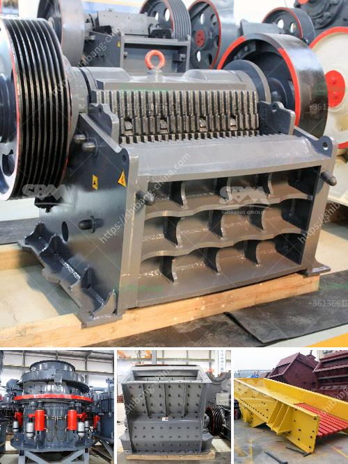

<h3>7 different vibrating screens, how do you choose?</h3>
Vibrating screens are essential equipment used in various industries, including mining, construction, and manufacturing. These screens perform an important function by sorting and separating materials according to their particle size. With numerous types of vibrating screens available today, it can be challenging to select the right one for your specific application. In this article, we will explore seven different types of vibrating screens and provide guidance on how to choose the best option for your needs.

Inclined vibrating screens comprise a sloping deck that vibrates in a circular motion. These screens are ideal for applications requiring high efficiency and accurate particle separation. They are commonly used in aggregate processing, where large capacities and efficient screening are crucial.

Horizontal vibrating screens feature a horizontal deck and motion, providing exceptional screening efficiency across a wide range of materials. These screens are commonly used in applications where the feed material has a high moisture content or when fines need to be removed before further processing.

High-frequency vibrating screens operate at high speeds, typically above 3000 rpm, offering improved screening efficiency and increased product yield. These screens are most effective for fine particle separation and are suitable for handling difficult-to-screen materials.

Banana screens, also known as multi-slope screens, feature multiple inclinations along the length of the deck. This design improves material stratification and allows for efficient screening of high tonnages. Banana screens are ideal for screening moist and sticky materials prone to blinding or pegging.

Dewatering screens are specifically designed to remove excess moisture from materials. These screens use high-frequency vibrations to dewater wet materials efficiently, crucial in industries such as sand and gravel or mineral processing.

Trommel screens consist of a rotating cylindrical drum with perforated screens. They are highly effective for screening large volumes of coarse materials, such as biomass, municipal solid waste, or minerals. Trommel screens are versatile and suitable for various applications requiring rough separation.

Circular vibrating screens use a circular motion to convey the material along the screen deck, resulting in effective separation and efficient conveying. These screens are renowned for their ease of operation and maintenance and are popular in industries such as mining and aggregates.

1. Application: Determine the specific material characteristics and screening requirements to match the screen's capabilities.

2. Capacity: Consider the required throughput and ensure the screen can handle the desired volume efficiently.

3. Deck Type: Select the appropriate deck type, whether inclined, horizontal, or multi-slope, based on the material properties and screening objectives.

4. Screen Size and Openings: Determine the size of the screen and the desired opening size to ensure optimal particle separation.

5. Motion and Vibration Amplitude: Understand the material behavior and choose a screen with suitable motion and vibration amplitude to achieve desired results.

6. Maintenance and Durability: Consider the ease of maintenance, wear resistance, and overall longevity of the screen to optimize your investment.

Choosing the right vibrating screen among the various available options is essential for achieving optimal screening performance. The aforementioned seven types provide diverse solutions for different applications. By considering factors such as the application, capacity, deck type, screen size, and maintenance needs, you can make an informed choice and benefit from efficient particle separation and increased productivity in your specific industry.
<h3>Contact us</h3><ul><li><strong>Whatsapp:&nbsp;<a href="https://wa.me/8613661969651">+8613661969651</a></strong></li><li><a href="https://swt.shibang-china.com/?git&amp;zhl&amp;7 different vibrating screens how do you choose"><strong>Online Service(chat now)</strong></a></li></ul><h3>Related</h3><ul><li><a href='What are the advantages of hammer mills used in the mining industry？.md'>What are the advantages of hammer mills used in the mining industry？</a></li><li><a href='What determines the capacity of a stone crusher.md'>What determines the capacity of a stone crusher?</a></li><li><a href='What are the parts of a ball mill.md'>What are the parts of a ball mill?</a></li><li><a href='What crusher produces rock in limestone .md'>What crusher produces rock in limestone ?</a></li><li><a href='What is gyratory crushers .md'>What is gyratory crushers ?</a></li></ul>