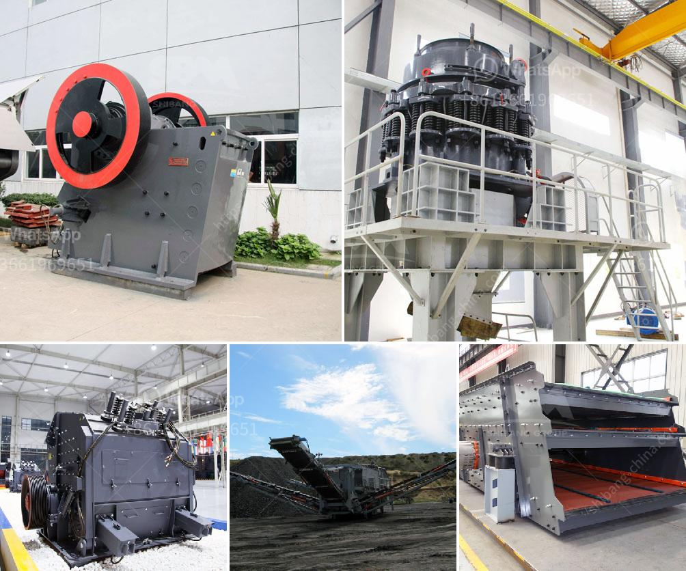

<h3>How is fluorite mined, and what equipment is needed?</h3>
Fluorite is a mineral composed of calcium fluoride and is found in a variety of vibrant colors, commonly purple, green, and blue. Due to its beautiful hues, fluorite is an extensively sought-after gemstone for both decorative purposes and industrial applications. The mining process of fluorite is both demanding and labor-intensive.

To begin the process, fluorite boulders are extracted from the earth through sustainable mining practices. Once the boulders are obtained, they are transported to a nearby processing plant. During this transport, earth-moving equipment such as bulldozers and loaders are utilized to move the heavy boulders efficiently and safely.

At the processing plant, the fluorite ore is crushed and thoroughly washed by water to remove any impurities. This process not only removes impurities but also breaks the fluorite into smaller particles, making it easier to extract and separate. Various sizes of crushers, such as jaw crushers and cone crushers, are used to achieve this purpose.

After the crushing stage, the fluorite ore is further ground into a fine powder through grinding equipment such as ball mills and rod mills. This process helps to liberate the fluorite from impurities and create the desired product for further processing.

Once the mineral has been ground to the desired fineness, it is then subjected to beneficiation, where gravity separation and flotation techniques are commonly employed. Gravity separation separates fluorite from the gangue minerals based on their differences in density. Flotation, on the other hand, makes use of various chemicals to selectively adhere to the fluorite minerals, enabling their separation from the waste material.

To facilitate the flotation process, specialized equipment such as flotation cells and reagents are required. Flotation cells are large tanks where finely ground fluorite particles are suspended in water and aerated to create bubbles. The desired fluorite particles attach to these bubbles, which rise to the surface and are collected as a concentrate.

Reagents, or chemicals, are essential in the flotation process to aid in the separation of fluorite from other minerals. Commonly used reagents include collectors, frothers, modifiers, and depressants, which are mixed into the water to assist in the flotation process.

Once the fluorite concentrate is obtained, it is further processed to remove any remaining impurities and moisture. This is typically done through drying processes using rotary dryers or fluidized bed dryers, where hot air is circulated to remove moisture from the concentrate.

Finally, the high-grade fluorite concentrate is packaged and shipped to various industries for its diverse applications, such as in the manufacture of steel, ceramics, refrigerants, and optical lenses, among others.

In conclusion, the mining process of fluorite involves the extraction of boulders, followed by crushing, grinding, beneficiation, and flotation. Essential equipment such as crushers, mills, flotation cells, and drying machines are used to extract, separate, and process fluorite minerals. This labor-intensive process ensures the production of high-quality fluorite concentrates, which are then utilized in various industries worldwide.
<h3>Contact us</h3><ul><li><strong>Whatsapp:&nbsp;<a href="https://wa.me/8613661969651">+8613661969651</a></strong></li><li><a href="https://swt.shibang-china.com/?git&amp;zhl&amp;How is fluorite mined and what equipment is needed"><strong>Online Service(chat now)</strong></a></li></ul><h3>Related</h3><ul><li><a href='What is a ball mill for .md'>What is a ball mill for ?</a></li><li><a href='What is the maintenance of a jaw crusher.md'>What is the maintenance of a jaw crusher?</a></li><li><a href='What crusher produces rock in limestone .md'>What crusher produces rock in limestone ?</a></li><li><a href='What are the Different Types of Crusher How to choose.md'>What are the Different Types of Crusher? How to choose?</a></li><li><a href='What is the application of a ball mill.md'>What is the application of a ball mill?</a></li></ul>