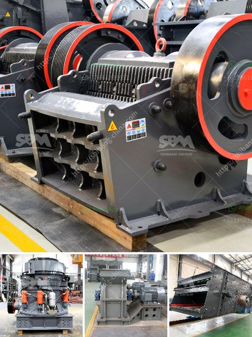

<h3>How often/what maintenance needs to be done on crushing plant</h3>
A crushing plant is a vital part of any quarry or mining operation. It is used to crush various types of raw materials into fine aggregates. With proper maintenance, the crushing plant ensures high availability and productivity to keep the business running smoothly.

Routine maintenance tasks are essential to ensuring the plant remains in peak operational condition. These tasks are typically performed on a regular schedule to prevent breakdowns and keep the plant in optimal working order.

One of the first maintenance tasks is inspecting and cleaning the plant. This includes removing any debris or buildup that may have accumulated on the various components of the plant, such as the feeder, crusher, screens, and conveyors. Regular cleaning helps prevent material build-up, which can lead to inefficiencies and equipment failures.

Another critical maintenance task is lubrication. Proper lubrication of all moving parts ensures smooth operation and prolongs the lifespan of the equipment. This includes regularly oiling the bearings, checking oil levels, and refilling as needed. Lubrication should be done following the manufacturer's recommendations to ensure the correct type and quantity of lubricant is used.

Inspecting the wear parts is also crucial to maintain the crushing plant's performance. Wear parts, such as jaw plates, liners, and impact bars, are subject to constant abrasion and impact. Regularly inspecting these parts allows for timely replacements, preventing unexpected breakdowns and costly downtime.

In addition to routine inspections, it is vital to monitor the plant's performance and address any issues that arise promptly. This can be done through regular data collection and analysis. Monitoring factors such as production rates, power consumption, and vibration levels can help identify potential problems before they escalate.

Regularly checking the electrical system is also essential. Ensuring all electrical connections are secure and in good condition helps prevent malfunctions and electrical accidents. Any signs of frayed wires, loose connections, or faulty components should be immediately addressed.

Safety should always be a priority in any maintenance tasks performed on the crushing plant. Operators and maintenance personnel should be trained on proper safety procedures and wear appropriate personal protective equipment. Regular safety audits can help identify any potential hazards and ensure compliance with safety standards.

In conclusion, the maintenance of a crushing plant is a multifaceted task that requires attention to detail and proper planning. Routine maintenance tasks such as cleaning, lubrication, and inspection play a vital role in keeping the plant in optimal condition. Regular monitoring of performance and addressing any issues promptly ensures high availability and productivity. By prioritizing safety and adhering to manufacturer recommendations, the crushing plant can operate efficiently, contributing to the success of the quarry or mining operation.
<h3>Contact us</h3><ul><li><strong>Whatsapp:&nbsp;<a href="https://wa.me/8613661969651">+8613661969651</a></strong></li><li><a href="https://swt.shibang-china.com/?git&amp;zhl&amp;How oftenwhat maintenance needs to be done on crushing plant"><strong>Online Service(chat now)</strong></a></li></ul><h3>Related</h3><ul><li><a href='What is the price of a cone crusher in Venezuela.md'>What is the price of a cone crusher in Venezuela?</a></li><li><a href='What are the uses of a cone crusher to mining operations.md'>What are the uses of a cone crusher to mining operations?</a></li><li><a href='What machines are required for a limestone powder factory.md'>What machines are required for a limestone powder factory?</a></li><li><a href='What is a dry ball mill.md'>What is a dry ball mill?</a></li><li><a href='What is white silica sand used for .md'>What is white silica sand used for ?</a></li></ul>