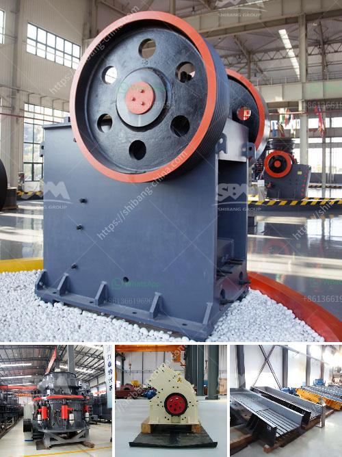

<h3>What RPM does the jaw crusher spin?</h3>
The jaw crusher is widely used in mining, metallurgy, construction material, highway, railway, water conservancy and chemical industries for crushing various materials with compression strength less than 350Mpa. It is preferred equipment for the complete product line as coarse crusher.

To answer the question on what RPM does the jaw crusher spin, the crusher is designed to operate at a variable speed. The speed setting of the crusher can be adjusted through the console, making it suitable for a variety of materials to be crushed – including softer rocks such as limestone, as well as harder ones such as granite and basalt.

In general, the higher the RPM (revolutions per minute), the more aggressive the crushing action will be. This means that the jaw crusher will be able to process more materials efficiently, although it may result in an increase in noise and energy consumption. On the other hand, a slower RPM will result in a more gentle crushing action, making it suitable for fragile materials. However, this may also slow down production.

It is important to note that the speed setting should be adjusted according to the specific requirements of the material being crushed and the desired final product. For instance, when crushing hard materials, a higher RPM may be necessary to achieve the desired particle size and shape.

The RPM of the jaw crusher is determined by the size and weight of the flywheel and the eccentric shaft. An RPM of around 350 is currently being used, making the machine suitable for a variety of applications.

By using the cone crusher as a primary crusher, it is possible to avoid the use of two machines simultaneously, as the jaw crusher and cone crusher are interdependent. Therefore, when considering the crushing process, both machines can be combined into one machine, saving both space and costs.

The jaw crusher uses a motor to drive the belt and pulley, allowing the movable jaw to move according to a predetermined track. In order to reverse the movement of the jaw crusher, a device is installed between the pulley and the eccentric shaft. When the eccentric shaft rotates, the pulley drives the movable jaw to make a periodic swinging motion around a fixed point.

In conclusion, the jaw crusher RPM can be from 200 to 400 depending on the design of the crusher. For example, when using a large jaw crusher with a large feed opening, the motor can produce more torque, resulting in slower rotational speed and thus higher capacity. On the other hand, a smaller jaw crusher with a smaller feed opening will require a higher RPM for effective crushing. Ultimately, the speed at which the jaw crusher operates should be set to meet the specific requirements of the application.
<h3>Contact us</h3><ul><li><strong>Whatsapp:&nbsp;<a href="https://wa.me/8613661969651">+8613661969651</a></strong></li><li><a href="https://swt.shibang-china.com/?git&amp;zhl&amp;What RPM does the jaw crusher spin"><strong>Online Service(chat now)</strong></a></li></ul><h3>Related</h3><ul><li><a href='What is a belt conveyor machine .md'>What is a belt conveyor machine ?</a></li><li><a href='What should be the RPM of a ball mill with a 45inch diameter.md'>What should be the RPM of a ball mill with a 45-inch diameter?</a></li><li><a href='What are the cement mill precrushing equipment .md'>What are the cement mill pre-crushing equipment ?</a></li><li><a href='what is the cost of making gravel crusher plant 600tph？.md'>what is the cost of making gravel crusher plant 600tph？</a></li><li><a href='What is the capacity of the grinding mill.md'>What is the capacity of the grinding mill?</a></li></ul>