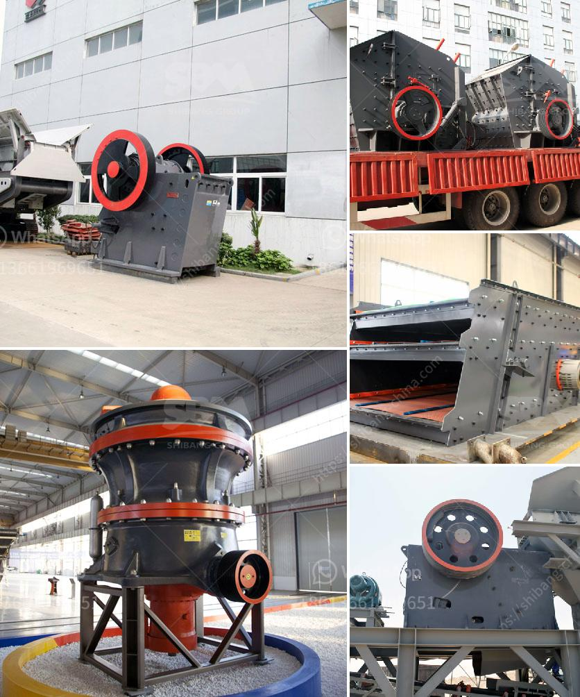

<h3>What are cone crusher used to crush ?</h3>
Cone crushers are popular rock crushing machines in aggregates production, mining operations, and recycling applications. They are normally used in secondary, tertiary, and quaternary crushing stages. The new generation of cone crushers provides customers with higher capacity, better product shape, and easier automatic control.

Through a combination of their design and the material being crushed, cone crushers can effectively crush hard and abrasive materials such as granite, basalt, and limestone. There are different types of cone crushers, including spring cone crusher, Simmons cone crusher, high-efficiency compound cone crusher, hydraulic cone crusher, and gyratory crusher.

One common feature in all these machines is the steep cone angle. The steepness of this angle helps to increase the material retention time in the crushing chamber, resulting in a higher reduction ratio and a well-shaped product. As the rock enters the top of the cone crusher, it becomes wedged and squeezed between the mantle and the bowl liner, becoming smaller and smaller until it is discharged at the bottom.

Cone crushers are used in a variety of industries. In the aggregates industry, cone crushers are used to produce cubical-shaped aggregates for construction applications as well as for the production of gravel and sand. Cone crushers are also used in the mining industry for reducing ore size and sorting operations. They are often utilized in aggregates production, construction material recycling, and mining operations where there are high demands for quality and productivity.

Cone crushers are especially beneficial for reducing the size of materials that need to pass through further processing stages. In the quarrying industry, cone crushers are often used to crush larger rocks into smaller ones, reducing the size of materials for further processing stages. This makes cone crushers particularly suitable for applications such as gravel pits, quarries, and open-pit mines.

Additionally, cone crushers are used for intermediate or fine crushing in aggregate production. They are commonly used for secondary, tertiary, or quaternary crushing stages. Consequently, cone crushers can also be used in the production of road base, concrete, and asphalt materials for paving projects. This versatility makes cone crushers an excellent choice in a wide range of applications.

With advancements in technology, cone crushers are continuously evolving to meet customer demands for better performance, higher capacity, and improved product quality. Manufacturers are developing features such as hydraulic clearing, tramp release, and automated control systems to enhance the users' experience and maximize productivity.

In conclusion, cone crushers are widely used to crush a variety of rocks and ores in various industries. They offer high performance, better product shape, and easy automation, making them an ideal choice for both large-scale and smaller-scale operations. With their versatility and continuous advancements, cone crushers will continue to play a crucial role in crushing operations and contribute to the development of various industries.
<h3>Contact us</h3><ul><li><strong>Whatsapp:&nbsp;<a href="https://wa.me/8613661969651">+8613661969651</a></strong></li><li><a href="https://swt.shibang-china.com/?git&amp;zhl&amp;What are cone crusher used to crush "><strong>Online Service(chat now)</strong></a></li></ul><h3>Related</h3><ul><li><a href='What equipment is required for a large quarry.md'>What equipment is required for a large quarry?</a></li><li><a href='What materials can the vertical roller mill grind.md'>What materials can the vertical roller mill grind?</a></li><li><a href='What is a ball mill for .md'>What is a ball mill for ?</a></li><li><a href='What is the best type of crusher for hard rock.md'>What is the best type of crusher for hard rock?</a></li><li><a href='what is iron ore screening equipment？.md'>what is iron ore screening equipment？</a></li></ul>