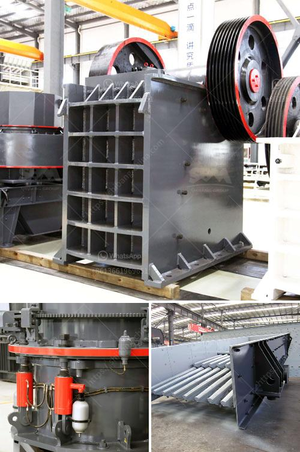

<h3>What are equipments used in a cement plant ?</h3>
A cement plant, also known as a cement manufacturing plant, is a facility that combines raw materials such as limestone, sand, clay, and iron oxide to produce cement. These materials are crushed, blended, and heated at high temperatures to form a clinker, which is then ground into a fine powder to produce the final product, cement.

To carry out various processes involved in cement production, several types of equipment are used in cement plants. These equipment aid in enhancing the overall efficiency and productivity of the plant while ensuring high-quality cement output. Let us take a closer look at some of the essential equipment used in a cement plant:

1. Crushers: Crushers are used to reduce the size of large rocks or raw materials into smaller, more manageable pieces. Different types of crushers, such as jaw crushers, impact crushers, and hammer crushers, are employed based on the hardness and size of the raw materials.

2. Raw Mill: A raw mill is used to grind the raw materials into a fine powder before they are fed into the kiln for the clinkerization process. The raw mill typically consists of a horizontal rotating drum with steel balls inside to grind the raw materials and prepare them for the kiln.

3. Kiln: The kiln is the heart of a cement plant, where the raw materials are heated at extremely high temperatures to produce the clinker. A typical cement kiln is a large cylindrical steel shell, lined with refractory bricks, and rotates on its horizontal axis. The kiln is often fueled by coal, natural gas, or alternative fuels such as waste materials or petcoke.

4. Clinker Cooler: After leaving the kiln, the clinker is extremely hot. The clinker cooler, also known as the grate cooler, is used to cool the clinker rapidly to a temperature that can be handled by downstream equipment. The clinker cooler utilizes air or water to lower the temperature of the clinker, which helps in preserving its quality.

5. Cement Mill: The cement mill is used to grind the clinker into a fine powder. It consists of a rotating drum filled with steel balls, which crushes and grinds the clinker into the desired fineness. Gypsum is also added to control the setting time of the cement.

6. Cement Silos: Cement silos are used to store the finished cement product before it is transported to the market or to other construction sites. These cylindrical structures are typically made of steel and have various storage capacities.

7. Packing and Dispatch: In this final stage of the cement production process, the finished cement is packed into bags or bulk containers for transport and sale. Packaging equipment, such as rotary packers, are used to ensure accurate and efficient packaging while maintaining the quality of the cement.

Overall, the equipment used in a cement plant plays a crucial role in achieving optimal production efficiency, ensuring consistent product quality, and meeting the demands of the cement market. Each piece of equipment serves a unique purpose, contributing to the smooth operation of a cement plant and the production of high-quality cement used in various construction projects worldwide.
<h3>Contact us</h3><ul><li><strong>Whatsapp:&nbsp;<a href="https://wa.me/8613661969651">+8613661969651</a></strong></li><li><a href="https://swt.shibang-china.com/?git&amp;zhl&amp;What are equipments used in a cement plant "><strong>Online Service(chat now)</strong></a></li></ul><h3>Related</h3><ul><li><a href='what are advantage of grinding machines？.md'>what are advantage of grinding machines？</a></li><li><a href='What is the feed of the jaw crusher .md'>What is the feed of the jaw crusher ?</a></li><li><a href='what are the various uses of lime stone powder？.md'>what are the various uses of lime stone powder？</a></li><li><a href='What is the final product of columbite.md'>What is the final product of columbite?</a></li><li><a href='What equipment do you need to start a quarry business.md'>What equipment do you need to start a quarry business?</a></li></ul>