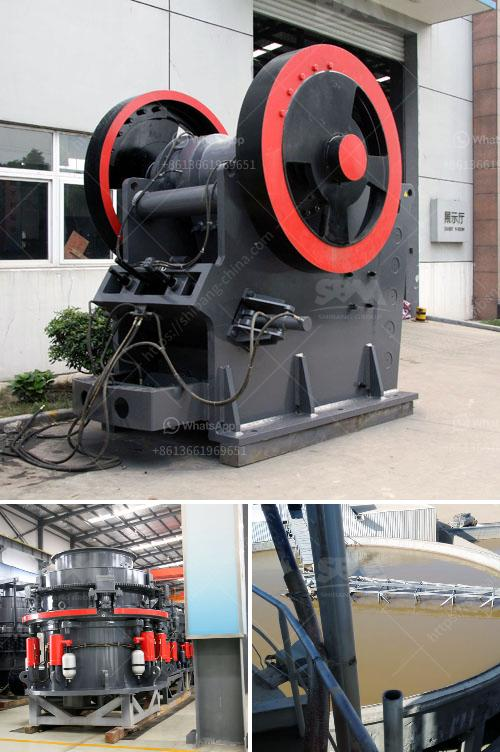

<h3>What are gravel ores that can be crushed by a mobile crusher?</h3>
Gravel ores are natural materials or aggregates found in the ground that are composed of various minerals. They are typically mined and processed for use in construction, landscaping, and other industrial applications. Gravel ores are often crushed into smaller sizes using heavy machinery such as mobile crushers, which enable efficient and convenient processing on-site.

One of the key advantages of using a mobile crusher for crushing gravel ores is the ability to move the crushing equipment closer to the material source. This eliminates the need for transportation and reduces costs associated with hauling large quantities of gravel ores to a stationary crusher. Mobile crushers are equipped with tracks or wheels, allowing them to be easily maneuvered in diverse terrain and reach remote locations.

Various types of gravel ores can be crushed by a mobile crusher, depending on their size, hardness, and composition. Common examples include limestone, granite, basalt, and sandstone. These materials are often used in construction projects, such as building roads, bridges, and buildings, as well as in landscaping applications, like creating driveways, pathways, and garden borders.

Limestone is a sedimentary rock composed mainly of calcium carbonate. It is widely used as a construction material due to its durability and versatility. Mobile crushers can crush large pieces of limestone into smaller sizes suitable for different applications, such as aggregate for road base or filler material in concrete.

Granite is an igneous rock that is extremely hard and durable. It is commonly used for decorative purposes, such as countertops and flooring. Mobile crushers are capable of efficiently crushing granite into various sizes, making it suitable for different types of construction projects.

Basalt is a volcanic rock that is known for its strength and resistance to weathering. It is often used in road construction and as a base material for buildings. Mobile crushers can easily crush basalt into smaller sizes for use in these applications, ensuring efficient utilization of the resource.

Sandstone is a sedimentary rock composed of sand-sized grains held together by a mineral cement. It is widely used as a building material and in landscape design. Mobile crushers can effectively crush sandstone into smaller sizes, making it suitable for use as aggregate in concrete or as decorative elements in gardens.

In summary, gravel ores are natural materials or aggregates that can be crushed by a mobile crusher. This equipment offers the advantage of on-site crushing, eliminating the need for transportation and reducing costs. Various types of gravel ores, including limestone, granite, basalt, and sandstone, can be efficiently processed using a mobile crusher, making them suitable for various construction and landscaping applications.
<h3>Contact us</h3><ul><li><strong>Whatsapp:&nbsp;<a href="https://wa.me/8613661969651">+8613661969651</a></strong></li><li><a href="https://swt.shibang-china.com/?git&amp;zhl&amp;What are gravel ores that can be crushed by a mobile crusher"><strong>Online Service(chat now)</strong></a></li></ul><h3>Related</h3><ul><li><a href='What does a ball mill do in mining.md'>What does a ball mill do in mining?</a></li><li><a href='What kind of quartz can be used in the paint industry and how to get it.md'>What kind of quartz can be used in the paint industry and how to get it?</a></li><li><a href='What kind of equipment is used for fine crushed stone？.md'>What kind of equipment is used for fine crushed stone？</a></li><li><a href='What are equipments used in a cement plant .md'>What are equipments used in a cement plant ?</a></li><li><a href='What is the purpose of using hydraulic cylinders in cone crushers.md'>What is the purpose of using hydraulic cylinders in cone crushers?</a></li></ul>