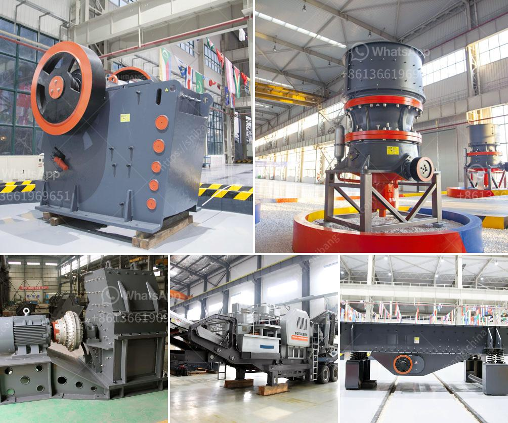

<h3>What are some applications of bauxite ?</h3>
Bauxite is a sedimentary rock mainly composed of aluminum oxide minerals, which are also known as aluminum hydroxides. It is the primary ore of aluminum and is widely used in various industries. Bauxite deposits are found in large quantities worldwide and provide a crucial source of aluminum, which is an essential material used in numerous applications.

One of the primary applications of bauxite is in the manufacturing of aluminum metal. The process of extracting aluminum from bauxite ore involves a two-stage process: refining bauxite to obtain alumina, and then smelting alumina to produce aluminum. The aluminum derived from bauxite is widely used in the automotive, aerospace, construction, electrical, and packaging industries due to its lightweight, corrosion-resistant, and high-strength properties. Approximately 90% of the world's bauxite production is used for aluminum production, making it the most significant application of this mineral.

Another significant application of bauxite is in the production of alumina, also known as aluminum oxide. Alumina is a white powder with various uses, including being a crucial ingredient in the manufacturing of refractory products, ceramics, abrasives, and chemicals. Refractory products, such as furnace linings, crucibles, and kiln furniture, require high-temperature resistance and excellent thermal insulation, which alumina provides. In the ceramics industry, alumina is used to create ceramic parts with exceptional hardness, wear resistance, and electrical insulation.

Bauxite is also employed in the production of aluminum chemicals. Aluminum sulfate, for instance, is widely used in water treatment plants as a flocculating agent to purify drinking water and wastewater. It helps in removing impurities by causing particles to clump together and settle at the bottom, facilitating easier removal. Bauxite residue, a byproduct of alumina production, can also be used to extract rare earth elements (REE), which are vital components in various high-tech applications such as magnets, batteries, and electronics.

Furthermore, bauxite finds applications in the cement industry. It is used as a raw material in the production of clinker, which is the key ingredient in cement manufacturing. Bauxite is combined with limestone, clay, and other materials, then heated in a kiln to produce clinker. This clinker is later ground into a fine powder and blended with gypsum to produce cement. The addition of bauxite helps regulate the composition of the clinker, improving its strength and durability.

Apart from these major applications, bauxite is also used in several minor applications. It is used as an abrasive in sandblasting and grinding media for metal polishing. In the agriculture sector, bauxite is used to condition soil by improving its texture and drainage capabilities. It also helps in reducing soil acidity, thus enhancing plant growth. Bauxite can even be used as a proppant in hydraulic fracturing to prop open fractures and allow oil and gas to flow more efficiently from the well.

In conclusion, bauxite has a wide range of applications in various industries. Its primary use is in the production of aluminum metal, which is widely utilized in transportation, construction, electrical, and packaging sectors. Additionally, bauxite is used in the production of alumina, aluminum chemicals, cement, and numerous minor applications such as abrasives, soil conditioning, and hydraulic fracturing. As a result of its versatility and abundance, bauxite plays a significant role in modern industrial processes and contributes to various aspects of our daily lives.
<h3>Contact us</h3><ul><li><strong>Whatsapp:&nbsp;<a href="https://wa.me/8613661969651">+8613661969651</a></strong></li><li><a href="https://swt.shibang-china.com/?git&amp;zhl&amp;What are some applications of bauxite "><strong>Online Service(chat now)</strong></a></li></ul><h3>Related</h3><ul><li><a href='What are the advantages of a jaw crusher over the gyratory crusher .md'>What are the advantages of a jaw crusher over the gyratory crusher ?</a></li><li><a href='What is the common ore crusher for aluminum.md'>What is the common ore crusher for aluminum?</a></li><li><a href='What RPM does the jaw crusher spin.md'>What RPM does the jaw crusher spin?</a></li><li><a href='What is the cost of a jaw crusher.md'>What is the cost of a jaw crusher?</a></li><li><a href='What are the advantages of a roll crusher compared to other crushers.md'>What are the advantages of a roll crusher compared to other crushers?</a></li></ul>