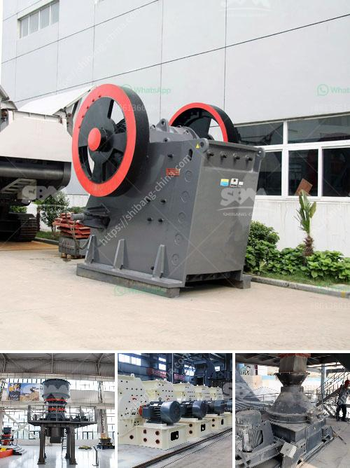

<h3>What are some good ways to improve the capacity of a cement ball mill?</h3>
A cement ball mill is a crucial equipment in the production of cement. It frequently represents the first stage in the comminution of materials used in cement production and is applicable to all types of cement production equipment. As a result of the ball mill's widespread use in cement production, the importance of improving its efficiency and productivity cannot be overstated. In this article, we will highlight some effective ways to enhance the capacity of a cement ball mill.

One potential approach is to use a closed-circuit grinding process. By implementing the pre-grinding process, which further reduces the particle size of the materials before they are fed into the ball mill, the capacity of the ball mill is increased considerably.

Another approach is to enhance the ventilation of the mill. Proper ventilation can help remove the moisture and heat generated by the grinding process, thus improving the mill's operational efficiency. Furthermore, adding a pre-grinding system to a ball mill has become a globally recognized method to increase performance. Adding such a system enables the mill to operate with lower consumption, thereby improving its efficiency.

Moreover, some companies have been using alternative fuels to reduce production costs. In such cases, an additional ball mill would be required. However, investing in an extra mill can be quite expensive. Instead, the capacity of the existing mill can be increased by introducing a pre-grinding system. This can eliminate the need for a separate pre-mill, thus saving investment costs.

Additionally, enhancing the mill's load-carrying capacity can be achieved by increasing its diameter. By increasing the mill's diameter, the residence time of the material inside the mill can be extended, allowing for more efficient grinding. Furthermore, increasing the diameter also allows for an increase in the mill's rotational speed, which further improves grinding efficiency.

Another way to enhance the capacity of a cement ball mill is to replace the closed-circuit system's separator with a pre-grinding system. This removes the fine particles that could negatively affect the mill's efficiency. The pre-grinding system improves the particle size distribution of cement and increases production efficiency.

Furthermore, regular maintenance of the mill is essential. Ensuring that all moving parts are well lubricated and that the mill is clean and free from debris can help maximize its operational capacity. Inspections should be conducted regularly to identify any potential issues and rectify them promptly.

In conclusion, improving the capacity of a cement ball mill is crucial for enhancing the efficiency and profitability of cement production. The aforementioned ways provide effective means to increase the capacity of cement ball mill, which ultimately leads to improved production efficiency and higher profitability.
<h3>Contact us</h3><ul><li><strong>Whatsapp:&nbsp;<a href="https://wa.me/8613661969651">+8613661969651</a></strong></li><li><a href="https://swt.shibang-china.com/?git&amp;zhl&amp;What are some good ways to improve the capacity of a cement ball mill"><strong>Online Service(chat now)</strong></a></li></ul><h3>Related</h3><ul><li><a href='What is the maintenance of a jaw crusher.md'>What is the maintenance of a jaw crusher?</a></li><li><a href='What is the density of crushed stone aggregate 10mm 20mm and 40mm.md'>What is the density of crushed stone aggregate 10mm, 20mm, and 40mm?</a></li><li><a href='What are the processing equipment for feldspar powder？.md'>What are the processing equipment for feldspar powder？</a></li><li><a href='What is a hydraulic cone crusher What are the advantages.md'>What is a hydraulic cone crusher? What are the advantages?</a></li><li><a href='What are the spare parts of a stone crusher.md'>What are the spare parts of a stone crusher?</a></li></ul>