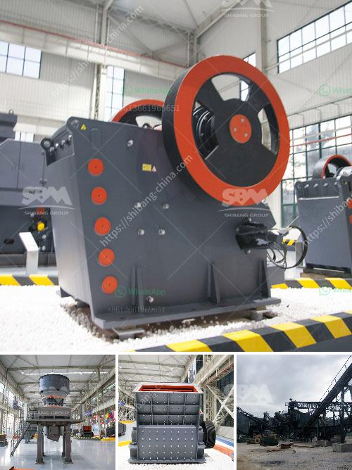

<h3>What are the Different Types of Crusher? How to choose?</h3>
Crushers are important pieces of machinery that are used to reduce the size of different materials. These machines can be categorized into different types depending upon their working principle, the size the material to be crushed, and the desired output size. Let's take a closer look at the different types of crushers available in the market and how to choose the right one for your specific needs.

Jaw crushers are commonly used in the mining and construction industry due to their ability to crush tough and abrasive materials. They consist of a fixed plate, a movable plate, and a cone-shaped hopper. The material is crushed by the two plates as they move towards each other. Jaw crushers are ideal for primary crushing as they deliver high crushing ratios and a large feed opening.

Cone crushers are commonly used for secondary and tertiary crushing stages in the aggregate and mining industries. They work by compressing the material between a mantle and a concave. The crushed material exits the crushing chamber through the discharge port at the bottom of the crusher. Cone crushers are known for their efficiency, versatility, and high capacity.

Impact crushers, also known as hammer crushers, utilize impact force to crush materials. They are ideal for producing smaller sized materials with a high reduction ratio. Impact crushers work by throwing the material against a hard surface, causing it to break and reduce in size. These crushers are commonly used in recycling, mining, and quarrying applications.

Gyratory crushers are primarily used for primary crushing in the mining industry. These crushers have a conical head and a concave surface. The material is crushed between the head and concave as it moves downward. Gyratory crushers are capable of producing large quantities of uniform material in a short period.

Roll crushers are used for primary and secondary crushing of materials that are relatively low in abrasiveness and moisture content. These machines consist of two rolls, one of which is fixed while the other is movable. The material is fed into the gap between the rolls and crushed as they rotate towards each other.

- Material: The type of material being crushed will determine the type of crusher to be selected. Some materials are more abrasive and require crushers with higher strength and durability.

- Output Size: The desired output size will dictate the type of crusher required. Different crushers have different reduction ratios, and some are better suited for producing smaller or larger outputs.

- Capacity: The capacity of the crusher should match the required production capacity of the plant or operation.

- Maintenance: Consider the ease of maintenance and availability of spare parts for the chosen crusher. 

In conclusion, selecting the right type of crusher is crucial for achieving the desired size, shape, and quality of the final product. Understanding the material being crushed, the required output size, and the capacity will help in making an informed decision. Consulting with experts and conducting thorough research will further aid in selecting the right crusher for your specific needs.
<h3>Contact us</h3><ul><li><strong>Whatsapp:&nbsp;<a href="https://wa.me/8613661969651">+8613661969651</a></strong></li><li><a href="https://swt.shibang-china.com/?git&amp;zhl&amp;What are the Different Types of Crusher How to choose"><strong>Online Service(chat now)</strong></a></li></ul><h3>Related</h3><ul><li><a href='What is a ball mill.md'>What is a ball mill?</a></li><li><a href='What is a dry ball mill.md'>What is a dry ball mill?</a></li><li><a href='What crusher produces rock in limestone .md'>What crusher produces rock in limestone ?</a></li><li><a href='what is the cost of an 200mt capacity of cement plant？.md'>what is the cost of an 200mt capacity of cement plant？</a></li><li><a href='What is the waste from an orecrushing plant.md'>What is the waste from an ore-crushing plant?</a></li></ul>