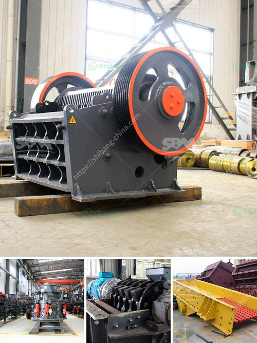

<h3>What are the advantages of a jaw crusher over the gyratory crusher ?</h3>
A jaw crusher is a compression type of crusher. It utilizes a smaller eccentric shaft, compared to the gyratory crusher, to crush materials. The equipment is renowned for its high efficiency in crushing hard and abrasive materials in both the aggregate and mining industries. It benefits from a sturdy construction, as well as an extremely high crushing ratio. These qualities make it an effective and popular choice in the industry.

One of the key advantages of a jaw crusher is its ability to process a wide range of materials. Some of the materials commonly processed include limestone, gravel, granite, quartz, and blast furnace slag, among others. The jaw crusher can process these materials to a relatively uniform size, allowing them to be used for various applications without the need for additional crushing stages.

Furthermore, the jaw crusher reduces the size of the rocks by progressively crushing them into smaller pieces. This process significantly reduces the amount of fines and slimes produced, resulting in a more uniform product. Additionally, it minimizes the generation of dust and noise, making it a more environmentally friendly option.

Another advantage of the jaw crusher is its versatility. The machine can handle a wide range of materials and can be used in various applications. For example, it can be used for crushing rocks into a variety of sizes and is often used in the construction industry for breaking down large rocks into smaller pieces for gravel or rock dust. It can also be used in the mining industry to extract valuable ores and reduce them to a smaller size for further processing.

In addition to these advantages, the jaw crusher also has an easy-to-use operating system and an efficient hydraulic system. These mechanisms allow the equipment to operate smoothly, further enhancing its efficiency. The jaw crusher also features low energy consumption and significantly reduced noise levels when compared to other crushing equipment.

One final advantage of the jaw crusher is its affordability. The machine is quite affordable and is available in a variety of models, making it an ideal choice for small to medium-sized businesses. Additionally, the jaw crusher has a low maintenance cost and boasts a long lifespan, which makes it a cost-effective option.

In conclusion, the jaw crusher is a superior machine compared to the gyratory crusher. It benefits from a higher reduction ratio, a more uniform product size, and a lower operational and maintenance cost. With so many advantages, it is an excellent choice in various crushing applications. Whether in the aggregate or mining industry, the jaw crusher proves to be a reliable and efficient machine.
<h3>Contact us</h3><ul><li><strong>Whatsapp:&nbsp;<a href="https://wa.me/8613661969651">+8613661969651</a></strong></li><li><a href="https://swt.shibang-china.com/?git&amp;zhl&amp;What are the advantages of a jaw crusher over the gyratory crusher "><strong>Online Service(chat now)</strong></a></li></ul><h3>Related</h3><ul><li><a href='What guards should be installed on a jaw crusher.md'>What guards should be installed on a jaw crusher?</a></li><li><a href='What is a single toggle jaw crusher.md'>What is a single toggle jaw crusher?</a></li><li><a href='what equipments are used in the production of bentonite？.md'>what equipments are used in the production of bentonite？</a></li><li><a href='what size material can be made with an impact crusher？.md'>what size material can be made with an impact crusher？</a></li><li><a href='What size aggregate is used in concrete.md'>What size aggregate is used in concrete?</a></li></ul>