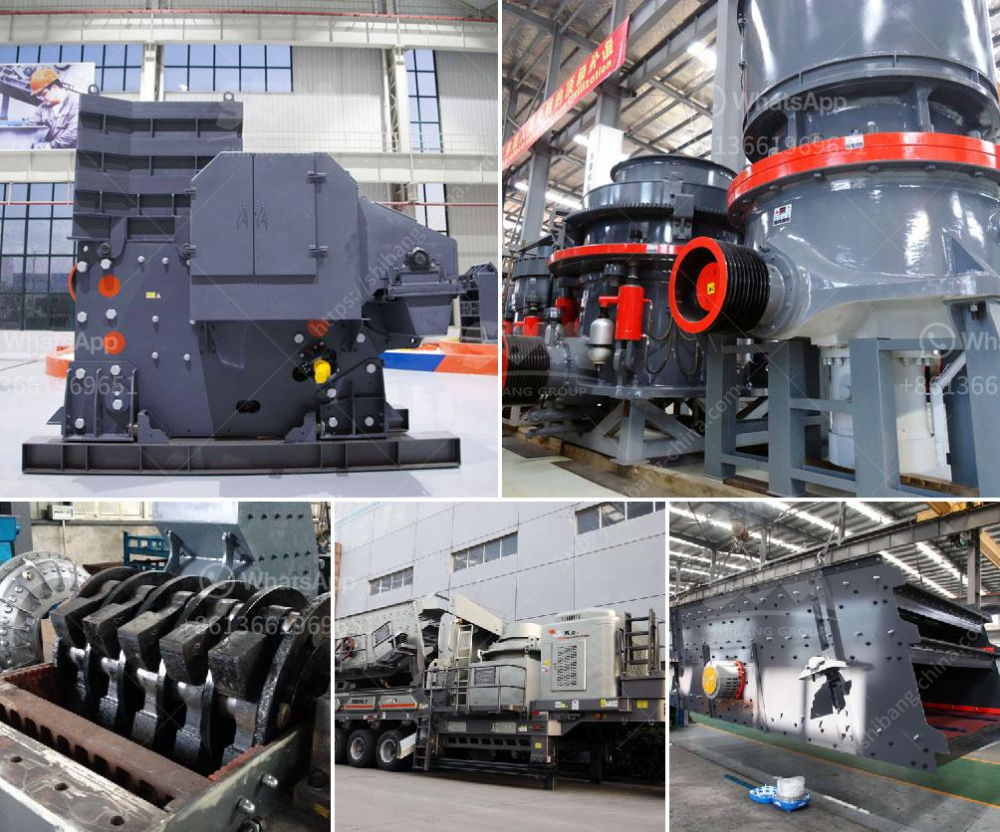

<h3>What are the advantages of a roll crusher compared to other crushers?</h3>
A roll crusher is a piece of heavy-duty equipment used in mining and industrial processes. It features a pair of large wheels or cylinders mounted on horizontal axis. When rocks, ore, and other materials pass between the two cylinders, they are crushed or ground into smaller pieces. A roll crusher can be used in a wide variety of applications, including concrete recycling, coal mining, and mineral or metal production. 

Some advantages of roll crushers are they give a very fine product size distribution and they produce very little dust or fines. Rolls crushers are effectively used in minerals crushing where the ores are not too abrasive and they are also used in smaller scale production mining of more abrasive metal ores. 

To illustrate, if we take an example of iron ore, roll crushers can handle such materials as clay or silt contaminated with large quantities of hematite or magnetite, which results in a sticky feed material. In such cases, the feed material roller crusher can crush includes limestone, gypsum, coal, lime as well as other soft-rocks of similar texture. The squeezing principle used by roll crushers gives an extremely fine product size distribution and produces very little dust or fines.

Another advantage of roll crushers is their ability to produce a narrow particle size distribution, thus minimizing the production of undesired product sizes. Efficient crushing is achieved by means of a single motor and a single module with hopper, thus reducing complexity and cost. Moreover, roll crushers are equipped with shear and pinching points of safety measures to prevent any damage to the rolls or other motors and transmission parts. 

Roll crushers are also energy efficient, reducing energy consumption by approximately 35-40% compared to other crushers. This efficiency is due to the principle of crushing by minimal pressure, which allows manufacturers to maximize the quality and uniformity of the product grains.

Additionally, roll crushers are small in footprint and easy to install and maintain. Unlike other types of crushers, such as jaw crushers and cone crushers, which can require lots of maintenance work, roll crushers have a simple structure and few parts, meaning less maintenance time and cost. Furthermore, roll crushers are particularly suitable for use in confined spaces and in environments where there is a restricted amount of space available for equipment installation.

In conclusion, roll crushers offer a cost-effective solution for processing a wide variety of materials, while providing several advantages compared to other crushers. These machines present numerous benefits in terms of low maintenance requirements, easy operation, compact size, and the ability to produce a narrow particle size distribution. Overall, roll crushers provide an efficient and cost-effective way to process materials, making them a preferred choice in mining, mineral processing, and construction industries.
<h3>Contact us</h3><ul><li><strong>Whatsapp:&nbsp;<a href="https://wa.me/8613661969651">+8613661969651</a></strong></li><li><a href="https://swt.shibang-china.com/?git&amp;zhl&amp;What are the advantages of a roll crusher compared to other crushers"><strong>Online Service(chat now)</strong></a></li></ul><h3>Related</h3><ul><li><a href='What are the characteristics of the spring cone crusher.md'>What are the characteristics of the spring cone crusher?</a></li><li><a href='what is the cost of stone crusher？.md'>what is the cost of stone crusher？</a></li><li><a href='What is the difference between mining and crushing.md'>What is the difference between mining and crushing?</a></li><li><a href='What to people use silica sand mining for .md'>What to people use silica sand mining for ?</a></li><li><a href='What are the advantages of hammer mills used in the mining industry？.md'>What are the advantages of hammer mills used in the mining industry？</a></li></ul>