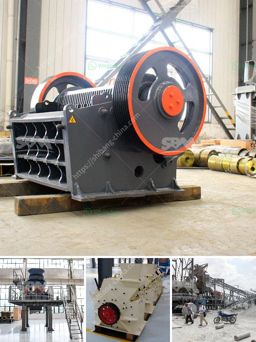

<h3>What are the advantages of dry magnetic separator？</h3>
In various industries, magnetic separators are used for removing magnetic materials from a mixture. The traditional wet magnetic separation process requires high water consumption and is not suitable for areas with water scarcity. In contrast, dry magnetic separators, which operate without water, have become a popular choice due to their numerous advantages. 

One key advantage of dry magnetic separators is their ability to effectively separate ferromagnetic and paramagnetic materials. Ferromagnetic materials, such as iron and steel, can be easily separated using dry magnetic separators. This is particularly useful in mining operations where the extraction of iron ore, for example, requires the removal of unwanted ferromagnetic impurities. Additionally, dry magnetic separators are highly efficient in separating paramagnetic materials, which have weak magnetic properties. This makes them suitable for applications in the recycling industry, where non-ferrous metals like aluminum and copper need to be separated from other materials.

Another significant advantage of dry magnetic separators is their low operating cost. Unlike wet separators, dry separators do not require a constant supply of water, reducing the overall operational expenses. This is especially beneficial in remote locations or areas with limited water resources. Dry magnetic separators also have a lower maintenance cost as they do not require frequent cleaning or replacement of water filters. Their minimal maintenance requirements contribute to a longer lifespan and increased overall efficiency.

Furthermore, dry magnetic separators offer a more environmentally friendly option compared to their wet counterparts. The elimination of water usage reduces the depletion of water resources, making dry magnetic separators a sustainable choice. Additionally, the absence of water reduces the risk of contaminating the environment with potentially hazardous substances that may be present in the process water.

Dry magnetic separators are also known for their compact design, which results in a smaller footprint compared to wet separators. This makes them suitable for installation in limited spaces, allowing for more flexible and efficient integration into existing plant layouts. The compact design also simplifies transportation and installation, saving time and resources.

In terms of operation, dry magnetic separators provide a high level of automation, making them user-friendly and easily controllable. With advanced electronic controls and monitoring systems, operators can easily adjust the magnetic field intensity, belt speed, and other parameters to optimize the separation process. Additionally, dry magnetic separators are equipped with self-cleaning mechanisms that prevent the buildup of magnetic material on the separator's surface, reducing downtime for maintenance.

In conclusion, dry magnetic separators offer a multitude of advantages over traditional wet separators. Their ability to effectively separate ferromagnetic and paramagnetic materials, low operating costs, environmental friendliness, compact design, and ease of operation make them an excellent choice for various industries. As technology continues to advance, the future of magnetic separation is likely to favor the use of dry magnetic separators as a more efficient and sustainable solution.
<h3>Contact us</h3><ul><li><strong>Whatsapp:&nbsp;<a href="https://wa.me/8613661969651">+8613661969651</a></strong></li><li><a href="https://swt.shibang-china.com/?git&amp;zhl&amp;What are the advantages of dry magnetic separator？"><strong>Online Service(chat now)</strong></a></li></ul><h3>Related</h3><ul><li><a href='What is the best design for stone screening equipment.md'>What is the best design for stone screening equipment</a></li><li><a href='What raw materials and equipment are needed for artificial sand.md'>What raw materials and equipment are needed for artificial sand?</a></li><li><a href='what is a mobile impactor crusher？.md'>what is a mobile impactor crusher？</a></li><li><a href='What are the models of Raymond mill.md'>What are the models of Raymond mill?</a></li><li><a href='what is the cost of stone crusher？.md'>what is the cost of stone crusher？</a></li></ul>