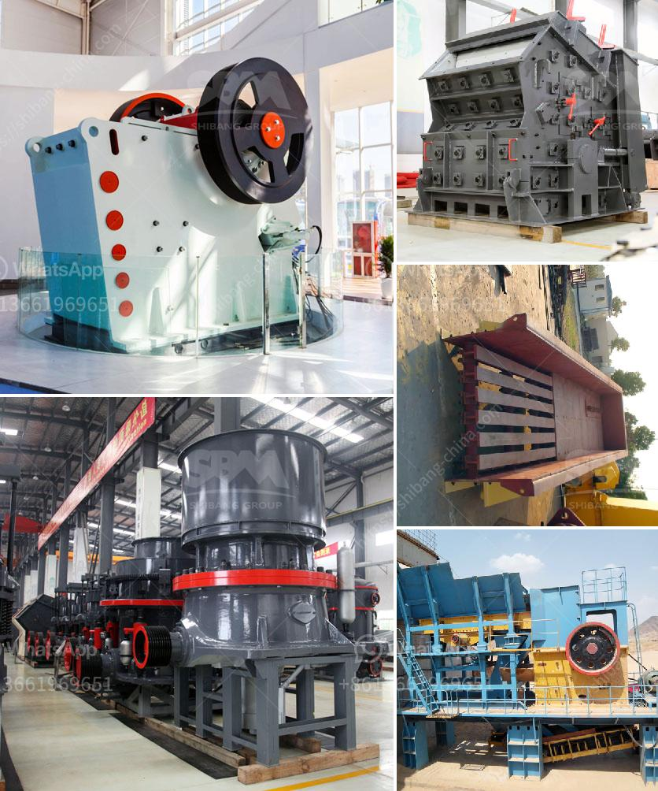

<h3>What are the advantages of hammer mills used in the mining industry？</h3>
In the mining industry, hammer mills are a highly sought-after piece of equipment. These versatile machines provide numerous benefits for miners and operators alike, helping them to process a wide range of materials efficiently and effectively. From crushing rocks and minerals to pulverizing concrete and glass, hammer mills have a significant impact on the mining industry. In this article, we will explore the advantages of hammer mills used in the mining industry.

One of the key advantages of a hammer mill is its ability to produce a wide range of particle sizes. This means that miners can easily adjust the size of the final product, based on their specific needs. Whether they need fine powders for chemical applications or larger aggregates for construction purposes, hammer mills can deliver the desired particle size with ease.

Additionally, hammer mills offer flexibility in terms of material processing. They can handle a variety of materials, including soft rocks like limestone and harder materials like granite or basalt. This versatility allows mining operations to process multiple materials using a single piece of equipment, saving time and money.

Another advantage of hammer mills in the mining industry is their low energy consumption. Compared to other types of machinery, hammer mills require relatively little energy to function properly. This means that operators can keep their energy costs low while still achieving high levels of production.

Furthermore, hammer mills are known for their durability and robust construction. They are designed to withstand high-impact conditions, making them ideal for the harsh environments often found in mining operations. Whether it's crushing hard rocks or pulverizing tough materials, hammer mills can handle the task with ease, ensuring a long-lasting and reliable operation.

In addition to their durability, hammer mills are also relatively easy to maintain. They typically require minimal upkeep, reducing the time and resources needed for maintenance. This is especially advantageous in remote mining locations where access to specialized technicians may be limited.

Another advantage of using hammer mills in the mining industry is their ability to operate in wet conditions. Wet grinding is essential in many mining operations, as it helps to liberate valuable minerals from the surrounding ore. Hammer mills can effectively break down wet materials and provide consistent particle size reduction, even with high moisture content.

Lastly, hammer mills are a cost-effective solution for mining operations. They have lower operational costs compared to other crushing equipment, making them an attractive option for both large and small-scale mining operations. The initial investment is typically lower, and their efficient performance and durability result in long-term cost savings.

In conclusion, hammer mills offer numerous advantages for the mining industry. Their ability to produce various particle sizes, process a wide range of materials, and handle wet conditions make them indispensable in mining operations. Their durability, low energy consumption, and low maintenance requirements further contribute to their appeal. As a cost-effective solution, hammer mills can help mining operations maximize their productivity and profitability.
<h3>Contact us</h3><ul><li><strong>Whatsapp:&nbsp;<a href="https://wa.me/8613661969651">+8613661969651</a></strong></li><li><a href="https://swt.shibang-china.com/?git&amp;zhl&amp;What are the advantages of hammer mills used in the mining industry？"><strong>Online Service(chat now)</strong></a></li></ul><h3>Related</h3><ul><li><a href='What is the production process of stone aggregates .md'>What is the production process of stone aggregates ?</a></li><li><a href='What is an impact crusher and what is its working principle.md'>What is an impact crusher and what is its working principle?</a></li><li><a href='What is the process that coal goes through to become a finished product.md'>What is the process that coal goes through to become a finished product?</a></li><li><a href='What equipment do you need for coal mining.md'>What equipment do you need for coal mining?</a></li><li><a href='What points should be checked by a maintenance PM on a ball mill.md'>What points should be checked by a maintenance PM on a ball mill?</a></li></ul>