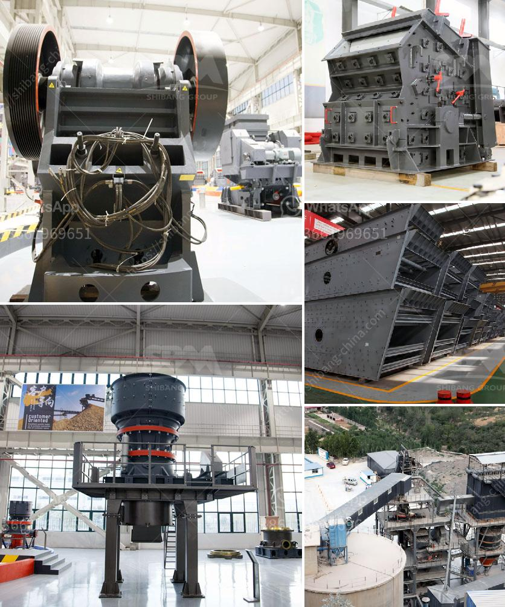

<h3>What are the basic geotechnical issues involved in quarry development?</h3>
Quarry development involves intricate planning and engineering processes to ensure the successful extraction of valuable resources from the earth's surface. Geotechnical issues play a crucial role in this development, as they assess the natural materials and conditions that impact the stability and feasibility of the quarry site. Understanding and managing these geotechnical challenges are essential to ensure safe and sustainable quarry operations.

One of the primary geotechnical issues involved in quarry development is the assessment of the rock and soil conditions. Geotechnical engineers analyze the composition, strength, and stability of the rocks to determine the excavation methods and ensure safe operations. The type of rock, its hardness, and its fracturing properties all affect the quarrying process. Understanding these factors allows engineers to select the appropriate techniques and machinery for rock excavation.

Moreover, the presence of faults and fractures in the rock formations poses a significant geotechnical challenge. These discontinuities can weaken the rock mass and increase the risk of slope instability. Geotechnical investigations help identify these structures and assess their potential impact on the quarrying operations. Proper measures, such as controlled blasting methods or reinforcement techniques, need to be implemented to mitigate the risks associated with these geological features.

Another geotechnical concern in quarry development is the evaluation of groundwater conditions. Groundwater can impact the stability of walls and slopes in the quarry, hence it must be efficiently managed to prevent slope failure or flooding. Geotechnical investigations include drilling boreholes and installing monitoring wells to understand the hydrogeological aspects of the area. This data is crucial in designing appropriate dewatering systems or implementing adequate drainage measures to maintain safe working conditions.

Furthermore, the design and stability of quarry slopes are critical geotechnical considerations. Slope stability analysis helps identify potential failure mechanisms, such as sliding or rock falls, that can jeopardize worker safety and equipment. Geotechnical engineers use various methods like numerical modeling, physical testing, and site monitoring to assess the stability and design suitable slopes that can withstand the operational loads and forces.

Soil erosion and sediment control are also vital geotechnical aspects in quarry development. The removal of topsoil and vegetation during the quarrying process can expose the underlying soil, leading to erosion. Sediment runoff can affect nearby water bodies, potentially harming the environment. Geotechnical engineers work on implementing appropriate erosion control measures, such as berms, sedimentation ponds, or surface water diversions, to minimize soil erosion and protect water quality.

In conclusion, quarry development involves a range of geotechnical challenges that must be thoroughly understood and managed for safe and sustainable operations. Evaluating rock and soil conditions, identifying faults and fractures, assessing groundwater conditions, designing stable slopes, and implementing erosion control measures are all crucial steps in successful quarry development. Geotechnical engineers play a pivotal role in addressing these issues and ensuring the quarry's longevity while minimizing environmental impacts and prioritizing worker safety.
<h3>Contact us</h3><ul><li><strong>Whatsapp:&nbsp;<a href="https://wa.me/8613661969651">+8613661969651</a></strong></li><li><a href="https://swt.shibang-china.com/?git&amp;zhl&amp;What are the basic geotechnical issues involved in quarry development"><strong>Online Service(chat now)</strong></a></li></ul><h3>Related</h3><ul><li><a href='What should I know about a crusher plant.md'>What should I know about a crusher plant?</a></li><li><a href='What machines are used in mines.md'>What machines are used in mines?</a></li><li><a href='What equipment is used to extract iron ore .md'>What equipment is used to extract iron ore ?</a></li><li><a href='What machines are used in quarry mining What is the role of each.md'>What machines are used in quarry mining? What is the role of each?</a></li><li><a href='What is the cost of gravel crushing .md'>What is the cost of gravel crushing ?</a></li></ul>