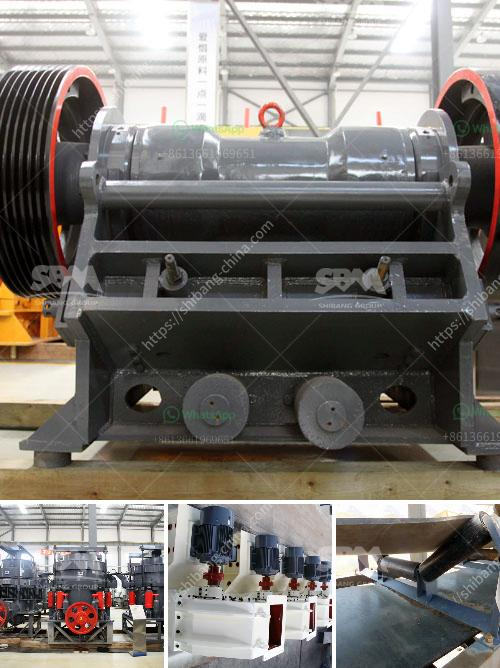

<h3>What are the byproducts of mining quartz?</h3>
Mining quartz is not for the faint of heart. The process involves extracting this precious mineral from deep within the earth, often in extreme conditions and challenging environments. While the end product, quartz, is widely used in various applications due to its unique properties, the extraction process generates several byproducts that need careful consideration. Let's delve into the world of quartz mining and explore its byproducts.

Quartz mining typically involves the use of heavy machinery, explosives, and drilling equipment to reach the quartz deposits buried underground. This process can lead to the release of dust particles into the air, which may contain crystalline silica. Crystalline silica, commonly known as silica dust, is a hazardous substance that poses health risks if inhaled. Silica dust particles are extremely small and can penetrate deep into the lungs, causing respiratory issues such as silicosis, lung cancer, and chronic obstructive pulmonary disease (COPD).

To mitigate these risks, mining companies employ various safety measures like water sprays and ventilation systems to control the emission of silica dust. Workers are equipped with personal protective equipment, including respiratory masks, to avoid inhaling dust particles. Strict regulations and guidelines are in place to ensure the safety of workers and the surrounding environment during the mining process.

Another byproduct of quartz mining is wastewater. The extraction process often requires water to separate the quartz from other minerals or impurities. The water used becomes contaminated and requires treatment before it can be safely discharged back into the environment. Wastewater treatment facilities are employed to remove impurities and chemicals from the water, ensuring it meets regulatory standards for release.

Mining operations can also result in soil erosion and habitat fragmentation, impacting local ecosystems. To mitigate these effects, environmental management plans are implemented to restore and rehabilitate disturbed areas. Strategies such as re-vegetation, erosion control measures, and wildlife conservation efforts are employed to minimize the ecological footprint of quartz mining.

Quartz mining byproducts also include waste rock and tailings. Waste rock refers to the overburden or unnecessary material that is removed during the mining process. Tailings are the finely crushed ore residue that remains after extraction. Both waste rock and tailings require proper disposal to prevent environmental contamination. Mining companies employ various methods such as containment ponds, land reclamation, and tailings dams to safely manage and store these byproducts.

Additionally, the energy consumption associated with quartz mining is also a consideration. Extracting quartz requires large amounts of energy for machinery operation, transportation, and processing. Mining companies are continuously exploring ways to reduce energy consumption through efficient machinery, renewable energy sources, and technological advancements.

In conclusion, quartz mining is a complex process that yields a valuable end product but also generates several byproducts that require careful management. From silica dust control to wastewater treatment, waste disposal, and habitat restoration, mining companies must prioritize environmental and worker safety. Continuous improvements in mining practices, along with adherence to regulations and best practices, ensure that the byproducts of quartz mining are responsibly managed, reducing the impact on both human health and the environment.
<h3>Contact us</h3><ul><li><strong>Whatsapp:&nbsp;<a href="https://wa.me/8613661969651">+8613661969651</a></strong></li><li><a href="https://swt.shibang-china.com/?git&amp;zhl&amp;What are the byproducts of mining quartz"><strong>Online Service(chat now)</strong></a></li></ul><h3>Related</h3><ul><li><a href='What is the need to replace the jaw crusher plate？.md'>What is the need to replace the jaw crusher plate？</a></li><li><a href='What kind of quartz can be used in the paint industry and how to get it.md'>What kind of quartz can be used in the paint industry and how to get it?</a></li><li><a href='What is 42 and 65 in 42×65 gyratory crusher.md'>What is 42 and 65 in 42×65 gyratory crusher?</a></li><li><a href='What is a ball mill used for in gold mining.md'>What is a ball mill used for in gold mining?</a></li><li><a href='What are the features of a jaw crusher.md'>What are the features of a jaw crusher?</a></li></ul>