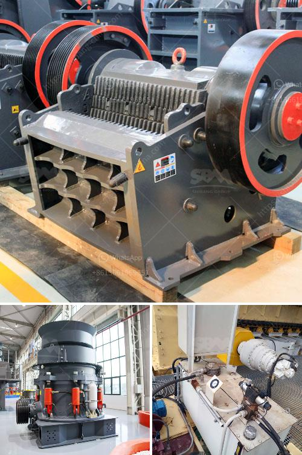

<h3>What are the cement mill pre-crushing equipment ?</h3>
In the cement production process, there are several important stages that require the use of different equipment. One of these stages is pre-crushing, where various types of cement mill pre-crushing equipment are used to reduce the size of clinker before it enters the grinding mill. This article will explore the different types of pre-crushing equipment commonly used in cement mills and their significance in the production process.

One of the primary pre-crushing equipment used in the cement industry is a hydraulic hammer crusher. It is specifically designed to break large chunks of materials such as rock, clinker, and limestone into smaller pieces. The hammer crusher operates by applying high pressure to the materials, resulting in their fragmentation or pulverization. The crushed materials are then transported through conveyor belts to the clinker storage or directly to the cement mill for grinding.

Another commonly used pre-crushing equipment is a jaw crusher. This machine uses a set of vertically positioned jaws to repeatedly compress and break down the materials between them. Jaw crushers are particularly suited for reducing hard and abrasive materials, often found in cement production. With their sturdy construction and high compression force, jaw crushers ensure efficient and reliable pre-crushing of clinker and other raw materials.

Similarly, impact crushers are also utilized in cement mills for pre-crushing purposes. These crushers rely on impact force to break down the materials. They feature a rotating rotor equipped with blow bars that strike the incoming clinker or other raw materials, causing them to break apart. Impact crushers are known for their versatility and high production capacity, making them an ideal choice for cement mill pre-crushing.

Additionally, roller crushers are commonly used in cement mills for pre-crushing clinker material. These machines consist of two parallel, horizontally positioned rollers that rotate in opposite directions. The clinker material is fed between the rollers, which crush it into smaller pieces. Roller crushers are known for their reliability, ease of operation, and ability to handle hard materials efficiently.

The significance of pre-crushing equipment in cement mills cannot be underestimated. Successful pre-crushing of clinker and other raw materials ensures a consistent and uniform feed for the grinding mill, resulting in higher mill efficiency and reduced energy consumption. It also helps to minimize wear and tear on the grinding mill components, prolonging their lifespan and reducing maintenance costs. By breaking down the materials before they enter the grinding mill, pre-crushing equipment also helps to achieve a finer and more homogeneous cement product, improving its quality and strength.

In conclusion, cement mills require effective pre-crushing equipment to ensure an efficient and reliable production process. Hydraulic hammer crushers, jaw crushers, impact crushers, and roller crushers are commonly used in cement mills for pre-crushing clinker and other raw materials. Each equipment type has its unique characteristics and benefits, contributing to the overall success of the cement production process.
<h3>Contact us</h3><ul><li><strong>Whatsapp:&nbsp;<a href="https://wa.me/8613661969651">+8613661969651</a></strong></li><li><a href="https://swt.shibang-china.com/?git&amp;zhl&amp;What are the cement mill precrushing equipment "><strong>Online Service(chat now)</strong></a></li></ul><h3>Related</h3><ul><li><a href='what is iron ore screening equipment？.md'>what is iron ore screening equipment？</a></li><li><a href='What type of couplings are generally used for a gyratory crusher.md'>What type of couplings are generally used for a gyratory crusher?</a></li><li><a href='What is the cost of a jaw crusher.md'>What is the cost of a jaw crusher?</a></li><li><a href='What are the advantages of dry magnetic separator？.md'>What are the advantages of dry magnetic separator？</a></li><li><a href='What is the cost of a 32ton per hour aggregate crusher in China.md'>What is the cost of a 32-ton per hour aggregate crusher in China?</a></li></ul>