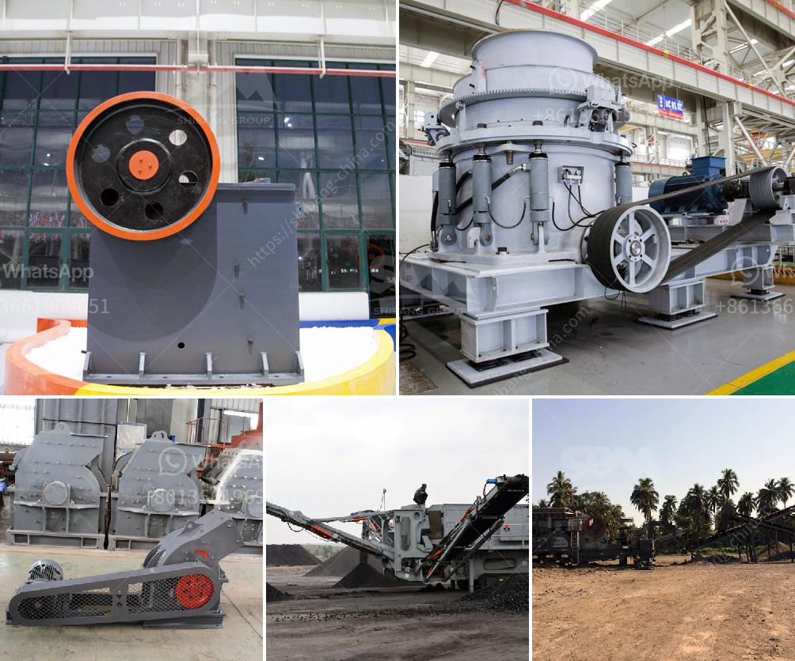

<h3>What are the characteristics of the spring cone crusher?</h3>
The spring cone crusher, also known as the Symons cone crusher, is an efficient and efficient crushing machine, which is widely used in various industries such as mining, road construction, chemical industry, metallurgy, and more. It is suitable for crushing rocks and ores with medium hardness or above.

Firstly, the spring cone crusher has a reasonable structure. It consists of a moving cone, a fixed cone, a crushing wall, a transmission mechanism, a motor, and a control system. The moving cone is driven by a motor, and the eccentric sleeve rotates to move the moving cone in a swinging motion. This design ensures a symmetrical crushing chamber and uniform crushing force, resulting in a higher crushing efficiency.

Secondly, the spring cone crusher has great crushing performance. It has a large stroke, which allows the crushing cavity to have a larger space for ore particles to pass through. This greatly improves the crushing capacity and efficiency. Additionally, the spring cone crusher has a good particle size distribution, as the crushing cavity is specially designed to interlock the particles, resulting in a more uniform size distribution of the crushed materials.

Thirdly, the spring cone crusher is easy to operate and maintain. The operation of the machine is simple, with a clear and intuitive control system. Operators can easily adjust the discharge opening to control the particle size of the crushed materials. The cone crusher also has a variety of safety features, such as overload protection and iron release, ensuring the safety of the operation. In terms of maintenance, the spring cone crusher requires less frequent maintenance compared to other crushers. The easily replaceable wear parts make maintenance easier and reduce downtime.

Fourthly, the spring cone crusher has a wide range of applications. It is suitable for crushing various types of ores and rocks with medium or above hardness, such as iron ore, copper ore, limestone, quartz, granite, basalt, and more. The cone crusher is often used in secondary or tertiary crushing stages, providing high-quality end products for construction projects, road construction, and other industries.

Lastly, the spring cone crusher has a long service life. The main components of the machine, including the crushing wall and the crushing cone, are made of high-strength materials, which are more resistant to wear and corrosion. The advanced manufacturing technology ensures the reliability and durability of the machine, prolonging its service life and reducing the maintenance costs for users.

To summarize, the spring cone crusher has several key characteristics that make it stand out in the crushing industry. Its reasonable structure, excellent crushing performance, easy operation and maintenance, wide range of applications, and long service life make it a popular choice for many operators in various industries.
<h3>Contact us</h3><ul><li><strong>Whatsapp:&nbsp;<a href="https://wa.me/8613661969651">+8613661969651</a></strong></li><li><a href="https://swt.shibang-china.com/?git&amp;zhl&amp;What are the characteristics of the spring cone crusher"><strong>Online Service(chat now)</strong></a></li></ul><h3>Related</h3><ul><li><a href='what size material can be made with an impact crusher？.md'>what size material can be made with an impact crusher？</a></li><li><a href='What type of crusher used for copper ore crushing.md'>What type of crusher used for copper ore crushing?</a></li><li><a href='What is the process of crushing copper ore.md'>What is the process of crushing copper ore?</a></li><li><a href='What is a hammer mill work.md'>What is a hammer mill work?</a></li><li><a href='What equipment is required for quartz sand production.md'>What equipment is required for quartz sand production?</a></li></ul>