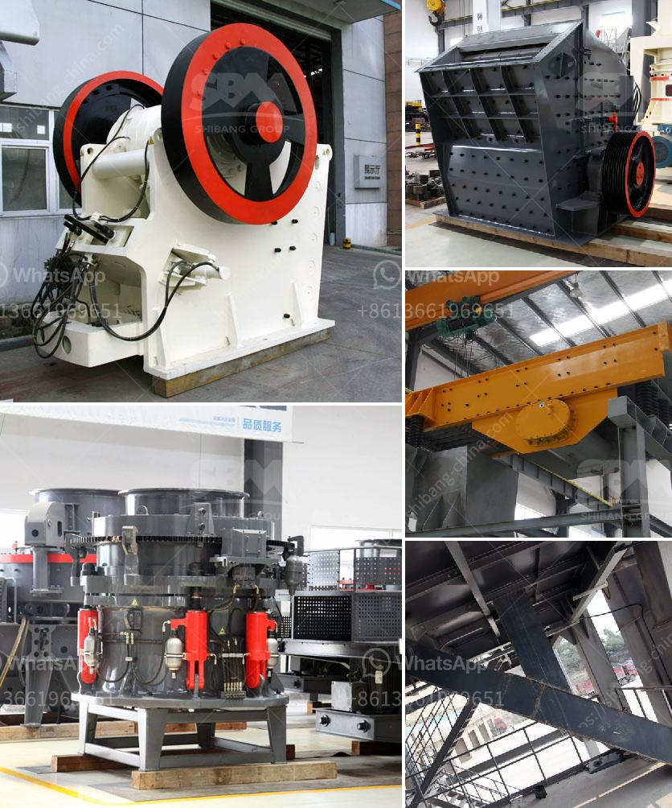

<h3>What are the coal sizing requirements for a power plant?</h3>
When it comes to coal-fired power plants, one critical factor that directly impacts their efficiency and performance is the coal sizing. Coal sizing refers to the process of sorting or categorizing coal particles based on their size distribution before they are utilized in the power generation process. Proper coal sizing is essential for ensuring optimal combustion, reduced emissions, and maximum energy production.

Different power plant designs and combustion systems have their unique coal sizing requirements to achieve optimal functioning. However, there are certain general guidelines and standards that power plants must adhere to when it comes to coal sizing. Let's explore the coal sizing requirements for power plants in more detail.

Coal particles used in power plants are typically categorized into different size fractions. The particle size distribution plays a crucial role in achieving optimal combustion. If the coal particles are too large, they may not burn completely, leading to reduced efficiency and increased emissions. On the other hand, if the particles are too small, they can cause operational issues such as clogging and uneven combustion.

To achieve the desired particle size distribution, coal is usually crushed before being fed into the power plant. Coal crushers or pulverizers are used to break down larger coal particles into smaller ones. Different types of crushers are available, such as jaw crushers, gyratory crushers, cone crushers, and impact crushers, each suitable for specific coal sizes and desired product specifications.

Before utilizing coal in a power plant, it undergoes various fuel preparation processes, including sizing. The coal is typically ground into a powder-like consistency to improve its combustion efficiency and maximize energy extraction. The fineness of the coal powder also affects the overall combustion characteristics.

Proper storage and handling of coal are crucial to prevent particle degradation and maintain the desired size distribution. Coal is often stored in stockpiles or silos, and appropriate measures are taken to prevent moisture absorption, which can lead to a decrease in coal particle size and subsequent combustion issues.

Power plants need to ensure that their crushing and pulverizing equipment is properly designed and maintained to achieve the required coal sizing requirements. Regular inspections, maintenance, and replacement of worn parts are essential to avoid operational inefficiencies and safety hazards.

In conclusion, coal sizing is a critical aspect of power plant operations. Achieving the right particle size distribution is essential for optimal combustion, reduced emissions, and maximum energy production. Coal crushing, fuel preparation, storage, and equipment maintenance all contribute to meeting the coal sizing requirements for a power plant. By adhering to these requirements, power plants can ensure smooth operations, longer equipment lifespan, and a more sustainable energy production process.
<h3>Contact us</h3><ul><li><strong>Whatsapp:&nbsp;<a href="https://wa.me/8613661969651">+8613661969651</a></strong></li><li><a href="https://swt.shibang-china.com/?git&amp;zhl&amp;What are the coal sizing requirements for a power plant"><strong>Online Service(chat now)</strong></a></li></ul><h3>Related</h3><ul><li><a href='What is the best granite crusher machine.md'>What is the best granite crusher machine?</a></li><li><a href='What equipment is used for silver mining.md'>What equipment is used for silver mining?</a></li><li><a href='What are the different types of cone crushers.md'>What are the different types of cone crushers?</a></li><li><a href='What are the features of a jaw crusher.md'>What are the features of a jaw crusher?</a></li><li><a href='what are common raw materials for artificial sand.md'>what are common raw materials for artificial sand</a></li></ul>