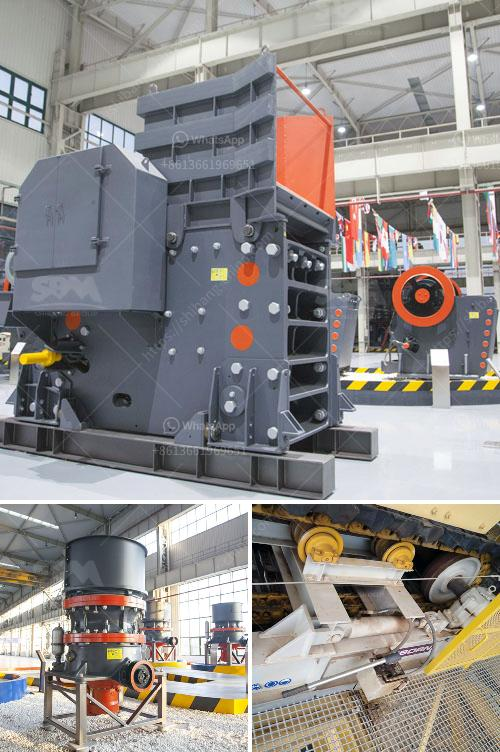

<h3>What are the different parts of a crusher in a power plant?</h3>
A crusher is an essential piece of equipment in any power plant. It is used to reduce the size of large rocks into smaller rocks or gravel, making it easier to burn for energy in the power plant's combustion chamber. The crusher consists of a rock hammer, a breaker plate, an impact liner, and a jaw plate. All these parts are crucial for the smooth functioning of the crusher.

The rock hammer is a crucial part of the crusher's operation. It is typically made of steel, and it is used to break large rocks into smaller pieces that can be handled more easily. The rock hammer is powered by hydraulic cylinders that apply pressure to it, allowing it to strike the rocks with immense force. This force is what enables the rock hammer to break down the rocks and prepare them for further processing.

The breaker plate is another crucial part of the crusher. It is usually made of manganese steel and is located in the crusher's main body. The breaker plate acts as a barrier between the rock hammer and the main body of the crusher, preventing damage to the crusher caused by large rocks. When the rocks are struck by the rock hammer, they are redirected by the breaker plate and forced to continue their journey towards the outlet of the crusher.

The impact liner is a protective layer that lines the inside of the crusher's main body. It is typically made of manganese steel and acts as a shield against wear and tear caused by the rocks being processed. The impact liner absorbs the impact energy from the rocks and prevents it from damaging the main body of the crusher. Without the impact liner, the crusher's main body would quickly deteriorate and become unusable.

The jaw plate is perhaps the most important part of the crusher. It is made of manganese steel and is positioned vertically between the rock hammer and the breaker plate. The jaw plate's primary function is to crush the rocks that pass through the crusher. As the rocks are forced between the jaw plate and the breaker plate, they are crushed into smaller pieces. The smaller pieces then pass through the outlet of the crusher, ready to be transported for combustion.

In conclusion, a crusher in a power plant has various parts that work together to crush large rocks into smaller pieces. These parts include the rock hammer, breaker plate, impact liner, and jaw plate. Each part plays a crucial role in the crusher's operation and contributes to the overall efficiency and effectiveness of the power plant. Without these parts, the crusher would not be able to perform its necessary functions, making it an indispensable component in the power plant machinery.
<h3>Contact us</h3><ul><li><strong>Whatsapp:&nbsp;<a href="https://wa.me/8613661969651">+8613661969651</a></strong></li><li><a href="https://swt.shibang-china.com/?git&amp;zhl&amp;What are the different parts of a crusher in a power plant"><strong>Online Service(chat now)</strong></a></li></ul><h3>Related</h3><ul><li><a href='What is the capacity of the grinding mill.md'>What is the capacity of the grinding mill?</a></li><li><a href='What is the design of the explosion proof valve for a coal mill.md'>What is the design of the explosion proof valve for a coal mill?</a></li><li><a href='What happened in the vibrating screen.md'>What happened in the vibrating screen?</a></li><li><a href='What is the process of crushing copper ore.md'>What is the process of crushing copper ore?</a></li><li><a href='What are the functions of a gyratory crusher in mining.md'>What are the functions of a gyratory crusher in mining?</a></li></ul>