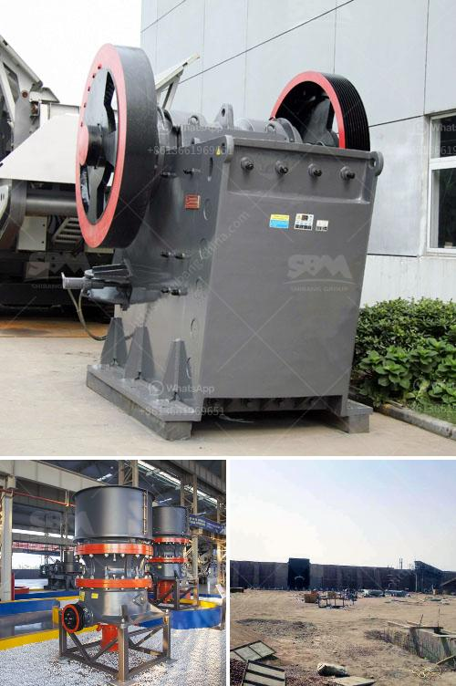

<h3>What are the different types of cone crushers?</h3>
Cone crushers are widely used for secondary and fine crushing in the fields of mining, building materials, metallurgy and so on. It is suitable for crushing all kinds of ores and rocks with hardness of medium or above. In this article, we will talk about the different types of cone crushers and how to choose the right one for your project.

Firstly, cone crusher can be divided into the following types based on the different crushing principles and product sizes:

1. Spring Cone Crusher: Known for its efficiency in crushing, the spring cone crusher is manufactured as modern high-performance crusher that embodies high swing frequency, optimized crushing cavity, and rational stroke. Its higher speed and stroke provide higher rated power, improved throughput, and increased crushing ratio, resulting in more cubic and high-quality aggregate.

2. Symons Cone Crusher: Widely used in the metallurgical industry, construction materials industry, road building industry, chemical industry, and silicate industry, it is suitable for crushing various ores and rocks with medium or higher hardness. The Symons cone crusher has a large crushing ratio, high efficiency, low energy consumption, uniform product size, and is suitable for medium and fine crushing of various ores and rocks.

3. Hydraulic Cone Crusher: As a classic primary crusher with stable performances, hydraulic cone crusher is widely used to crush various medium-hard and abrasive stones. It adopts hydraulic system to adjust the size of discharge opening and protect its overload operation. With improved crushing frequency and eccentric distance, the hydraulic cone crusher can achieve finer product sizes while maintaining high efficiency.

4. Single-Cylinder Cone Crusher: This type of crusher integrates mechanical, hydraulic, electrical, automation, and intelligent control technologies, representing the world's most advanced crusher technology. It is widely used in metallurgy, construction, hydropower, transportation, chemical industry, and building materials industry. It is suitable for crushing various ores and rocks with medium and above hardness.

When choosing which type of cone crusher to select, it is important to consider the raw materials being processed and the required output. Each type of cone crusher has its own advantages and disadvantages, which should be taken into consideration before selecting a crusher for your plant.

Factors to consider include the feed size, the required product size, the capacity and throughput, the liner wear life, power consumption, and the ease of maintenance. It is also important to consider the overall cost of the crusher, including initial purchase price, operating costs, and spare parts.

In conclusion, cone crushers are essential equipment in mining and aggregate industries. With so many types of cone crushers available, it is important to carefully consider your needs and budget before making a decision. Remember to consult with industry professionals to ensure you select the right cone crusher for your project.
<h3>Contact us</h3><ul><li><strong>Whatsapp:&nbsp;<a href="https://wa.me/8613661969651">+8613661969651</a></strong></li><li><a href="https://swt.shibang-china.com/?git&amp;zhl&amp;What are the different types of cone crushers"><strong>Online Service(chat now)</strong></a></li></ul><h3>Related</h3><ul><li><a href='What is a conetype rock crusher.md'>What is a cone-type rock crusher?</a></li><li><a href='What does aggregate crusher mean.md'>What does "aggregate crusher" mean?</a></li><li><a href='What is the waste from an orecrushing plant.md'>What is the waste from an ore-crushing plant?</a></li><li><a href='What is crushed quartz stone.md'>What is crushed quartz stone?</a></li><li><a href='What parameters should be considered when going to purchase jaw crushers.md'>What parameters should be considered when going to purchase jaw crushers?</a></li></ul>