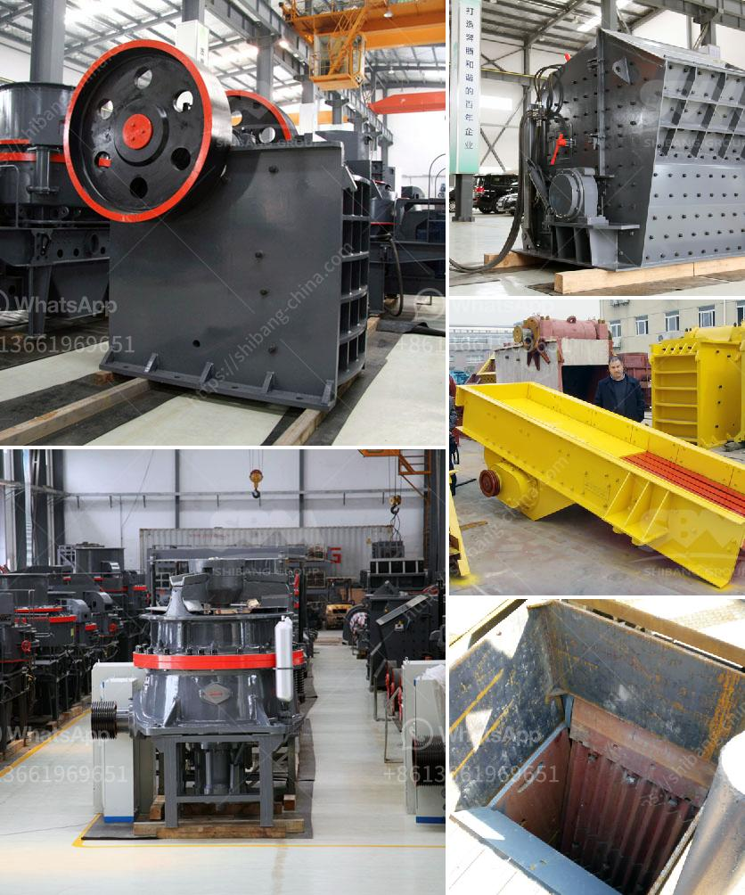

<h3>What are the factors that promote the development of mining?</h3>
Mining has been an essential part of human civilization for thousands of years. From the Stone Age to the present day, mineral extraction has played a significant role in shaping economies and societies worldwide. Several factors contribute to the development and growth of the mining industry. This article aims to explore some of these influential factors.

1. Natural resource abundance: The foremost factor that drives the development of mining is the presence of valuable mineral deposits. Countries endowed with rich reserves of minerals, such as coal, iron ore, copper, gold, and diamonds, tend to experience significant mining development. These resources act as a catalyst for growth, attracting investments and fostering economic activities in the sector.

2. Technological advancements: Rapid developments in mining technology have substantially contributed to the industry's growth. Advances in equipment, drilling techniques, and extraction methods have increased operational efficiency and expanded the scope of mining. Automation and digitalization have also played a vital role in enhancing productivity and safety, making the sector more lucrative.

3. Government policies and regulations: Regulatory frameworks and government policies significantly impact mining development. Favorable regulations, transparent licensing procedures, and clear land tenure systems encourage investments and provide certainty to stakeholders. Governments' provision of financial incentives, tax breaks, and infrastructure support further promote the growth of the mining sector.

4. Economic benefits and job creation: Mining projects often result in substantial economic benefits, including foreign direct investment, export revenues, and government tax revenue. These financial gains can be reinvested in infrastructure, education, and healthcare, leading to overall development. Additionally, mining operations create direct and indirect employment opportunities, stimulating local economies and reducing unemployment rates.

5. Global demand for minerals: The demand for minerals, driven by industrialization and urbanization, influences mining development. Growing populations, particularly in emerging economies, require extensive resources to meet infrastructure and consumer goods demands. Industries such as manufacturing, construction, and electronics rely heavily on mineral inputs, creating a market for mining companies to meet these needs.

6. Environmental considerations: While mining activities can have detrimental environmental impacts, increasing environmental consciousness has forced the industry to adopt more sustainable practices. Responsible mining, including proper waste management, land rehabilitation, and biodiversity preservation, is becoming a crucial factor in supporting the development of mining. Companies that prioritize environmental stewardship gain a competitive advantage and secure social acceptance.

7. Infrastructure and access to markets: The availability of infrastructure, such as transportation networks, ports, and energy supply, plays a crucial role in mining development. Efficient transportation facilitates the movement of extracted minerals to domestic and international markets, unlocking economic potential. Investments in infrastructure projects often go hand in hand with mining development, as both sectors mutually benefit from improved connectivity.

In conclusion, several factors contribute to the development of mining, creating a complex interplay between natural resources, technology, regulations, and market dynamics. While natural resource abundance and technological advancements lay the foundation, government policies, economic benefits, environmental considerations, and infrastructure are critical enablers. The mining industry, when carried out responsibly and sustainably, can be a driving force behind economic growth, job creation, and technological progress while meeting global mineral demands.
<h3>Contact us</h3><ul><li><strong>Whatsapp:&nbsp;<a href="https://wa.me/8613661969651">+8613661969651</a></strong></li><li><a href="https://swt.shibang-china.com/?git&amp;zhl&amp;What are the factors that promote the development of mining"><strong>Online Service(chat now)</strong></a></li></ul><h3>Related</h3><ul><li><a href='What is a stone crusher.md'>What is a stone crusher?</a></li><li><a href='What are the models of Raymond mill.md'>What are the models of Raymond mill?</a></li><li><a href='What is the difference between impact cone jaw crushers .md'>What is the difference between impact cone jaw crushers ?</a></li><li><a href='What are the functions of a gyratory crusher in mining.md'>What are the functions of a gyratory crusher in mining?</a></li><li><a href='What mechanical equipment is used to mine copper？.md'>What mechanical equipment is used to mine copper？</a></li></ul>