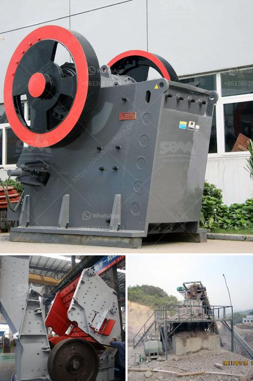

<h3>What are the features of a jaw crusher?</h3>
A jaw crusher, also known as a toggle crusher, is one of the main types of primary crushers in a mine or ore processing plant. The size of a jaw crusher is determined by the rectangular or square opening at the top of the jaws (feed opening). For instance, a 24 x 36 jaw crusher has a opening of 24" by 36", a 56 x 56 jaw crusher has a opening of 56" square.

The main features of a jaw crusher include its ability to crush large amounts of material, its compact structure, and its compact size. Depending on the size of the machine, jaw crushers can be used for a variety of purposes, including primary crushing, secondary crushing, and as a final product for grinding.

One of the key features of a jaw crusher is its ability to handle tough and abrasive materials. In mining applications, jaw crushers are usually used as the primary crusher for crushing rock, ore or other materials. They can handle large lumps of material and are known for their efficiency in crushing tough and abrasive ores.

Another important feature of a jaw crusher is its compact structure. This allows the machine to be easily transported and to be used in confined spaces. This makes them ideal for on-site crushing operations where space is limited, such as construction sites or mining sites.

Additionally, jaw crushers are known for their compact size, which makes them easy to install and operate. They can be quickly set up and ready to use, even in remote locations. This makes them an ideal choice for mobile crushing applications, where the crusher needs to be easily transported from one site to another.

Jaw crushers are also known for their versatility. They can be used for a variety of applications, depending on the type of material being crushed. For example, they can be used to crush hard rock, limestone, granite, or other materials. They can also be used for recycling construction waste or for processing materials in the mining industry.

In terms of operation, a jaw crusher operates by squeezing rock or ore between two jaws, one moving and one stationary. The moving jaw is mounted on a pitman that has a reciprocating motion, while the stationary jaw remains fixed. As the material is fed into the top of the jaws, it is gradually crushed into smaller pieces as it moves down through the chamber.

Overall, jaw crushers offer several advantages over other types of crushers. They are known for their ability to handle tough and abrasive materials, their compact structure, and their versatility in different applications. Whether used for primary crushing, secondary crushing, or as a final product, jaw crushers are an essential tool in any mining or construction operation.
<h3>Contact us</h3><ul><li><strong>Whatsapp:&nbsp;<a href="https://wa.me/8613661969651">+8613661969651</a></strong></li><li><a href="https://swt.shibang-china.com/?git&amp;zhl&amp;What are the features of a jaw crusher"><strong>Online Service(chat now)</strong></a></li></ul><h3>Related</h3><ul><li><a href='What is the process that coal goes through to become a finished product.md'>What is the process that coal goes through to become a finished product?</a></li><li><a href='what brand of iron ore crusher more advanced.md'>what brand of iron ore crusher more advanced</a></li><li><a href='What is the cost of roller mills.md'>What is the cost of roller mills?</a></li><li><a href='what is the quarrying process？.md'>what is the quarrying process？</a></li><li><a href='What is chrome ore used for.md'>What is chrome ore used for?</a></li></ul>