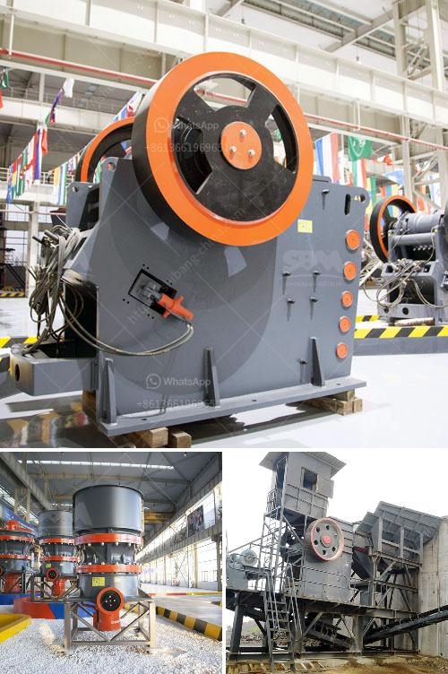

<h3>What are the fields of coal crushing equipment ?</h3>
Coal is a valuable resource that has been used for centuries to generate electricity in power plants and fuel millions of homes and industries worldwide. A crucial step in extracting coal from the ground is the crushing process. Various professional equipment is specifically designed to crush coal efficiently and effectively. Let’s explore some of the fields where coal crushing equipment is utilized.

Coal mining is a vital industry that supplies coal for various purposes, including electricity generation, steel production, and cement manufacturing. In underground mining operations, coal is typically extracted from deep underground seams using various methods. Heavy-duty crushers are used to break down large chunks of coal into smaller, more manageable pieces before it is transported to the surface.

Coal is a primary source of fuel for electricity generation in power plants. The coal crushing process is a key component in the power plant system. Small particles of coal are crushed into even smaller particles before being fed into the boiler for combustion. Crushing equipment ensures that the coal is properly prepared for combustion and is in the appropriate size and consistency to maximize energy output in the power plant.

The coal trading industry plays a pivotal role in the global economy. To meet the varying demands of customers, coal traders require coal crushing equipment to resize and sort coal according to different specifications. Crushing equipment allows traders to offer coal in different size ranges, ensuring it cateres to the specific needs of various industries, such as steel, cement, and paper manufacturing.

Coal crushing equipment is also used in the effort to reduce the environmental impact of coal. The mining and processing of coal require several equipment to be used. Crushing and screening equipment is essential for environmental management. Crushing equipment helps in reducing the carbon footprint by reducing the need for further mining activities, thereby minimizing environmental damage.

In the field of research and development, coal crushing equipment is used to analyze coal samples for both quality and composition. Scientists and engineers analyze coal samples to determine the most efficient combustion methods and identify impurities that may impact coal quality. The data gathered from coal crushing equipment helps in understanding the behavior of coal, leading to improved processing techniques and cleaner energy production.

These are just a few of the fields where coal crushing equipment finds great utility. The wide range of industries that rely on coal for their operations necessitates the development and utilization of advanced equipment to ensure efficient and eco-friendly coal processing. Continued advancements in crushing technology will undoubtedly lead to better efficiency, reduced carbon emissions, and increased sustainability in the coal industry.

In conclusion, coal crushing equipment plays a crucial role in various fields such as mining, power plants, coal trading, environmental management, and research and development. As the demand for coal continues to grow, the development of more advanced and efficient crushing equipment is essential to meet the diverse needs of industries and ensure the sustainable use of this valuable resource.
<h3>Contact us</h3><ul><li><strong>Whatsapp:&nbsp;<a href="https://wa.me/8613661969651">+8613661969651</a></strong></li><li><a href="https://swt.shibang-china.com/?git&amp;zhl&amp;What are the fields of coal crushing equipment "><strong>Online Service(chat now)</strong></a></li></ul><h3>Related</h3><ul><li><a href='What materials are used in concrete alternatives to sand.md'>What materials are used in concrete alternatives to sand?</a></li><li><a href='what does a raymond coal mill cost？.md'>what does a raymond coal mill cost？</a></li><li><a href='What is bauxite used to make and how to extraction process.md'>What is bauxite used to make? and how to extraction process?</a></li><li><a href='What is the purpose of using hydraulic cylinders in cone crushers.md'>What is the purpose of using hydraulic cylinders in cone crushers?</a></li><li><a href='what are advantage of grinding machines？.md'>what are advantage of grinding machines？</a></li></ul>