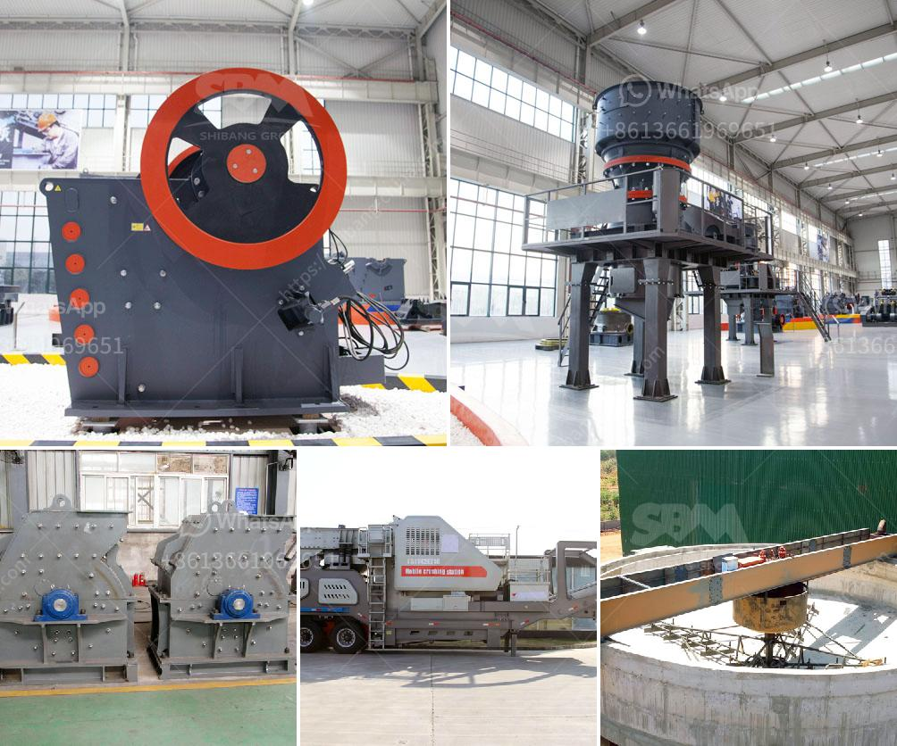

<h3>What are the functions of a gyratory crusher in mining?</h3>
A gyratory crusher is an ore processing machine that crushes the ore between an eccentrically mounted cone and a crushing throat that is fixed. In mining, the most important criteria for effective crushing of oresis to choose the type of crusher that suits the rock (ore) material and to ensure uniform feed.

Gyratory crushers are known for their high production rates, with a higher capacity than a jaw crusher. In order to get cubical material out of a gyratory crusher, it should be choke fed. Gyratory crushers are not suitable for crushing clay, as clay will clog the crusher.

Gyratory crushers consist of a shell, which is sloping inwards, and a long spindle that is suspended from a bar at the top with the help of pivots. At the bottom of the crusher, the spindle is mounted atop an eccentric sleeve that enables spindle movement in a conical path around the shell.

Crushing takes place between the concaves in the crushing chamber and the mantle-lined crushing cone. This process is repeated until the material being crushed reaches the desired size and falls out through the bottom of the crusher.

Gyratory crushers essentially serve as primary crushers, as they are designed to receive run-on-mine (ROM) rocks directly from the mines. The gyratory crushers crush to reduce the size by a maximum of about one-tenth its size.

Usually, metallurgical operations require greater size reduction for subsequent stages of crushing. In mining, gyratory crushers are relatively rare overhead equipment, mainly used to crush copper ore in large-scale mining operations.

In most cases, gyratory crushers are utilized for primary crushing but they may have limited capacity in other applications. The material being crushed is generally very abrasive, and the mantle and concave surfaces are subjected to wear and damage.

The primary function of a gyratory crusher is to provide a continuous, controlled flow of material to be crushed. This helps to maintain a consistent feed to the crusher, optimizing production and minimizing wear and tear on the equipment.

Another primary function of a gyratory crusher is to act as a concave surface and exert an eccentric motion on the mantle. This allows the crushing head to oscillate between open side setting (OSS) and closed side setting (CSS) to achieve the desired product size.

Furthermore, gyratory crushers are capable of producing a product size distribution with a finer grind than that of other primary crushers, which enables the downstream process to run smoother.

Gyratory crushers are essential equipment in mining operations, as they can process large amounts of hard material efficiently. Their main functions are to provide a continuous flow of material to the crusher and to exert an eccentric motion on the mantle to achieve the desired product size.
<h3>Contact us</h3><ul><li><strong>Whatsapp:&nbsp;<a href="https://wa.me/8613661969651">+8613661969651</a></strong></li><li><a href="https://swt.shibang-china.com/?git&amp;zhl&amp;What are the functions of a gyratory crusher in mining"><strong>Online Service(chat now)</strong></a></li></ul><h3>Related</h3><ul><li><a href='What is quarry crushing .md'>What is quarry crushing ?</a></li><li><a href='What is the best granite crusher machine.md'>What is the best granite crusher machine?</a></li><li><a href='What is the difference between jaw crusher and cone crusher？.md'>What is the difference between jaw crusher and cone crusher？</a></li><li><a href='What is the price of coal crusher in Indonesia.md'>What is the price of coal crusher in Indonesia?</a></li><li><a href='What is the selling price of the hammer crusher.md'>What is the selling price of the hammer crusher?</a></li></ul>