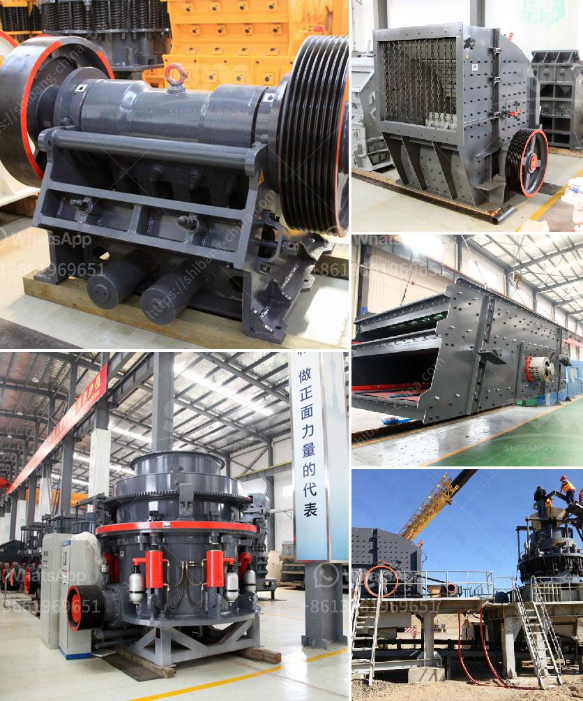

<h3>What are the investments for a stone crusher?</h3>
Investing in a stone crusher brings several benefits to the construction and mining industry. High returns on investment: Stone crushers are capable of producing high-quality sand and aggregate. These materials are widely used in construction, making it essential for the industry's profitability. Additionally, investments in these types of machinery are more affordable than ever before, making it easier for businesses to acquire the equipment.

When looking to invest in a stone crusher, there are several factors to be considered to ensure that the returns are maximized. These include the following:

1. Size and output capacity: This determines how much material can be crushed within a specified time. Larger crushers are capable of processing more significant quantities, which leads to higher profits. The desired output capacity should be determined by considering the demand for the crushed material in the area of operation.

2. Performance and efficiency: A well-performing stone crusher improves productivity and reduces operating costs. It is essential to invest in a machine that utilizes advanced technology to ensure excellent performance and minimize downtime. High-quality crushers often come with features such as hydraulic systems and automated controls that increase efficiency.

3. Maintenance and upkeep: Stone crushers require regular maintenance, and it is crucial to invest in the right resources and staff to carry out these activities effectively. Proper maintenance helps extend the machine's lifespan and ensures that it remains in good working condition. Neglecting maintenance can lead to breakdowns, resulting in expensive repairs and downtime.

4. Location and site preparation: Before setting up a stone crusher, it is crucial to conduct a comprehensive analysis of the site and determine the investment and operating costs. The site's geological conditions, accessibility, and proximity to raw materials are all factors to be considered. The location should be easily accessible for transporting raw materials and finished products.

5. Environmental considerations: Stone crushing operations can have a significant impact on the environment if not properly managed. It is essential to invest in measures that reduce dust emissions, noise pollution, and water runoff. Implementing proper waste management systems and adhering to relevant environmental regulations will help mitigate any negative effects.

Overall, investing in a stone crusher is a profitable venture. However, careful analysis and planning are necessary to ensure a successful return on investment. It is recommended to engage the services of professionals who can assist in determining the right equipment size and specifications for the specific application. Additionally, carrying out a feasibility study and cost analysis will provide a clear understanding of the potential returns and payback period.

In conclusion, the investment in a stone crusher is lucrative, considering the high returns on investment. However, this also requires substantial resources and planning to ensure a successful outcome. By choosing the right equipment, maintaining it properly, and adhering to environmental guidelines, businesses can maximize profitability while minimizing any negative impacts.
<h3>Contact us</h3><ul><li><strong>Whatsapp:&nbsp;<a href="https://wa.me/8613661969651">+8613661969651</a></strong></li><li><a href="https://swt.shibang-china.com/?git&amp;zhl&amp;What are the investments for a stone crusher"><strong>Online Service(chat now)</strong></a></li></ul><h3>Related</h3><ul><li><a href='What is the difference between impact cone jaw crushers .md'>What is the difference between impact cone jaw crushers ?</a></li><li><a href='What is a hammer mill work.md'>What is a hammer mill work?</a></li><li><a href='What is the waste from an orecrushing plant.md'>What is the waste from an ore-crushing plant?</a></li><li><a href='what are common raw materials for artificial sand.md'>what are common raw materials for artificial sand</a></li><li><a href='What is the mining process of barite？.md'>What is the mining process of barite？</a></li></ul>