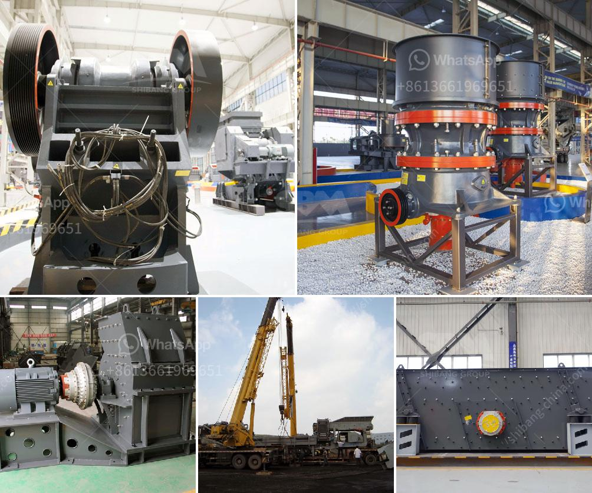

<h3>What are the limitations affecting the ball mill feed?</h3>
The ball mill is a crucial piece of equipment for grinding crushed materials into fine powder. It is mainly used in mining, cement, and other industrial sectors. However, the ball mill feed cannot be optimized continuously due to certain limitations. In this article, we will discuss some of these limitations affecting the ball mill feed and their impact on the grinding process.

1. Feed size distribution: One of the primary limitations affecting the ball mill feed is the size distribution of the feed particles. The feed particles should ideally have a narrow size distribution to ensure efficient grinding. However, in practice, the feed may contain a wide range of particle sizes, resulting in inefficient grinding. Large particles require longer grinding times and consume more energy, leading to increased operating costs. On the other hand, fine particles tend to accumulate in the mill, reducing its capacity and causing unnecessary wear on the mill components.

2. Feed moisture content: Moisture content in the feed material can significantly affect the performance of the ball mill. Excessive moisture can cause sticking, agglomeration, and clogging, leading to reduced mill efficiency and increased downtime. It also affects the flowability of the feed material, resulting in the formation of ball and pulp coating, preventing proper grinding action. Therefore, it is essential to control the moisture content of the feed material to optimize the ball mill performance.

3. Feed gradation: The gradation of the feed material refers to the variation in particle size distribution. A well-graded feed is essential for effective grinding in the ball mill. Non-uniform particle size distribution can lead to excessive recirculation of coarse particles and inadequate grinding of fine particles. This results in over-grinding of some particles and under-grinding of others, reducing the overall efficiency of the grinding process.

4. Feed rate: The feed rate or the amount of feed material introduced into the ball mill also affects its performance. Insufficient feed rate can cause the mill to run under-loaded, resulting in poor grinding action and premature wear of the mill liners. On the other hand, excessive feed rate can overload the mill, leading to reduced grinding efficiency and possible equipment damage. Finding the optimal feed rate is crucial for maximizing the ball mill's productivity.

5. Feed hardness: The hardness of the feed material significantly affects the ball mill's grinding performance. Harder materials require more energy to grind, leading to increased power consumption. Furthermore, harder materials can cause excessive wear on the mill liners and grinding media, reducing their lifespan and increasing maintenance costs. It is crucial to consider the feed hardness and select appropriate grinding media and liner materials to ensure efficient grinding and prolong equipment life.

In conclusion, several limitations affect the ball mill feed, including feed size distribution, moisture content, feed gradation, feed rate, and feed hardness. These limitations can impact the grinding process, leading to reduced efficiency, increased operating costs, and equipment damage. Understanding and optimizing these factors are essential for maximizing the performance of the ball mill and achieving the desired grinding results.
<h3>Contact us</h3><ul><li><strong>Whatsapp:&nbsp;<a href="https://wa.me/8613661969651">+8613661969651</a></strong></li><li><a href="https://swt.shibang-china.com/?git&amp;zhl&amp;What are the limitations affecting the ball mill feed"><strong>Online Service(chat now)</strong></a></li></ul><h3>Related</h3><ul><li><a href='What is vsi in mobile stone jaw crusher.md'>What is vsi in mobile stone jaw crusher</a></li><li><a href='What is the flywheel size and weight in a jaw crusher.md'>What is the flywheel size and weight in a jaw crusher?</a></li><li><a href='What are the advantages of hammer mills used in the mining industry？.md'>What are the advantages of hammer mills used in the mining industry？</a></li><li><a href='What is the definition of crushing in mining.md'>What is the definition of crushing in mining?</a></li><li><a href='What is the yield in mineral processing.md'>What is the yield in mineral processing?</a></li></ul>