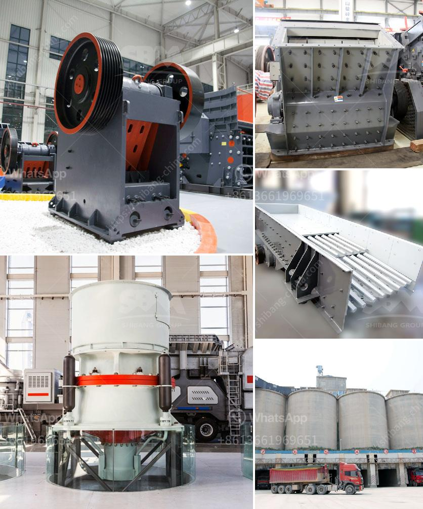

<h3>What are the main current crusher and which is good?</h3>
As our world continues to advance technologically, the need for efficient and powerful crushers has become more prevalent. Crushers are essential equipment used in various industries, including mining, construction, and demolition, to break down large rocks, stones, and other materials into smaller, more manageable sizes. In today's market, there are several main crushers that are widely used, each with its own advantages and applications.

One of the most popular types of crushers is the jaw crusher. This crusher works by compressing materials between two heavy-duty jaws, which results in breaking down the materials into smaller sizes. Jaw crushers are known for their high production rates, reliability, and ease of use. They are suitable for a wide range of applications, including primary crushing of hard materials.

Another noteworthy crusher in the market is the cone crusher. This type of crusher utilizes a cone-shaped chamber that gyrates at high speeds to crush the materials. Cone crushers are well suited for secondary and tertiary crushing stages, providing excellent cubicity and shape of the end product. These crushers are often used in the mining industry, where they can process large amounts of ores and minerals efficiently.

Hammer crushers are favored in industries that require the crushing of brittle materials. These crushers consist of a rotating shaft with hammers attached to it, which impacts the material, causing it to break apart. Hammer crushers are versatile and can be used in various applications, including limestone crushing, coal crushing, and more. Due to their simplicity and low cost, they are popular choices among many industries.

Impact crushers are designed to deliver high reduction ratios and are commonly used in the recycling industry and quarrying operations. These crushers utilize a rotor with hammers to strike the material and break it into smaller pieces. Impact crushers offer precise control over particle shape and size distribution, making them ideal for producing uniform and high-quality aggregates.

In recent years, another crusher has gained attention in the market – the vertical shaft impact (VSI) crusher. Unlike the traditional crushers, the VSI crusher utilizes a high-speed rotor and anvils for impact crushing. This crusher is highly efficient in producing manufactured sand and cubic-shaped aggregates. Due to its ability to control particle shape, it is often used in the production of concrete and asphalt.

Determining which crusher is the best largely depends on the specific application and requirements of the industry or project. Factors such as material hardness, desired particle size, production capacity, and budget must be carefully considered. Consulting with industry experts and conducting thorough research can help in making an informed decision.

Overall, the main crushers currently in the market include jaw crushers, cone crushers, hammer crushers, impact crushers, and VSI crushers. Each of these crushers has its unique advantages and applications. It is crucial to evaluate the specific needs and preferences of the industry to choose the most suitable crusher. With advancements in technology, crushers are continuously being improved to provide more efficient and environmentally friendly solutions to various industries.
<h3>Contact us</h3><ul><li><strong>Whatsapp:&nbsp;<a href="https://wa.me/8613661969651">+8613661969651</a></strong></li><li><a href="https://swt.shibang-china.com/?git&amp;zhl&amp;What are the main current crusher and which is good"><strong>Online Service(chat now)</strong></a></li></ul><h3>Related</h3><ul><li><a href='what are the steps limestone ore processed？.md'>what are the steps limestone ore processed？</a></li><li><a href='What is the mining process of barite？.md'>What is the mining process of barite？</a></li><li><a href='What is the price of coal crusher in Indonesia.md'>What is the price of coal crusher in Indonesia?</a></li><li><a href='What machines do stone crushing plants need？.md'>What machines do stone crushing plants need？</a></li><li><a href='What method of mining is used to obtain calcite.md'>What method of mining is used to obtain calcite?</a></li></ul>