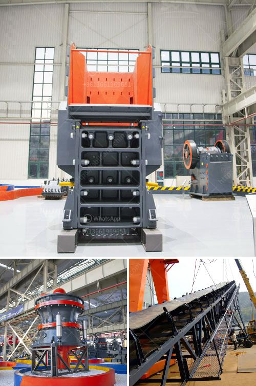

<h3>What are the mechanical devices used in mining? What is the role of each?</h3>
In the vast world of mining, there are various mechanical devices employed to extract valuable minerals and resources from the earth. These devices play a crucial role in the mining industry, ensuring the productivity and efficiency of the mining process. From excavation to transportation, these mechanical tools are essential in every step of the way.

One of the fundamental mechanical devices used in mining is drills. Drills are often employed in both surface and underground mining to create holes for explosives or to insert blasting tools. Different types of drilling rigs are used depending on the hardness and type of the material being drilled. These drills significantly speed up the excavation process and provide access to minerals that would be otherwise inaccessible.

Another essential piece of equipment in mining is the excavator. An excavator is a powerful machine equipped with a bucket attached to a hydraulic arm. It is primarily used for digging and removing large amounts of materials such as soil, rocks, or minerals. Excavators are versatile and can be fitted with various attachments, allowing them to perform multiple tasks, including demolition, land clearance, and load transportation. The bucket on the excavator can be exchanged for grapples, breakers, or even crushers, making it a highly efficient tool in mining operations.

Bulldozers are also commonly used in mining to move large volumes of earth or ores. These robust machines are equipped with a broad and flat metal blade mounted on the front, allowing for efficient pushing and leveling of materials. Bulldozers are particularly useful in surface mining where the removal of overburden is necessary. They provide stability and power, allowing for the clearance of vast areas and the creation of access roads.

Conveyors are another mechanical device extensively used in mining. These systems are responsible for the transportation of materials throughout the mining site. Conveyor belts are used to move ores, rocks, or minerals from the mining area to the processing plant or storage facilities. They are crucial for optimizing efficiency, reducing manual labor, and ensuring the continuous flow of materials. Conveyor systems can be customized to fit the specific needs of the mining operation, including the angle, length, and speed of the belt.

Furthermore, crushers and grinders are integral to the crushing and grinding processes in mining. Crushers are utilized to break down large rocks and minerals into smaller, more manageable pieces. This enables easier handling and transportation of materials. Grinders, on the other hand, are employed to further reduce the size of these materials, allowing for easier separation of minerals from the waste material.

To conclude, mechanical devices are essential in mining as they enhance productivity, efficiency, and safety within the industry. From drills to excavators, bulldozers to conveyors, each device plays a vital role in the extraction and transportation of minerals. These devices allow for the rapid excavation of materials, the removal of overburden, and the processing of ores. Mining would not be possible without the utilization of these mechanical tools, which continue to evolve and improve with advancements in technology.
<h3>Contact us</h3><ul><li><strong>Whatsapp:&nbsp;<a href="https://wa.me/8613661969651">+8613661969651</a></strong></li><li><a href="https://swt.shibang-china.com/?git&amp;zhl&amp;What are the mechanical devices used in mining What is the role of each"><strong>Online Service(chat now)</strong></a></li></ul><h3>Related</h3><ul><li><a href='What equipment do you need to start a quarry business.md'>What equipment do you need to start a quarry business?</a></li><li><a href='What is the problem with ore mining .md'>What is the problem with ore mining ?</a></li><li><a href='What material is the jaw crusher tooth plate.md'>What material is the jaw crusher tooth plate?</a></li><li><a href='What are the Different Types of Crusher How to choose.md'>What are the Different Types of Crusher? How to choose?</a></li><li><a href='What is a composite cone crusher.md'>What is a composite cone crusher?</a></li></ul>