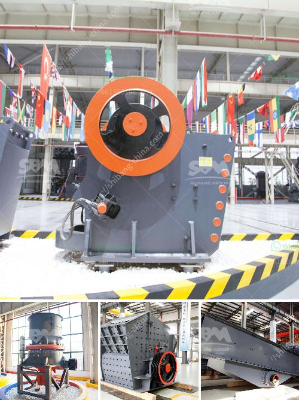

<h3>What are the merits of vibratory screens?</h3>
Vibratory screens, also known as vibrating screens, are widely used in various industries to efficiently and uniformly separate materials. These screens operate by gently vibrating the material, which helps to separate it into different sizes or remove impurities. Vibratory screens offer several merits that make them an excellent choice for many applications.

One of the significant advantages of vibratory screens is their high efficiency in separating materials. These screens use vibrations to move the material along the mesh surface, allowing smaller particles to fall through and larger particles to move towards the discharge end. This separation mechanism ensures that materials are graded and sized accurately, leading to improved quality control in production processes.

Another advantage of vibratory screens is their ability to handle a wide range of materials. These screens can handle materials with different sizes, shapes, and properties, including wet and dry materials, powders, granules, and more. The versatility of vibratory screens makes them suitable for a variety of industries, including mining, construction, chemical, and recycling.

Vibratory screens are also known for their low maintenance requirements. Unlike other types of screening equipment, such as trommel screens or gyratory screens, vibratory screens have fewer moving parts, reducing the chances of mechanical failures or breakdowns. Additionally, the minimal wearing parts of vibratory screens are relatively easy and cost-effective to replace, minimizing downtime and maintenance costs.

The energy efficiency of vibratory screens is another key benefit. These screens consume less power compared to other types of screening equipment. By using vibrations to move and separate materials, vibratory screens require minimal energy input, resulting in lower operational costs over time. This energy efficiency is particularly important for industries that use screens extensively, as it can significantly contribute to overall cost savings.

In addition to efficiency, accuracy is another advantage of vibratory screens. These screens can achieve precise separation and sizing of materials due to their unique design and operational principles. The vibrations applied to the screen enable finer particles to pass through while ensuring larger particles are retained. This accuracy is essential for industries that require precise particle sizing or for removing impurities to meet specific standards.

Furthermore, vibratory screens contribute to a cleaner working environment. The vibrations of these screens help to prevent the material from clogging or sticking to the screen surface. This anti-clogging effect reduces the need for manual interventions, such as frequent cleaning or unclogging of equipment. As a result, vibratory screens can improve overall productivity and enhance workplace safety by reducing exposure to potentially hazardous or dusty environments.

In conclusion, vibratory screens offer several merits that make them a preferred choice for many industries. Their high efficiency, versatility, and ability to handle a wide range of materials contribute to improved quality control and productivity. The low maintenance requirements and energy efficiency of vibratory screens further enhance their appeal. Finally, their accuracy and ability to maintain a clean working environment make them a valuable asset across various industries. With these advantages, vibratory screens continue to play a crucial role in effective material separation and processing.
<h3>Contact us</h3><ul><li><strong>Whatsapp:&nbsp;<a href="https://wa.me/8613661969651">+8613661969651</a></strong></li><li><a href="https://swt.shibang-china.com/?git&amp;zhl&amp;What are the merits of vibratory screens"><strong>Online Service(chat now)</strong></a></li></ul><h3>Related</h3><ul><li><a href='what is the difference between tube grinder and ball mill.md'>what is the difference between tube grinder and ball mill</a></li><li><a href='What does a 100 ton per hour jaw crusher cost.md'>What does a 100 ton per hour jaw crusher cost?</a></li><li><a href='What is the cost of gravel crushing .md'>What is the cost of gravel crushing ?</a></li><li><a href='What is the difference between a ball mill and a roller mill.md'>What is the difference between a ball mill and a roller mill?</a></li><li><a href='What is chrome ore used for.md'>What is chrome ore used for?</a></li></ul>