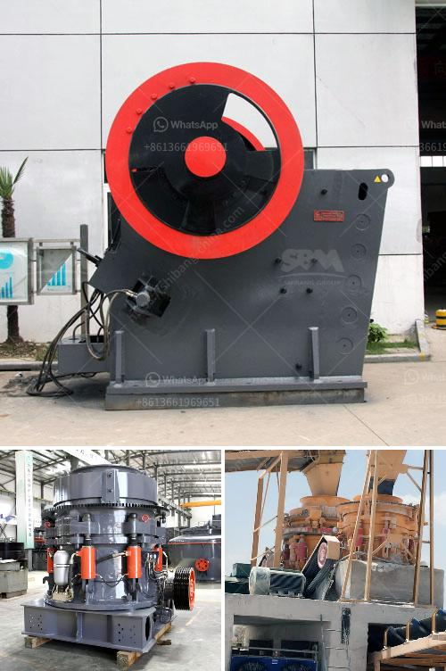

<h3>What are the models of Raymond mill?</h3>
Raymond mill is a widely used mill machine for grinding coarse material into powder with different granularity. It is applicable to a variety of industries, such as mining, building materials, chemical industry, metallurgy, coal and cement. Raymond mill has multiple models, and each model is different in its overall structure, as well as capacity, power consumption, and outlet size. Here, I will introduce the commonly used models of Raymond mill.

The first model is commonly known as 3R Raymond mill. This model has a high efficient capacity, reaching 2-7 tons per hour. It has a compact structure and covers a small area, making it perfect for small-scale industrial production. This model is powered by a 15kw motor and has an output size ranging from 0.613-0.044mm. It is suitable for processing materials with a hardness of less than 9.3 and humidity below 6%.

The second model is called 4R Raymond mill. This model has a larger capacity compared to the 3R model, with an output ranging from 3-8 tons per hour. It is suitable for medium-scale industrial production. This model is powered by an 18.5kw motor and has an output size ranging from 0.613-0.044mm. It can process materials with a hardness of less than 9.3 and humidity below 6%.

The third model is known as 5R Raymond mill. This model has the highest capacity among all the models, with an output ranging from 5-10 tons per hour. It is suitable for large-scale industrial production. This model is powered by a 30kw motor and has an output size ranging from 0.613-0.044mm. It can process materials with a hardness of less than 9.3 and humidity below 6%.

These three models of Raymond mill have their own advantages and are suitable for different production requirements. However, regardless of the model, Raymond mill has a similar working principle. The material is evenly fed through the vibrating feeder into the grinding chamber, where the material is scooped up by the blade and ground between the roller and the grinding ring. The airflow generated by the high-speed centrifugal blower brings the crushed material into the analyzer for sorting, and the fine particles are collected into the cyclone separator and discharged through the outlet, while the large particles are returned to the grinding chamber for regrinding.

In conclusion, Raymond mill is an essential machine for grinding coarse material into powder. The commonly used models, including 3R, 4R, and 5R Raymond mill, have different capacities, power consumption, and outlet sizes. These models are suitable for various scales of industrial production and provide efficient and reliable performance. Users can choose the appropriate model according to their specific requirements.
<h3>Contact us</h3><ul><li><strong>Whatsapp:&nbsp;<a href="https://wa.me/8613661969651">+8613661969651</a></strong></li><li><a href="https://swt.shibang-china.com/?git&amp;zhl&amp;What are the models of Raymond mill"><strong>Online Service(chat now)</strong></a></li></ul><h3>Related</h3><ul><li><a href='What is Crushing and Screening .md'>What is Crushing and Screening ?</a></li><li><a href='What is the application of a ball mill.md'>What is the application of a ball mill?</a></li><li><a href='What equipment is necessary for crushing pumice.md'>What equipment is necessary for crushing pumice?</a></li><li><a href='What method of mining is used to obtain calcite.md'>What method of mining is used to obtain calcite?</a></li><li><a href='What is the price of coal crusher in Indonesia.md'>What is the price of coal crusher in Indonesia?</a></li></ul>