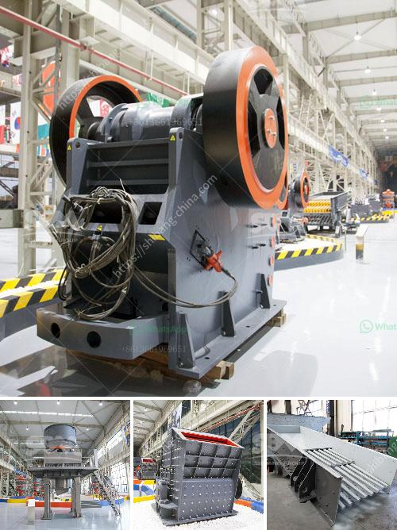

<h3>What are the nickel smelting equipment ?</h3>
Nickel smelting is the process of extracting nickel metal from its raw ore. This essential step in the production of nickel is carried out through a complex and highly technical procedure, requiring specialized equipment and machinery. Nickel smelting equipment includes a variety of tools and machines that facilitate the extraction and refining process. In this article, we will explore some of the most common and important equipment used in nickel smelting.

One of the primary pieces of equipment in nickel smelting is the rotary kiln. This cylindrical furnace is set at a slight angle and rotates slowly to ensure effective and efficient smelting. The rotary kiln provides high temperatures required to bring about chemical reactions necessary for nickel production. Maintaining a controlled environment within the kiln ensures optimal results.

To support the rotary kiln, a burner system is used to heat the furnace. Burners supply the necessary fuel - often natural gas or coal - that produces the required heat to achieve the desired temperature. Additionally, a burner system enables precise temperature control, crucial in nickel smelting to maintain the desired reaction rate and product quality.

Another vital piece of equipment in nickel smelting is the electric furnace. Electric furnaces are used to melt the raw ore and separate the valuable nickel metal from the impurities. The furnace uses heat generated through an electric arc to melt the material. Electric furnaces are highly efficient and provide precise temperature control. They are also environmentally friendly, as they produce fewer emissions compared to other smelting methods.

For nickel smelting to occur, it is essential to crush and grind the raw ore into a fine powder. This is achieved using a variety of crushing and grinding equipment, such as jaw crushers, roll crushers, and ball mills. These machines reduce the ore into smaller particles, allowing for more effective chemical reactions during the smelting process.

Additionally, specialized equipment called froth flotation cells is used during nickel smelting to separate the valuable nickel particles from the gangue minerals. Froth flotation cells employ a mixture of water, chemicals, and air to create froth that carries the valuable nickel particles to the surface, where they can be collected and further processed.

To support the entire smelting process, various auxiliary systems are required. This includes ventilation and dust collection systems to remove harmful gases and particles produced during the extraction and refining process. It also includes control systems that monitor and optimize the smelting equipment's performance.

In conclusion, nickel smelting requires a range of specialized equipment to extract and refine nickel metal from its raw ore. From rotary kilns and electric furnaces to crushing and grinding equipment, each piece of equipment plays a crucial role in the overall process. The selection and efficient operation of these machines are essential to ensure high-quality nickel production. As technology advances, the nickel smelting process continues to evolve, resulting in improved equipment and techniques that enhance productivity and sustainability in the industry.
<h3>Contact us</h3><ul><li><strong>Whatsapp:&nbsp;<a href="https://wa.me/8613661969651">+8613661969651</a></strong></li><li><a href="https://swt.shibang-china.com/?git&amp;zhl&amp;What are the nickel smelting equipment "><strong>Online Service(chat now)</strong></a></li></ul><h3>Related</h3><ul><li><a href='What kind of crusher is used to create railway ballast.md'>What kind of crusher is used to create railway ballast?</a></li><li><a href='What are the fields of coal crushing equipment .md'>What are the fields of coal crushing equipment ?</a></li><li><a href='What is the process for mining manganese ore.md'>What is the process for mining manganese ore?</a></li><li><a href='What is the best type of crusher for hard rock.md'>What is the best type of crusher for hard rock?</a></li><li><a href='What type of crusher should I use to crush quartzite rock.md'>What type of crusher should I use to crush quartzite rock?</a></li></ul>