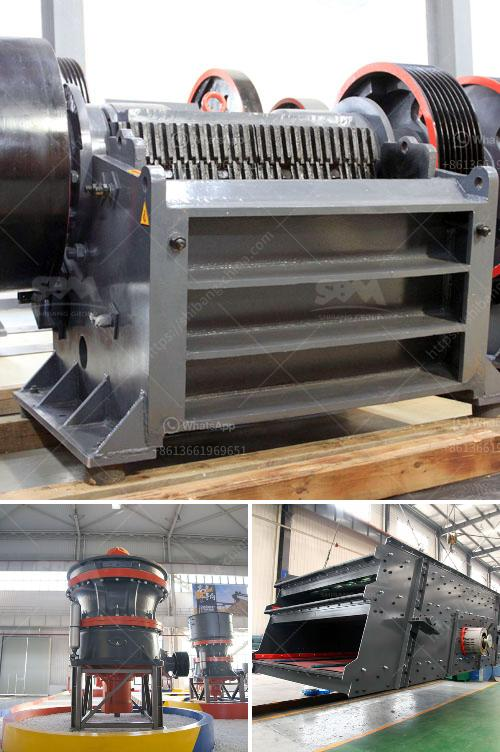

<h3>What are the parts of a Raymond Mill?</h3>
Raymond Mill is a common industrial milling equipment. Raymond Mills originated in 1906. CVGrueber created the Curt Von Grueber machinery factory in the southern suburbs of Berlin. So far, it has evolved for many generations. However, now Raymond Mill The performance of the powder machine is also much better than the Raymond grinding at that time; early Raymond mills had some drawbacks on the product, such as: 1. The product has low fineness. The fineness of ordinary Raymond mill is generally below 500 mesh. These devices can only occupy the lower end powder application market. 2. High mechanical failure rate, power consumption, noise, and large pollution. Raymond Mill is mainly composed of a host machine, a fineness analyzer, a blower, a finished product cyclone powder collector, a bag filter, and a connecting duct. According to the user's needs, it can be equipped with crushers, hoists, storage bins, electromagnetic vibration feeders and electrical control cabinets and other auxiliary equipment, such as users at the time of purchase of the mill, equipped with suitable accessories, can form a complete milling production line, made its milling production line from the beginning to the end of a closed loop layout, high automatic degree, easy to operate. -0 1. Host: The host is composed of a frame, a wind inlet volute, a blade, a grinding roller, a grinding ring, and a cover. It adopts a submerged arc welding and shot peening surface treatment, which makes the host structure firm, durable, and wear-resistant. It also improves the airflow in the Raymond mill, ensuring smooth operation and stable performance. 2. Fineness analyzer: The fineness analyzer is used to control the fineness of the Raymond mill's grinding. The analyzer is made of high-quality materials, which effectively guarantees the accuracy of the analysis results and the stable operation of the Raymond mill. 3. Blower: The blower is responsible for blowing the crushed materials into the analysis machine for screening. It is an essential part of the Raymond mill system. The blower is made of high-quality materials, which can ensure the reliable operation of the blower and improve the efficiency of the Raymond mill. 4. Finished product cyclone powder collector: The finished product cyclone powder collector collects the finished products, which are qualified materials required for the production of various industries. The cyclone powder collector uses a high-efficiency centrifugal separator, which effectively separates the air and powder, and improves the collection efficiency. 5. Bag filter: The bag filter is used to remove dust and impurities in the air. It effectively protects the environment and ensures the health and safety of workers. The bag filter is made of high-quality materials, which has good filtration efficiency and can effectively remove fine particles. 6. Connecting duct: The connecting duct is used to connect various parts of the Raymond mill. It adopts a sealed design to ensure the airtightness of the Raymond mill system and prevent the leakage of dust and powder. Raymond Mill is a highly efficient and high-capacity pulverizer. Its advanced working principle and structural design make it a high-quality and powerful pulverizing equipment. In the process of using Raymond Mill, there should be regular staff responsible for the supervision, and they also need technical training before installation to understand the principle performance and operation procedures of Raymond Mill. Users should also operate the equipment in strict accordance with the instructions, so that it can maintain a good performance state in daily operation.
<h3>Contact us</h3><ul><li><strong>Whatsapp:&nbsp;<a href="https://wa.me/8613661969651">+8613661969651</a></strong></li><li><a href="https://swt.shibang-china.com/?git&amp;zhl&amp;What are the parts of a Raymond Mill"><strong>Online Service(chat now)</strong></a></li></ul><h3>Related</h3><ul><li><a href='What types of crushers are used in copper mining in Zambia.md'>What types of crushers are used in copper mining in Zambia?</a></li><li><a href='What type of quarry crusher is .md'>What type of quarry crusher is ?</a></li><li><a href='What is a composite cone crusher.md'>What is a composite cone crusher?</a></li><li><a href='7 different vibrating screens how do you choose.md'>7 different vibrating screens, how do you choose?</a></li><li><a href='What is the final product of columbite.md'>What is the final product of columbite?</a></li></ul>