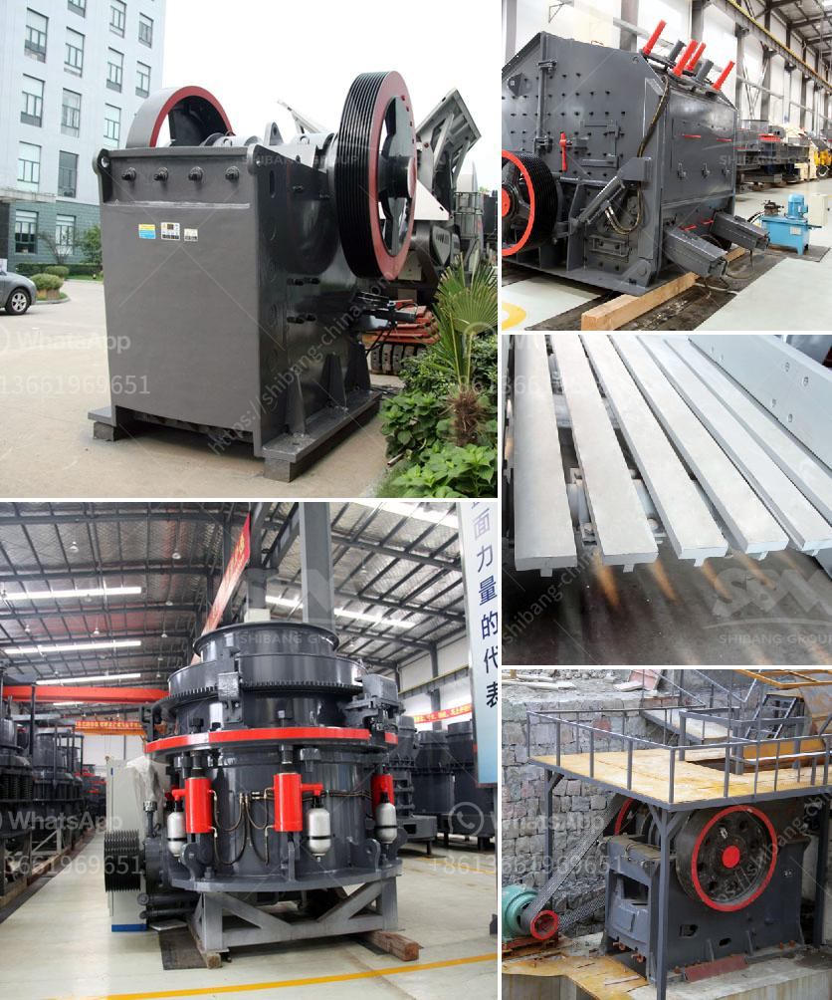

<h3>What are the parts of a ball mill?</h3>
A ball mill is a type of grinding equipment that is used to finely grind materials. Many balls, referred to as media, are placed into the mill with the material to be ground, and the mill is rotated. The material is finely ground by collision forces among the balls themselves and between the balls and the inner surface of the mill. The parts of the ball mill include a shell, a motor, a gearbox, and the peripheral components (supporting equipment, which include main shafts, auxiliary shafts, grinding balls, diaphragms, liners, etc.).

The purpose of the shell is to transmit energy from the motor to the grinding medium and charge the specific particle size of the material in the mill. The shell is made of steel, lined with high-quality rubber or other wear-resistant materials, which helps protect it from heavy wear and tear. Moreover, the inner surface of the shell may be studded with steel liners or rubber liners to enhance the grinding process and ensure efficient milling.

The motor is responsible for generating power to rotate the mill, which requires a high amount of torque. Typically, ball mills require more than 4,000 horsepower in order to grind the material effectively. For optimal operation, the motor should be positioned at a stable speed that allows for continuous operation without impacting the quality and efficiency of the milling process.

To enable the controlled rotation of the mill, a gearbox is placed between the motor and the mill itself. The gearbox is responsible for converting the high-speed rotational motion of the motor into a slower speed suitable for grinding. This helps to achieve the desired grinding speed, torque, and efficiency.

Peripheral components play a crucial role in the overall operation and efficiency of the ball mill. Main shafts, auxiliary shafts, and supporting equipment, such as bearings and roller assemblies, ensure the smooth and consistent rotation of the mill. These components must be designed to withstand high loads, vibrations, and potential impact from the grinding media and the material being ground.

Grinding balls, also known as grinding media, are critical components of the ball mill. They are spherical or cylindrical objects that are filled in the mill, more often than not, the substance to be ground is loaded into the ball mill, and as the mill rotates, the grinding media are lifted up along the rising side of the mill until they break loose from the shell. At this point, the media falls freely, hitting and grinding the substance being ground. Different types of grinding media, such as ceramic balls, flint pebbles, or stainless steel balls, are used depending on the material being ground and the desired final product.

Diaphragms and liners are other essential components of a ball mill. The diaphragm acts as a partition between the grinding media and the material in the mill, enabling efficient separation and ensuring that the desired particle size is achieved. Liners are used to protect the inner surface of the mill from abrasion caused by the grinding media and the material being ground. They also help optimize the grinding process by ensuring that the balls do not slide along the shell, instead moving more efficiently, increasing the impact and grinding efficiency.

In conclusion, a ball mill has several main components, including the shell, motor, gearbox, and peripheral equipment such as main shafts, auxiliary shafts, grinding balls, diaphragms, and liners. These components work together to enable effective and efficient grinding of materials, making a ball mill an essential piece of equipment for various industries.
<h3>Contact us</h3><ul><li><strong>Whatsapp:&nbsp;<a href="https://wa.me/8613661969651">+8613661969651</a></strong></li><li><a href="https://swt.shibang-china.com/?git&amp;zhl&amp;What are the parts of a ball mill"><strong>Online Service(chat now)</strong></a></li></ul><h3>Related</h3><ul><li><a href='What method of costing is used for the crusher industry.md'>What method of costing is used for the crusher industry?</a></li><li><a href='What equipment is required for quartz sand production.md'>What equipment is required for quartz sand production?</a></li><li><a href='What is the difference between impact cone jaw crushers .md'>What is the difference between impact cone jaw crushers ?</a></li><li><a href='What equipment do you need for coal mining.md'>What equipment do you need for coal mining?</a></li><li><a href='What is quarry crushing .md'>What is quarry crushing ?</a></li></ul>