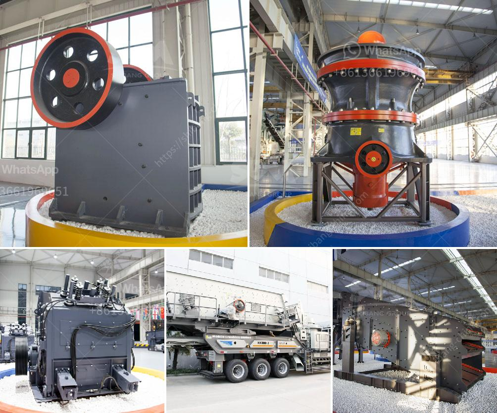

<h3>What are the parts of a mill in a cement plant?</h3>
A cement mill plays a crucial role in the cement production process. It is one of the key cement making machines and is widely used for grinding limestone, gypsum, clinker, and coal in the cement manufacturing plant. However, the mill is only one part of the grinding system, and its performance is reliant on the whole production line.

1. Grinding system: The material is distributed over the roller table and is pressed by the rollers to grind it. The grinded material moves towards the edge of the table and is swept by the grinding rollers into the high-pressure grinding zone.

2. Separator: The separator plays a vital role in ensuring the fineness of the cement particles. It separates the fine material from the coarse particles, allowing only the fine particles to pass through and be collected as finished cement.

3. Mill motor: The mill motor is responsible for generating the required mechanical force and energy to grind the materials. It drives the grinding table rotation and provides the necessary power to the roller press and other subsystems.

4. Gearbox: The gearbox is an essential component that ensures the smooth and efficient operation of the mill. It helps in controlling the rotational speed of the mill and transmitting the torque from the motor to the grinding table.

5. Mill shell: The mill shell is a hollow cylindrical shell made up of steel plates. It is lined with steel liners to protect it from wear and tear. The grinding media (steel balls) are filled inside the shell, which rotates along with the mill to grind the material.

6. Bearings: The mill bearings are crucial for maintaining smooth and friction-free operation. They support the mill shell, roller table, and other rotating components. The bearings are often lubricated to reduce friction and ensure longer service life.

7. Feeding system: The feeding system controls the flow of material into the mill. It consists of a belt conveyor or a bucket elevator, which transfers the raw material to the mill for grinding. Proper control of the feeding system is essential to maintain the desired material flow rate and avoid overload or blockage issues.

8. Dust collectors: A cement mill produces a significant amount of dust during operation. Dust collectors, such as bag filters or electrostatic precipitators, are used to capture the dust particles and prevent them from being released into the atmosphere. These collectors help in maintaining a clean and healthy working environment.

In conclusion, a cement mill is a crucial part of a cement plant, and its production efficiency and quality largely depend on the proper functioning of each of its components. The parts mentioned above play a vital role in the grinding, separating, and conveying processes within the mill. Therefore, regular maintenance and inspection of these parts are necessary to ensure the smooth and efficient operation of the cement mill and overall cement production process.
<h3>Contact us</h3><ul><li><strong>Whatsapp:&nbsp;<a href="https://wa.me/8613661969651">+8613661969651</a></strong></li><li><a href="https://swt.shibang-china.com/?git&amp;zhl&amp;What are the parts of a mill in a cement plant"><strong>Online Service(chat now)</strong></a></li></ul><h3>Related</h3><ul><li><a href='What equipment is used on a bauxite site.md'>What equipment is used on a bauxite site?</a></li><li><a href='7 different vibrating screens how do you choose.md'>7 different vibrating screens, how do you choose?</a></li><li><a href='what are the various uses of lime stone powder？.md'>what are the various uses of lime stone powder？</a></li><li><a href='What are the coal sizing requirements for a power plant.md'>What are the coal sizing requirements for a power plant?</a></li><li><a href='What is a beneficiation plant primary mill.md'>What is a beneficiation plant primary mill?</a></li></ul>