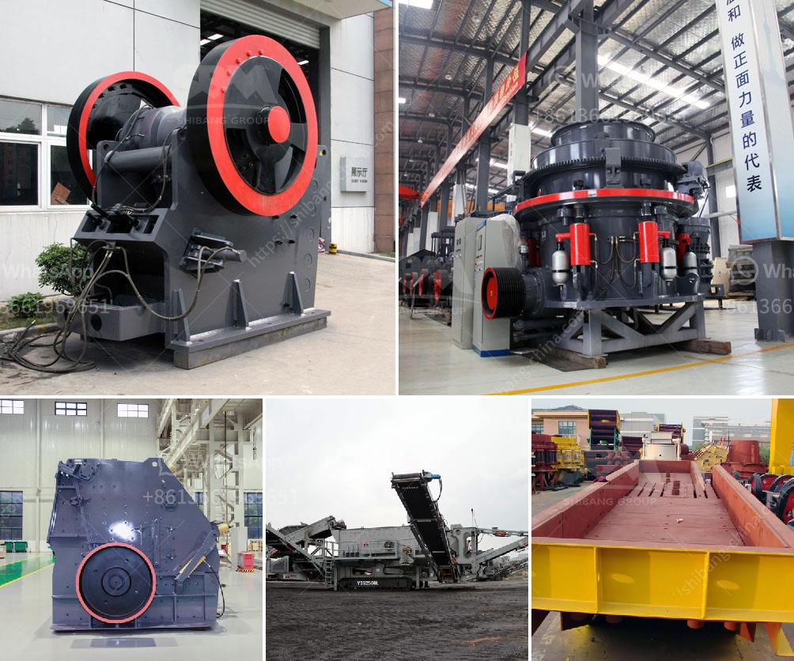

<h3>What are the processing equipment for feldspar powder？</h3>
Feldspar is a common type of mineral found in various parts of the world. It is widely used in industries such as ceramics, glass, and fillers due to its unique properties. Feldspar powder is a fine and powdery material that is obtained by processing feldspar rock or mineral with high purity.

To obtain feldspar powder, various processing techniques are used in different stages of the manufacturing process. These processing equipment play a crucial role in enhancing the quality and characteristics of the final product. Let's explore the processing equipment commonly used for producing feldspar powder.

1. Crushing Equipment: The first step in processing feldspar is crushing the raw material into smaller pieces. This is usually achieved using jaw crushers or gyratory crushers. The crushed material is then further reduced in size using cone crushers or impact crushers, ensuring that the feldspar particles are evenly broken down for subsequent processing.

2. Grinding Equipment: After the initial crushing stage, the feldspar particles need to be ground into a fine powder. This is accomplished using various grinding mills such as rod mills, ball mills, or Raymond mills. These mills grind the material to the desired particle size, ensuring that the feldspar powder is finely ground and uniform in texture.

3. Magnetic Separation Equipment: Magnetic separation is often used to remove impurities and magnetic minerals from feldspar ore. High-intensity magnetic separators are employed to separate the magnetic and non-magnetic components of the ore. This process helps improve the quality of the feldspar powder by eliminating undesirable minerals or impurities.

4. Flotation Equipment: Flotation is another common technique used to separate feldspar from impurities. Flotation cells or flotation machines are utilized to separate and concentrate feldspar from other materials. This process relies on the difference in surface properties of minerals, allowing selective attachment of specific particles to air bubbles.

5. Drying Equipment: Once the feldspar powder is prepared, it needs to be dried to remove any residual moisture. Various drying equipment, including rotary dryers and fluidized bed dryers, are used to reduce the moisture content to the desired level. Proper drying ensures the stability and long shelf life of the feldspar powder.

6. Packaging Equipment: After the processing stages, the final feldspar powder is packaged for distribution. Packaging equipment such as bagging machines or bulk loaders are utilized to pack the powder in different quantities and forms, depending on the end-user requirements.

In conclusion, the processing equipment for feldspar powder plays a vital role in transforming the raw material into a valuable and usable product. The crushing, grinding, magnetic separation, flotation, drying, and packaging equipment are all essential components of the processing line. By employing these equipment, the quality, purity, and particle size distribution of the feldspar powder can be controlled, ensuring its suitability for various applications in industries such as ceramics, glass, and fillers.
<h3>Contact us</h3><ul><li><strong>Whatsapp:&nbsp;<a href="https://wa.me/8613661969651">+8613661969651</a></strong></li><li><a href="https://swt.shibang-china.com/?git&amp;zhl&amp;What are the processing equipment for feldspar powder？"><strong>Online Service(chat now)</strong></a></li></ul><h3>Related</h3><ul><li><a href='What determines the capacity of a stone crusher.md'>What determines the capacity of a stone crusher?</a></li><li><a href='What type of crusher is good for bentonite and dolomite.md'>What type of crusher is good for bentonite and dolomite?</a></li><li><a href='what is the difference between tube grinder and ball mill.md'>what is the difference between tube grinder and ball mill</a></li><li><a href='What kind of crusher is used to create railway ballast.md'>What kind of crusher is used to create railway ballast?</a></li><li><a href='What are the main current crusher and which is good.md'>What are the main current crusher and which is good?</a></li></ul>