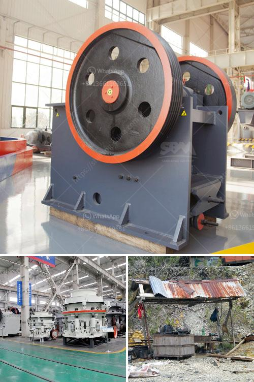

<h3>What are the requirements for a sand crushing plant?</h3>
A sand crushing plant, also known as a sand-making plant, is a combination of equipment that is used to crush rocks and produce sand. The main goal of a sand crushing plant is to produce aggregate material that can be used in various construction projects. The requirements for a sand crushing plant vary based on the type of project at hand, but there are some common requirements that all sand crushing plants must meet. In this article, we will explore these requirements in more detail.

1. Location: The location of the sand crushing plant plays a crucial role in determining its success. It should be located near the source of raw materials to minimize transportation costs. Additionally, it should be situated in an area that is far from residential areas to avoid any potential nuisances related to noise and dust.

2. Raw Materials: The main raw materials needed for a sand crushing plant are rocks. The type of rocks required may vary depending on the application of the sand. Commonly used rocks include granite, limestone, and basalt. These rocks should be of high quality and have a low moisture content to ensure the production of good quality sand.

3. Feeding Equipment: A sand crushing plant requires a steady supply of raw materials. Therefore, it needs a reliable feeding equipment system. This typically includes a vibrating feeder that evenly distributes the rocks to the primary crusher.

4. Crushing Equipment: The primary crusher is responsible for breaking down the rocks into smaller pieces. Common types of primary crushers used in sand crushing plants include jaw crushers and gyratory crushers. These crushers have different capabilities and are chosen based on the desired output size and capacity of the plant.

5. Screening Equipment: After the rocks are crushed, they need to be screened to separate the desired size of sand from any oversized or undersized particles. This is achieved using various types of screening equipment, such as vibrating screens and trommel screens.

6. Sand Washing Equipment: Depending on the application, the sand produced by the crushing plant may need to be washed to remove impurities. Sand washing equipment, such as sand screws or sand classifiers, can be used to achieve this.

7. Stockpiling Equipment: The final step in a sand crushing plant is the stockpiling of the sand. This can be done using conveyors or stackers, which collect the sand and deposit it in designated storage areas. This allows for easy access to the sand when it is needed for construction projects.

8. Environmental Considerations: Finally, a sand crushing plant must meet certain environmental regulations. This includes measures to minimize dust and noise pollution, as well as the proper disposal of any waste materials generated during the crushing process.

In conclusion, a sand crushing plant requires careful planning and consideration of various factors. From the location and quality of raw materials to the selection of appropriate equipment, each requirement must be met to ensure the production of high-quality sand. By meeting these requirements, a sand crushing plant can successfully contribute to the construction industry and meet the demands for sand in various projects.
<h3>Contact us</h3><ul><li><strong>Whatsapp:&nbsp;<a href="https://wa.me/8613661969651">+8613661969651</a></strong></li><li><a href="https://swt.shibang-china.com/?git&amp;zhl&amp;What are the requirements for a sand crushing plant"><strong>Online Service(chat now)</strong></a></li></ul><h3>Related</h3><ul><li><a href='What are equipments used in a cement plant .md'>What are equipments used in a cement plant ?</a></li><li><a href='What is Crushing and Screening .md'>What is Crushing and Screening ?</a></li><li><a href='What is the process of mining orthoclase feldspar.md'>What is the process of mining orthoclase feldspar?</a></li><li><a href='What is the difference between an impact cone and jaw crusher.md'>What is the difference between an impact, cone, and jaw crusher?</a></li><li><a href='What types of crushers are used in copper mining in Zambia.md'>What types of crushers are used in copper mining in Zambia?</a></li></ul>