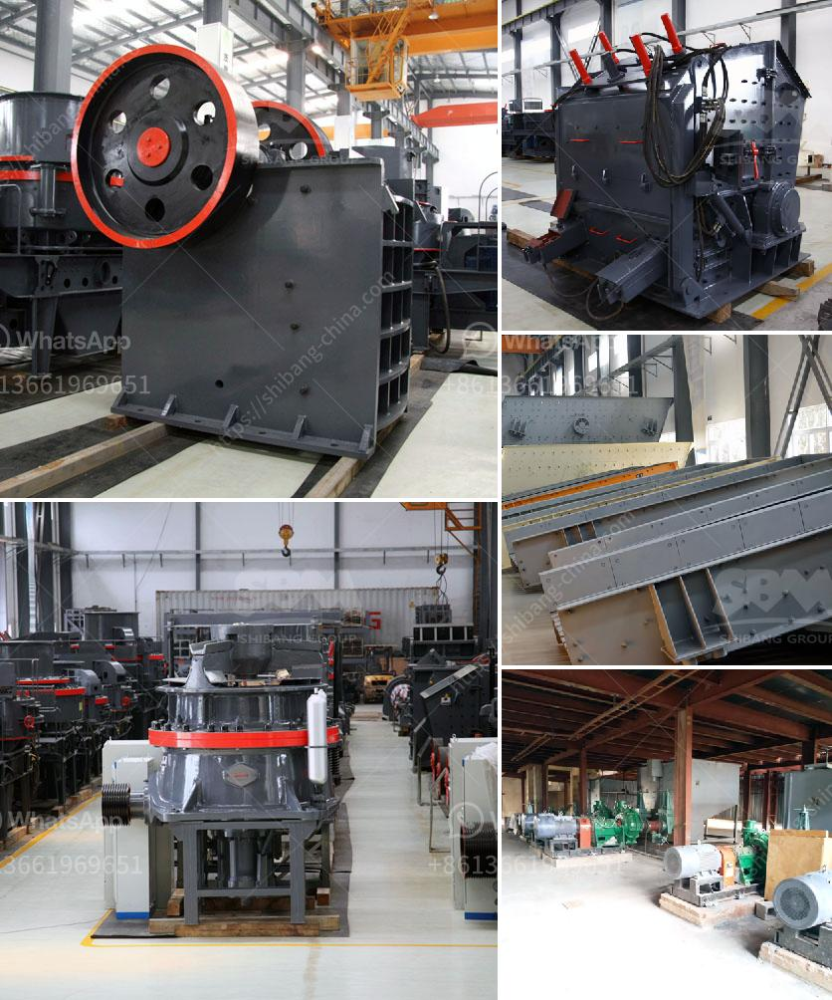

<h3>What are the spare parts of a stone crusher?</h3>
When it comes to stone crushers, different types of crushers have different spare parts requirements. The following are the common spare parts requirements for various stone crushers.

Liner plates are one of the main wear parts for crushing equipment. They are mainly used in cone crushers, jaw crushers, gyratory crushers, and impact crushers. Usually, these parts are made of high manganese steel and wear-resistant materials, which can withstand harsh working conditions and ensure the continuous crushing operation of stone crushers. The broken stone material is squeezed and impacted by the liner plates, which not only protects the main body of the crusher but also improves the crushing efficiency.

Hammer heads are the key parts in the crushing chamber of impact crushers, especially suitable for fine crushing and medium crushing of materials with high hardness. The hammer head is made of high chromium alloy material, which has excellent wear resistance and long service life. It can effectively reduce the production cost and extend the maintenance cycle of stone crushers.

The rotor is the key component in the crushing chamber of impact crushers. It directly affects the working efficiency and crushing effect of crushers. The rotor is made of high-quality alloy steel, which has a long service life and high impact resistance. The shape and size of the rotor can be customized according to different crushing requirements, ensuring a smooth crushing process and reducing energy consumption.

Screens are an essential part of stone crushers, which are used to separate stones into different sizes. Vibrating screens are generally composed of screen frames, screen meshes, springs, and electric motors. The screen frame is made of high-quality steel, which has a strong structure and can withstand the impact of stones during the screening process. The screen meshes are made of wear-resistant materials, which can effectively prevent screen holes from being damaged by hard stones. The springs and electric motors ensure the stable operation and smooth vibration of the screens, ensuring efficient stone crushing.

Bearings play a crucial role in the operation of stone crushers. They mainly support the rotating parts of the crushers, such as the eccentric shaft, which transmits power to the crushing chamber, as well as the flywheel, which stores energy during the operation of the crusher. Therefore, high-quality and durable bearings are highly sought after by stone crusher manufacturers. They can reduce the risk of machine failure, improve crushing efficiency, and extend the service life of stone crushers.

In conclusion, spare parts are essential for stone crushers to ensure their smooth and efficient operation. Liner plates, hammers, rotors, screens, and bearings are the common spare parts of stone crushers. Different models of crushers have different spare parts requirements. As a professional stone crusher manufacturer, it is essential to understand the requirements of your crushers and choose high-quality spare parts to ensure their long service life and reduce downtime.
<h3>Contact us</h3><ul><li><strong>Whatsapp:&nbsp;<a href="https://wa.me/8613661969651">+8613661969651</a></strong></li><li><a href="https://swt.shibang-china.com/?git&amp;zhl&amp;What are the spare parts of a stone crusher"><strong>Online Service(chat now)</strong></a></li></ul><h3>Related</h3><ul><li><a href='What kind of quartz can be used in the paint industry and how to get it.md'>What kind of quartz can be used in the paint industry and how to get it?</a></li><li><a href='What is the project cost for ball grinding unit .md'>What is the project cost for ball grinding unit ?</a></li><li><a href='What is quarry crushing .md'>What is quarry crushing ?</a></li><li><a href='What should be the RPM of a ball mill with a 45inch diameter.md'>What should be the RPM of a ball mill with a 45-inch diameter?</a></li><li><a href='What type of motor is used in cement mills.md'>What type of motor is used in cement mills?</a></li></ul>