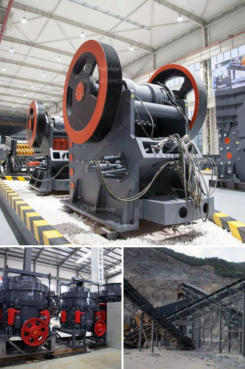

<h3>What are the specifications of the copper crusher?</h3>
The copper crusher is a mechanical process that crushes copper metal into small particles by using a conventional impact crusher, which consists of a rotating hammer that strikes the copper metal against a hard anvil. The specifications of the copper crusher are important in understanding its purpose and functionality. This article will outline the various specifications of the copper crusher, highlighting its significance in the copper mining industry.

Firstly, the copper crusher is designed to handle various types of copper ore, including sulfide ores, oxide ores, and native copper. Each type of copper ore requires a specific crushing process in order to obtain the pure copper metal. The specifications of the copper crusher ensure that it is capable of processing these different types of copper ore accurately and efficiently.

Secondly, the copper crusher has a designated input size range. This refers to the maximum size of the copper ore that can be fed into the crusher. The maximum input size can vary depending on the specific crusher model and its capacity. Typically, the input size ranges from several centimeters to a few tens of centimeters. It is crucial to adhere to the specified input size range to avoid damaging the crusher and achieving optimal crushing efficiency.

Another important specification of the copper crusher is its capacity. The capacity refers to the maximum amount of copper ore that the crusher can process within a given time period. The capacity can be measured in terms of tons per hour or tons per day. The choice of crusher model and its corresponding capacity is determined by the anticipated production requirements of the copper mining operation.

Furthermore, the copper crusher specifications also include the required output size range. The output size refers to the size of the crushed copper particles after they have passed through the crusher. The desired output size may vary depending on the intended use of the copper, whether it is for further processing, smelting, or exporting. Different crushers can produce different output particle sizes, enabling the copper mining operation to achieve the desired final product specifications.

Lastly, the copper crusher specifications may also outline additional features and functionalities. These can include features such as adjustable discharge settings, automated control systems, and safety mechanisms. These additional features enhance the overall performance, safety, and user-friendliness of the copper crusher.

In conclusion, the specifications of the copper crusher play a crucial role in its ability to process different types of copper ores accurately and efficiently. The input size range, capacity, output size range, and additional features and functionalities are all important considerations when selecting a copper crusher for a mining operation. By understanding and adhering to these specifications, mining companies can optimize the crushing process and obtain the desired copper product for further processing.
<h3>Contact us</h3><ul><li><strong>Whatsapp:&nbsp;<a href="https://wa.me/8613661969651">+8613661969651</a></strong></li><li><a href="https://swt.shibang-china.com/?git&amp;zhl&amp;What are the specifications of the copper crusher"><strong>Online Service(chat now)</strong></a></li></ul><h3>Related</h3><ul><li><a href='what brand of iron ore crusher more advanced.md'>what brand of iron ore crusher more advanced</a></li><li><a href='What type of crusher used for copper ore crushing.md'>What type of crusher used for copper ore crushing?</a></li><li><a href='What do crusher model letters represent.md'>What do crusher model letters represent?</a></li><li><a href='What is the purpose of using hydraulic cylinders in cone crushers.md'>What is the purpose of using hydraulic cylinders in cone crushers?</a></li><li><a href='What is the need to replace the jaw crusher plate？.md'>What is the need to replace the jaw crusher plate？</a></li></ul>