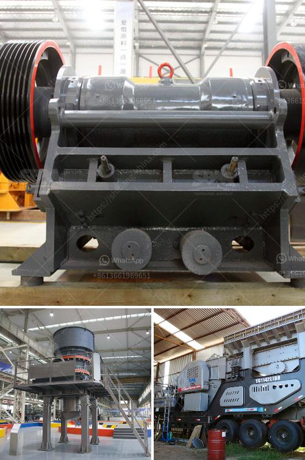

<h3>What are the specifications of the crusher for crushing concrete?</h3>
Crushers play an important role in the recycling process. They can turn large pieces of concrete into smaller, more manageable pieces that can be used as gravel for new construction projects. There are several types of crushers available in the market for crushing concrete, each with its unique set of specifications and capabilities.

One common type of crusher is the jaw crusher. It is a heavy-duty machine that is generally used for primary crushing of concrete. Jaw crushers are robust machines that have a stationary jaw and a moving jaw. The moving jaw swings back and forth to crush concrete against a fixed jaw. With this motion, the concrete is gradually reduced in size.

When considering the specifications of a jaw crusher for crushing concrete, there are several factors to consider. The feed size of the concrete must be taken into account. A jaw crusher works by exerting force on the concrete to break it down into smaller pieces. Therefore, the concrete should be fed into the machine with an appropriate size. Most jaw crushers can handle concrete with a maximum size of about 40 inches.

Another important specification to consider is the crushing capacity of the crusher. This refers to the maximum amount of concrete that can be processed per hour. Jaw crushers can vary greatly in terms of their capacity, depending on the model and manufacturer. Typical production capacities range from 100 to 3,000 tons per hour.

The power requirements of the crusher are also important to consider. Jaw crushers are typically powered by electric motors or diesel engines. The power rating of the motor or engine should be sufficient to ensure efficient crushing of concrete. Higher power ratings typically result in higher productivity and reduced downtime.

The design of the jaw crusher should also be considered. It should be robustly built to withstand the demanding conditions of crushing concrete. A heavy-duty frame and reinforced components are essential to ensure durability. Additionally, the crusher should have a reliable and efficient system for adjusting the gap between the jaws, allowing for the desired size of the crushed concrete.

Other specifications to consider include the presence of a pre-screening system, which helps to remove any unwanted materials from the concrete before crushing. This can improve the efficiency of the crushing process and reduce wear on the crusher's components.

In conclusion, the specifications of a crusher for crushing concrete are an important consideration when selecting the right machine for the job. Factors such as feed size, crushing capacity, power requirements, and design should all be taken into account. By carefully considering these specifications, one can ensure that the crusher is well-suited for the task at hand and will provide efficient and reliable crushing of concrete materials.
<h3>Contact us</h3><ul><li><strong>Whatsapp:&nbsp;<a href="https://wa.me/8613661969651">+8613661969651</a></strong></li><li><a href="https://swt.shibang-china.com/?git&amp;zhl&amp;What are the specifications of the crusher for crushing concrete"><strong>Online Service(chat now)</strong></a></li></ul><h3>Related</h3><ul><li><a href='What is the cost of gravel crushing .md'>What is the cost of gravel crushing ?</a></li><li><a href='What is a jaw crusher used for.md'>What is a jaw crusher used for?</a></li><li><a href='What is the total cost of a 100 TPH crusher plant.md'>What is the total cost of a 100 TPH crusher plant?</a></li><li><a href='What is a single toggle jaw crusher.md'>What is a single toggle jaw crusher?</a></li><li><a href='What is a conetype rock crusher.md'>What is a cone-type rock crusher?</a></li></ul>