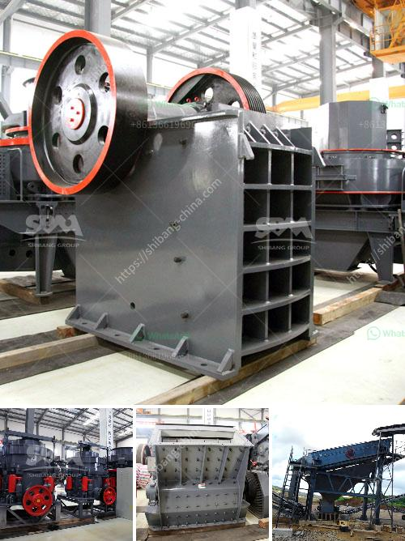

<h3>What are the specifications of the limestone powder used in the paper mill?</h3>
The use of limestone powder in the paper mill has been on the rise due to its multiple benefits. As a standard practice, before paper gets its final shape and quality, it is subjected to several processes. During these processes, limestone powder is added to enhance the quality of the paper.

Limestone powder is widely used in the paper mill industry for the production of various paper products including newspapers, books, magazines, and even packaging materials. It is an essential component in the production process because it acts as a filler material, improving the brightness, opacity, and printability of the paper.

The specifications of limestone powder used in the paper mill vary depending on the application. For general purposes, a calcium carbonate content of 70-80% is considered suitable and necessary for producing high-quality paper. This calcium carbonate content ensures that the paper has good opacity, allowing for better readability. It also helps in enhancing the paper's brightness, giving it a clean and professional appearance.

Another important specification of limestone powder used in the paper mill is its particle size. The particle size should be controlled within a certain range to ensure optimum performance. Generally, the particle size of limestone powder used in paper mill ranges from a few microns to a few hundred microns. This specific range is chosen to achieve the desired level of smoothness on the paper's surface. Additionally, the particle size distribution should also be consistent to avoid any variation in paper quality.

The whiteness of the limestone powder is another factor that determines its suitability for use in the paper mill. Higher whiteness levels contribute to the overall brightness of the paper and make it more appealing. Generally, limestone powders with high whiteness levels ranging from 90-95% are preferred in the paper industry. This ensures that the paper comes out bright and vibrant, creating a visual appeal for readers.

It is worth mentioning that the quality of limestone powder greatly depends on the source of the limestone and the processing methods employed. Various geological formations produce limestone with different characteristics. Therefore, it is crucial for paper mill operators to carefully select the source of limestone powder to ensure consistent quality and performance.

Overall, the specifications of limestone powder used in the paper mill industry are determined based on the desired qualities of the paper such as opacity, brightness, and printability. When used in the correct proportion and with the right specifications, limestone powder significantly improves the overall quality of paper products, making them suitable for a wide range of applications. As the demand for quality paper continues to grow, the importance of limestone powder in the paper mill industry is only expected to increase.
<h3>Contact us</h3><ul><li><strong>Whatsapp:&nbsp;<a href="https://wa.me/8613661969651">+8613661969651</a></strong></li><li><a href="https://swt.shibang-china.com/?git&amp;zhl&amp;What are the specifications of the limestone powder used in the paper mill"><strong>Online Service(chat now)</strong></a></li></ul><h3>Related</h3><ul><li><a href='What is the problem with ore mining .md'>What is the problem with ore mining ?</a></li><li><a href='What is the waste of ore crushing plant .md'>What is the waste of ore crushing plant ?</a></li><li><a href='What is Raymond mill and ball mill process .md'>What is Raymond mill and ball mill process ?</a></li><li><a href='What is the ore crusher discharge port size.md'>What is the ore crusher discharge port size?</a></li><li><a href='What machines are used in a crushing plant？.md'>What machines are used in a crushing plant？</a></li></ul>