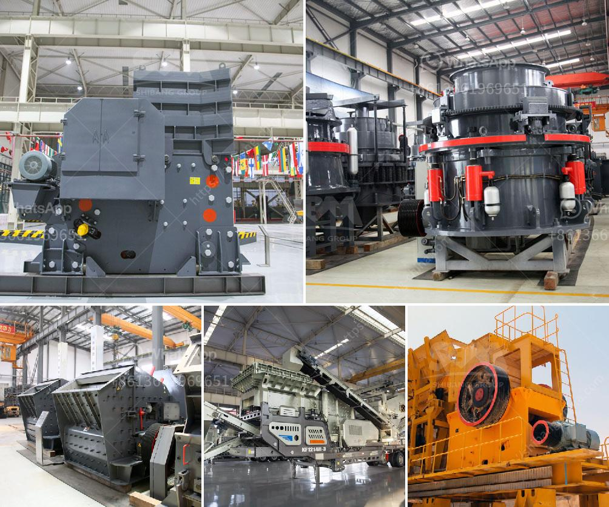

<h3>What are the steps in manufacturing Portland cement?</h3>
Portland cement is one of the most commonly used materials in construction. It is a fine powder, typically gray in color, that is made by heating limestone and other materials at high temperatures. This process, known as cement manufacturing, involves several steps to produce the final product.

1. Quarrying and Preparation of Raw Materials: The first step in manufacturing Portland cement is to quarry the limestone, clay, and other raw materials. These raw materials are typically extracted from quarries through blasting or drilling. Once the limestone and clay are obtained, they are crushed into smaller pieces and transported to the cement plant.

2. Raw Material Grinding: The crushed limestone and clay are then mixed in proper proportions to form a raw meal. This raw meal is further ground into a fine powder in a raw mill, a large rotating cylinder with steel balls inside. The grinding process helps to increase the surface area of the raw materials, allowing for better chemical reactions during the subsequent stages.

3. Burning: Once the raw materials are ground, they are sent to a rotary kiln, a large cylindrical furnace that is heated to extremely high temperatures. The raw materials are fed into one end of the kiln and move gradually towards the other end. As they travel, the raw materials are gradually heated, reaching temperatures of about 1450 degrees Celsius. This high temperature causes a series of chemical reactions to occur, resulting in the formation of clinker.

4. Clinker Cooling: After leaving the kiln, the clinker is cooled down rapidly to prevent it from re-reacting and forming unwanted compounds. This is typically done using a grate cooler system, where cool air is passed through the clinker bed, cooling it down to around 100 degrees Celsius.

5. Grinding of Clinker: The cooled clinker is then ground into a fine powder in a cement mill, along with a small amount of gypsum. The gypsum acts as a retarder, slowing down the time it takes for the cement to set. The resulting product, known as Portland cement, is carefully tested to ensure it meets the required specifications.

6. Packaging and Distribution: Once the cement is produced, it is packaged into bags or bulk containers for transportation and distribution to construction sites. This can involve loading the cement onto trucks, trains, or ships, depending on the location of the destination.

The manufacturing process of Portland cement requires specialized equipment and careful control of various parameters to ensure consistent and high-quality results. It is a complex process that combines chemistry, engineering, and environmental considerations.

In conclusion, the steps in manufacturing Portland cement involve quarrying and preparing the raw materials, grinding them into a fine powder, followed by burning and cooling to produce clinker. This clinker is then ground with gypsum to form the final product, Portland cement. The manufacturing process plays a crucial role in ensuring the strength and durability of the cement, making it a vital component in the construction industry.
<h3>Contact us</h3><ul><li><strong>Whatsapp:&nbsp;<a href="https://wa.me/8613661969651">+8613661969651</a></strong></li><li><a href="https://swt.shibang-china.com/?git&amp;zhl&amp;What are the steps in manufacturing Portland cement"><strong>Online Service(chat now)</strong></a></li></ul><h3>Related</h3><ul><li><a href='what are advantage of grinding machines？.md'>what are advantage of grinding machines？</a></li><li><a href='What crusher produces rock in limestone .md'>What crusher produces rock in limestone ?</a></li><li><a href='What is the ball milling method.md'>What is the ball milling method?</a></li><li><a href='What are the features of a jaw crusher.md'>What are the features of a jaw crusher?</a></li><li><a href='What materials are used in concrete alternatives to sand.md'>What materials are used in concrete alternatives to sand?</a></li></ul>