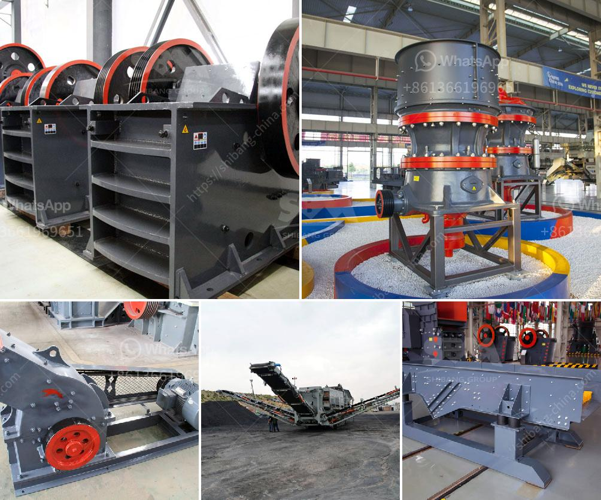

<h3>What are the uses of a cone crusher to mining operations?</h3>
A cone crusher is an essential part of the mining industry, as it functions to break up larger pieces of material into smaller particles. These machines are capable of handling a wide range of materials, including gravel, limestone, coal, iron ore, and zinc ore. Cone crushers are also used in the aggregate industry for crushing rock and stone to produce materials like gravel and asphalt.

One of the main benefits of using a cone crusher is the ability to produce a narrow-sized range of output particles. This allows operators to minimize the amount of material that needs further processing or re-handling, saving both time and money. By efficiently crushing the material to the desired size, cone crushers help to reduce overall operating costs.

Cone crushers are known for their high production capacity, with a maximum efficiency ratio of 94% and high-quality cubic-shaped products. Cone crushers are capable of producing large quantities of uniformly fine crushed stone, which makes them highly efficient for the mining industry.

A cone crusher consists of an inner and outer crushing cone, which are placed on an inclined shaft. These rotate in opposite directions, allowing the material to be crushed between them. The crushing action is caused by the closing of the gap between the mantle line (movable) mounted on the spindle and the concave liners (fixed) mounted on the main frame of the crusher.

The uses of cone crushers in mining operations are vast. They help to reduce large pieces of raw material into smaller, more manageable particles. This allows for the efficient extraction of valuable minerals and metals from the ore. Cone crushers are commonly used in secondary and tertiary crushing stages in mining operations.

In addition to their efficient crushing capabilities, cone crushers are also known for their durability and low maintenance requirements. This makes them ideal for the harsh operating conditions encountered in mining operations. Cone crushers are designed to withstand extreme temperatures, dust, and vibration, ensuring their longevity and reliability.

Cone crushers are often used in conjunction with other equipment, such as vibrating screens, conveyors, and feeders, to optimize the production process. By incorporating these additional components, mining operations can achieve even higher levels of efficiency and productivity.

Overall, cone crushers play a crucial role in the mining industry. Their ability to efficiently crush a wide range of materials allows for the extraction of valuable minerals and metals from the ore. Their robust construction and low maintenance requirements make them reliable machines in even the toughest operating conditions. With their high production capacity and ability to produce uniformly fine crushed stone, cone crushers are an essential tool for modern mining operations.
<h3>Contact us</h3><ul><li><strong>Whatsapp:&nbsp;<a href="https://wa.me/8613661969651">+8613661969651</a></strong></li><li><a href="https://swt.shibang-china.com/?git&amp;zhl&amp;What are the uses of a cone crusher to mining operations"><strong>Online Service(chat now)</strong></a></li></ul><h3>Related</h3><ul><li><a href='What method of mining is used to obtain calcite.md'>What method of mining is used to obtain calcite?</a></li><li><a href='What is the final product of columbite.md'>What is the final product of columbite?</a></li><li><a href='What are the merits of vibratory screens.md'>What are the merits of vibratory screens?</a></li><li><a href='What is a ball mill.md'>What is a ball mill?</a></li><li><a href='What is the difference between mining and crushing.md'>What is the difference between mining and crushing?</a></li></ul>