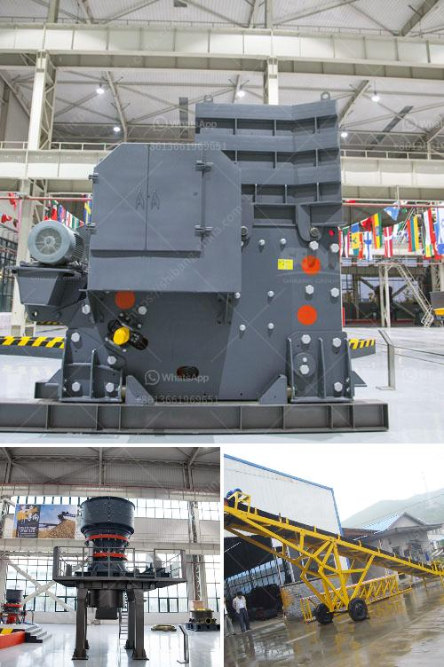

<h3>What can I use to crush rocks or granite?</h3>
Are you looking to crush rocks or granite for various purposes, such as construction or landscaping? If so, you're likely wondering what tools or equipment you can use to complete this task effectively. Crushing rocks or granite requires specialized machinery to ensure the process is efficient and safe. In this article, we will explore some common tools and equipment that you can use to crush rocks or granite.

A jaw crusher is a powerful machine that is commonly used in the mining and construction industries. It is capable of crushing large rocks or granite into smaller, more manageable sizes. The jaw crusher consists of a fixed jaw plate and a moving jaw plate that creates a V-shaped cavity. As rocks or granite enter the cavity, they are crushed between the two plates, resulting in smaller rock fragments.

Another popular choice for crushing rocks or granite is an impact crusher. This machine uses a rotating rotor with high-speed hammers to impact and shatter the stone into smaller pieces. Impact crushers are commonly used for recycling applications or in the production of aggregates, depending on the desired final product.

Cone crushers are often used for secondary or tertiary crushing of rocks or granite. They operate on the principle of squeezing the stone between a mantle and a concave, which creates a smaller-sized product. Cone crushers are particularly useful for producing cubical-shaped materials, making them ideal for shaping applications in construction projects.

For smaller-scale operations or DIY projects, a hammer mill can be an affordable alternative to larger crushing equipment. A hammer mill consists of hammers attached to a rotating shaft within a steel drum. As the drum rotates, the hammers repeatedly impact the material, breaking it into smaller pieces. Hammer mills are versatile and can crush not only rocks or granite but also other materials like wood or biomass.

If you have a small amount of rocks or granite that needs crushing, a mortar and pestle can be a handy tool. This ancient method involves manually grinding the material using a mortar (a bowl) and a pestle (a handheld tool). While it may be time-consuming and labor-intensive, a mortar and pestle are cheap and readily available.

Before crushing rocks or granite, it's important to consider safety precautions. Always wear appropriate protective gear such as goggles, gloves, and dust masks to prevent injuries or the inhalation of harmful particles.

In conclusion, whether you are working on a large-scale construction project or a small DIY endeavor, there are various tools and equipment available to crush rocks or granite. The choice of machinery depends on the scale of the operation, the desired final product, and the resources at your disposal. It is important to conduct thorough research and obtain professional advice to ensure you select the most suitable equipment for your specific needs.
<h3>Contact us</h3><ul><li><strong>Whatsapp:&nbsp;<a href="https://wa.me/8613661969651">+8613661969651</a></strong></li><li><a href="https://swt.shibang-china.com/?git&amp;zhl&amp;What can I use to crush rocks or granite"><strong>Online Service(chat now)</strong></a></li></ul><h3>Related</h3><ul><li><a href='What is the way to block the material of sand crusher .md'>What is the way to block the material of sand crusher ?</a></li><li><a href='What are the coal sizing requirements for a power plant.md'>What are the coal sizing requirements for a power plant?</a></li><li><a href='What is the applicability of a jaw crusher.md'>What is the applicability of a jaw crusher?</a></li><li><a href='What kind of crushers can I use for river rocks.md'>What kind of crushers can I use for river rocks?</a></li><li><a href='What is the need to replace the jaw crusher plate？.md'>What is the need to replace the jaw crusher plate？</a></li></ul>