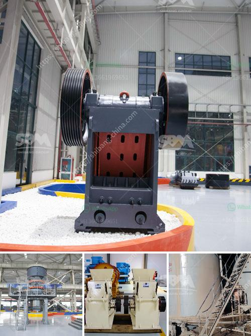

<h3>What can dolomite be used for and how to processing it?</h3>
Dolomite is a mineral that has gained popularity in various industries due to its unique composition and wide range of applications. It is a carbonate mineral made up of calcium magnesium carbonate, often containing small amounts of iron and manganese. This versatile mineral is widely used in agriculture, construction, manufacturing, and even healthcare. In this article, we will explore the various uses of dolomite and how it is processed.

One of the most common applications of dolomite is in the agricultural sector. Due to its high magnesium and calcium content, dolomite is often used as a soil conditioner. It helps to neutralize acidic soils and provides essential nutrients to plants. Additionally, dolomite is also used as a feed additive for livestock, as it aids in the digestion and absorption of nutrients.

In the construction industry, dolomite is used as an aggregate in concrete and asphalt mixtures. Its hardness and durability make it an excellent material for road construction, as it can withstand heavy traffic and harsh weather conditions. Dolomite is also used as a decorative stone in landscaping projects, adding aesthetic appeal to gardens and outdoor spaces.

Another major use of dolomite is in the manufacturing industry. Its high melting point and low reactivity make it an ideal raw material for producing refractory bricks and ceramics. Dolomite is also used in the production of glass and steel, where it acts as a fluxing agent. Flux helps to lower the melting point of the materials being combined, allowing for easier shaping and forming.

When it comes to processing dolomite, several methods can be employed. The most common method is through the use of crushing and grinding equipment. Jaw crushers, impact crushers, or cone crushers are used to break the ore down to a smaller size, suitable for further processing. After the crushing stage, dolomite goes through a grinding process, where it is pulverized to the desired fineness.

Once dolomite is pulverized, it can be processed further to produce various products. Dolomite powder is often used in the manufacturing of paints, ceramics, glass, and detergents. It can also be used as a filler in rubber, plastics, and adhesives. Furthermore, dolomite can be processed into dolomite lime, which is used to adjust soil pH levels and enhance fertilizer efficiency.

In summary, dolomite is a versatile mineral with a wide range of applications. From agriculture to construction, manufacturing to healthcare, dolomite plays a crucial role in various industries. Its unique composition and properties make it a valuable resource.

To process dolomite, it undergoes crushing and grinding to achieve the desired particle size. Afterwards, dolomite can be used to produce a multitude of products including dolomite powder and dolomite lime. With its diverse uses, dolomite is a valuable mineral that contributes to various sectors of the economy.
<h3>Contact us</h3><ul><li><strong>Whatsapp:&nbsp;<a href="https://wa.me/8613661969651">+8613661969651</a></strong></li><li><a href="https://swt.shibang-china.com/?git&amp;zhl&amp;What can dolomite be used for and how to processing it"><strong>Online Service(chat now)</strong></a></li></ul><h3>Related</h3><ul><li><a href='What can dolomite be used for when constructing highways.md'>What can dolomite be used for when constructing highways?</a></li><li><a href='What is the principle of a hammer crusher.md'>What is the principle of a hammer crusher?</a></li><li><a href='What is the operation of a vertical roller mill.md'>What is the operation of a vertical roller mill?</a></li><li><a href='What is a fixed jaw crusher plate and what are its uses.md'>What is a fixed jaw crusher plate and what are its uses?</a></li><li><a href='What is the design of the explosion proof valve for a coal mill.md'>What is the design of the explosion proof valve for a coal mill?</a></li></ul>