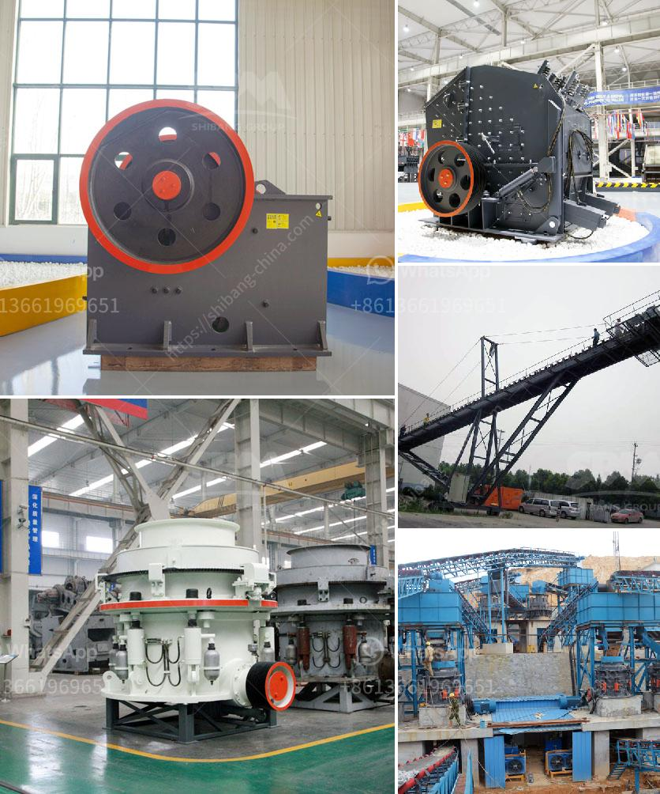

<h3>What can dolomite be used for when constructing highways?</h3>
When it comes to constructing highways, the choice of materials plays a crucial role in ensuring longevity, durability, and safety. One such material that has gained considerable attention in recent years is dolomite. Dolomite, a sedimentary rock that is rich in calcium magnesium carbonate, has proven to be beneficial in various aspects of highway construction. Let us explore the multiple uses and advantages of dolomite in highway construction.

One of the primary uses of dolomite in highway construction is as an aggregate material. Dolomite aggregates are crushed stones that are used as a base material for road surfaces, parking lots, and sidewalks. The use of dolomite aggregates provides several advantages. Firstly, dolomite's hardness and durability make it resistant to breaking, resulting in stronger and longer-lasting road surfaces. Its high frictional properties also enhance road safety by reducing skid risks, especially during wet or icy conditions.

Apart from being a base material, dolomite also serves as a filler material in asphalt mixtures. The addition of dolomite fillers enhances the stability, stiffness, and resistance to deformation of the asphalt mixture. This, in turn, improves the performance and durability of the pavement, ensuring a longer lifespan for the highway. Dolomite fillers also enhance the resistance of the asphalt to rutting, a common problem on heavily trafficked roads.

Another use of dolomite in highway construction is in the production of cement. Dolomite is used as a raw material in the manufacturing of cement, providing the necessary chemistry and alkalinity required for cement production. The dolomite-rich cement enhances the setting time, compressive strength, and durability of the concrete, making it suitable for highway applications. Moreover, dolomite cement has better sulfate resistance, reduced permeability, and improved chemical resistance, further enhancing the longevity of the infrastructure.

In addition to its engineering properties, dolomite has environmental advantages that make it a sustainable choice for highway construction. Dolomite is abundant worldwide, reducing the need for extensive mining and the associated environmental impacts. Its local availability also decreases transportation costs and carbon emissions, further contributing to a greener construction process. Moreover, dolomite has a low energy footprint during production, making it an eco-friendly alternative.

The innovative use of dolomite does not stop at the construction stage. After the highway is built, dolomite can be employed in road maintenance and repair works. Dolomite can be used to seal cracks, patch potholes, and fix loose patches on the road surface, extending the lifespan of the highway without the need for extensive reconstruction.

In conclusion, dolomite has numerous applications in highway construction, making it an invaluable material for engineers and constructors. Its use as an aggregate material, filler in asphalt mixtures, and component in cement production enhances the durability, performance, and safety of highways. Furthermore, its sustainable characteristics make it an environmentally friendly choice. As technological advancements continue, the usage of dolomite in highway construction is likely to further expand, revolutionizing the way our roads are built and maintained.
<h3>Contact us</h3><ul><li><strong>Whatsapp:&nbsp;<a href="https://wa.me/8613661969651">+8613661969651</a></strong></li><li><a href="https://swt.shibang-china.com/?git&amp;zhl&amp;What can dolomite be used for when constructing highways"><strong>Online Service(chat now)</strong></a></li></ul><h3>Related</h3><ul><li><a href='What is receiving feeder in a crusher.md'>What is receiving feeder in a crusher?</a></li><li><a href='What crusher produces rock in limestone .md'>What crusher produces rock in limestone ?</a></li><li><a href='What is the best jaw crusher for coal processing.md'>What is the best jaw crusher for coal processing?</a></li><li><a href='what is a bench berm in mining.md'>what is a bench berm in mining?</a></li><li><a href='What is the difference between an impact cone and jaw crusher.md'>What is the difference between an impact, cone, and jaw crusher?</a></li></ul>