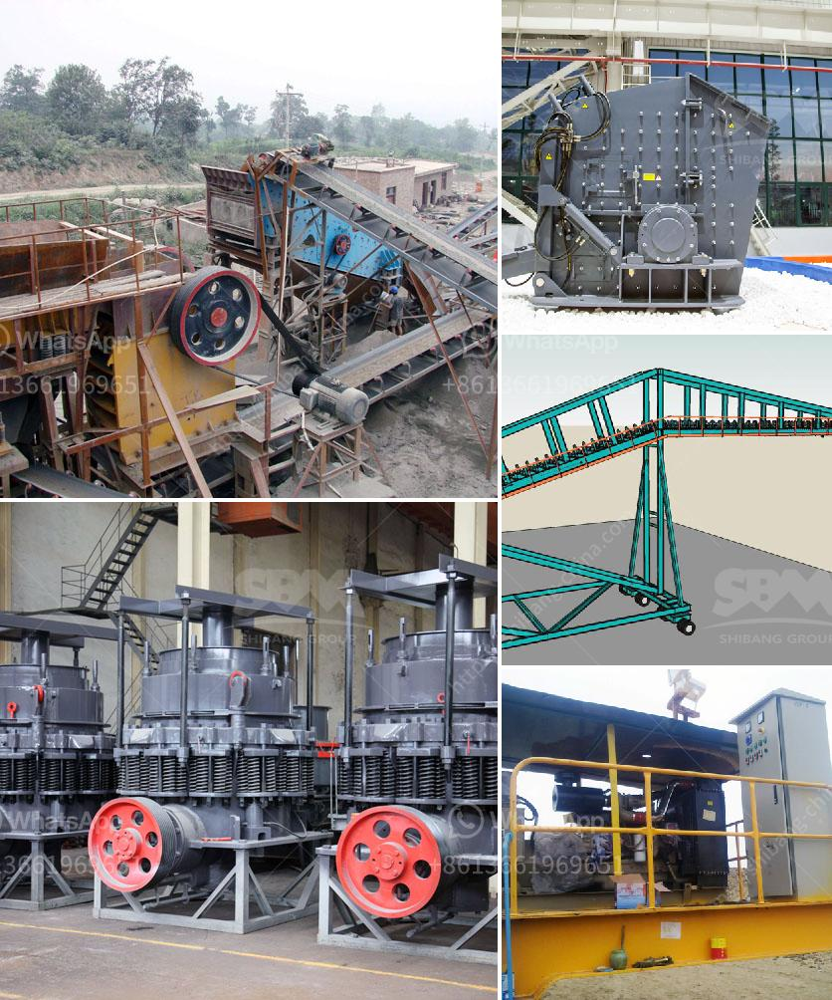

<h3>What causes tension rods in jaw crushers to break?</h3>
Jaw crushers are heavy-duty machines used to crush hard materials and ensure efficient operation in various industries. These machines consist of a fixed jaw and a movable jaw, called a swing jaw. As the material is crushed between the two jaws, the jaws close and exert a compressive force on the rock, thereby breaking it into smaller pieces.

Within the jaw crusher, two tension rods are commonly used to maintain the proper tensioning of the toggle, which moves the swing jaw. These tension rods are essential components in jaw crushers, serving as an elastic connection between the toggle and the frame. They prevent the swing jaw from moving too much or too little, ensuring the crusher's overall stability and productivity.

However, tension rods in jaw crushers can occasionally break, leading to unpredictable machine inefficiency and potential accidents. A variety of factors can cause tension rods to fail and understanding these can aid in preventing future occurrences. Here are some common causes of tension rod breakages in jaw crushers:

1. Overloading: Excessive material feed beyond the crusher's capacity can lead to increased stress on the tension rods. As the swing jaw exerts more force to crush the overload, the tension rods may not withstand the high pressure and break. Maintaining proper feeding practices and adhering to the crusher's recommended capacity can help prevent overloading.

2. Fatigue and wear: Constant cyclic loading on the tension rods due to jaw movement can cause fatigue and wear over time. This can weaken the rods, making them more susceptible to sudden breakage. Regular inspection and maintenance, including rod replacement at prescribed intervals, can help prevent excessive wear and reduce the risk of a sudden failure.

3. Material quality: Tension rods are typically made of high-strength steel to withstand the crushing forces. However, low-quality or flawed materials used in manufacturing can compromise the rods' strength, leading to premature failure. Using high-quality tension rods and regularly inspecting them for any defects or signs of wear is crucial for their longevity.

4. Misalignment: Proper alignment between the toggle and the swing jaw is essential for the correct functioning of tension rods. Misaligned components can cause uneven stress distribution, weakening the rods over time and increasing the likelihood of breakage. Regular adjustment and realignment by qualified personnel can help maintain proper rod alignment.

5. Improper maintenance: Neglecting regular maintenance routines, such as lubrication and cleaning, can contribute to tension rod failure. Lack of lubrication can cause increased friction, excessive wear, and eventual breakage. Following the manufacturer's maintenance guidelines and ensuring proper lubrication can prolong the life of the tension rods.

In conclusion, tension rod breakages in jaw crushers can have detrimental effects on the machine's efficiency and pose potential safety risks. Overloading, fatigue and wear, material quality, misalignment, and improper maintenance are common causes of these failures. To mitigate the risk of breakages, it is essential to follow recommended maintenance procedures, use high-quality materials, and monitor the tension rods regularly. Proper understanding and proactive measures can help ensure the reliable and safe operation of jaw crushers.
<h3>Contact us</h3><ul><li><strong>Whatsapp:&nbsp;<a href="https://wa.me/8613661969651">+8613661969651</a></strong></li><li><a href="https://swt.shibang-china.com/?git&amp;zhl&amp;What causes tension rods in jaw crushers to break"><strong>Online Service(chat now)</strong></a></li></ul><h3>Related</h3><ul><li><a href='What is the mining process of limestone.md'>What is the mining process of limestone?</a></li><li><a href='what is a primary and secondary crusher？.md'>what is a primary and secondary crusher？</a></li><li><a href='What is the role of a coal mill in the clinker manufacturing process.md'>What is the role of a coal mill in the clinker manufacturing process?</a></li><li><a href='What is a Raymond mill.md'>What is a Raymond mill?</a></li><li><a href='what size material can be made with an impact crusher？.md'>what size material can be made with an impact crusher？</a></li></ul>