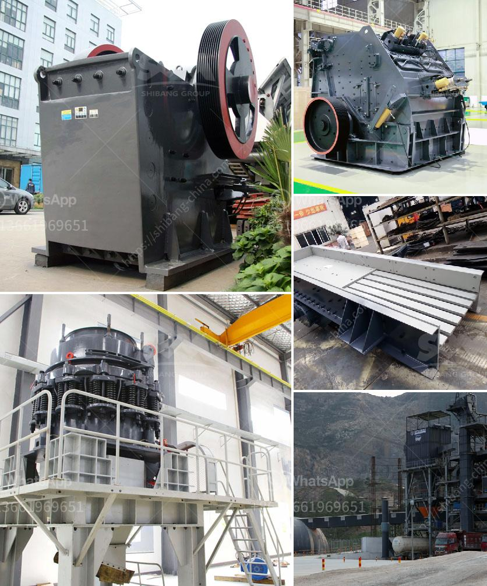

<h3>What chrome ore used for ?</h3>
Chrome ore, derived from the mineral chromite, is an essential ingredient in diverse industries. It has a wide range of uses, contributing to various sectors of the economy. With its unique properties and versatile applications, chrome ore is highly sought after worldwide.

Chromite, the primary source of chrome ore, is the world's second most abundant mineral. It is primarily extracted from open-pit mining operations, where the chromite is crushed and processed to create chrome concentrate. This concentrate is then further processed into various grades of chrome ore for commercial use.

Chrome ore is primarily used in the production of stainless steel, which is used in a multitude of applications from kitchen utensils to surgical instruments. Stainless steel is created by mixing chrome ore, iron ore, and other elements such as nickel and carbon in specific proportions. The mixture is then subjected to extreme heat, causing it to melt and form a solid material. The addition of chrome ore enhances the strength, corrosion resistance, and aesthetics of the final product, making it an ideal material for a wide range of applications.

Another major application of chrome ore is in the production of ferrochrome. Ferrochrome is an alloy of chrome and iron, which is used in the manufacturing of stainless steel, as well as other alloy steels. It imparts specific properties such as hardness, heat resistance, and corrosion resistance to the final product. Ferrochrome is widely used in industries such as automotive, aerospace, construction, and manufacturing.

Furthermore, chrome ore is utilized in the production of refractory materials, which are heat-resistant substances used in high-temperature applications. Refractory materials, with their exceptional resistance to heat, are essential for lining furnaces, kilns, and other industrial equipment that operate at extreme temperatures. Chrome ore adds the necessary thermal and mechanical strength to these materials, ensuring their performance in arduous conditions.

In addition to these major applications, chrome ore finds niche uses in various other industries. It is utilized in the production of superalloys, which are essential materials for jet engines, gas turbines, and other high-performance applications. Chrome ore is also used in the manufacture of pigments for paints, dyes, and inks. These pigments are known for their vibrant colors and excellent lightfastness properties.

Lastly, chrome ore is employed in the production of chrome plating, a process that involves electroplating a thin layer of chromium onto a metal surface. Chrome plating provides excellent corrosion resistance, durability, and aesthetic appeal to metal objects such as automotive parts, bathroom fixtures, and home appliances.

In conclusion, chrome ore is an indispensable mineral that has numerous applications in various industries. From stainless steel production to refractory materials and pigments, it plays a crucial role in enhancing the properties and performance of diverse products. With its abundance and diverse uses, chrome ore has become a valuable commodity in the global economy.
<h3>Contact us</h3><ul><li><strong>Whatsapp:&nbsp;<a href="https://wa.me/8613661969651">+8613661969651</a></strong></li><li><a href="https://swt.shibang-china.com/?git&amp;zhl&amp;What chrome ore used for "><strong>Online Service(chat now)</strong></a></li></ul><h3>Related</h3><ul><li><a href='What method of costing is used for the crusher industry.md'>What method of costing is used for the crusher industry?</a></li><li><a href='What are the features of a jaw crusher.md'>What are the features of a jaw crusher?</a></li><li><a href='What are the characteristics of the spring cone crusher.md'>What are the characteristics of the spring cone crusher?</a></li><li><a href='What equipment is used to extract iron ore .md'>What equipment is used to extract iron ore ?</a></li><li><a href='What kind of machine is needed to grind ore into fine powder？.md'>What kind of machine is needed to grind ore into fine powder？</a></li></ul>