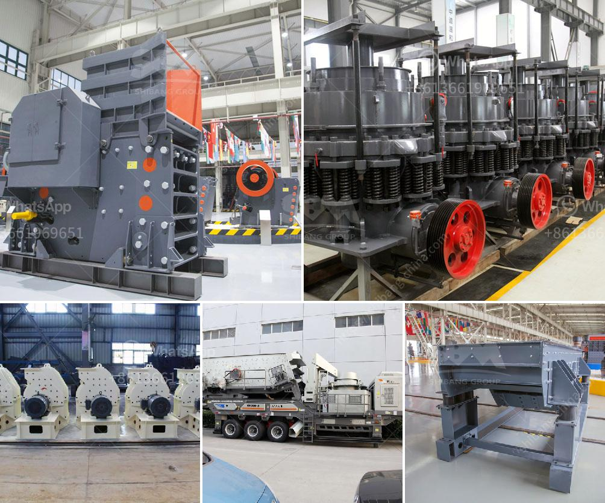

<h3>What critical in stone crusher project ?</h3>
When it comes to investing a stone crushing plant, many factors should be taken into consideration as the critical ones. Although different types of crushers and crushing plants may have different configurations, there are some general factors that affect the investment cost and operation efficiency of stone crushing projects. This article will discuss the key factors that must be considered in a stone crusher project.

1. Project location: The location of the project should be near to the raw materials source and the end market. This will minimize the transportation cost of materials and finished products, thereby reducing overall project expenses.

2. Raw materials availability: Availability and quality of raw materials are vital for a successful stone crushing project. It is essential to ensure a continuous supply of suitable raw materials to maintain consistent production. The quality of the raw materials directly affects the final product's quality, so it is crucial to select a reliable and stable source.

3. Production capacity: The desired production capacity of the stone crushing plant should be carefully considered based on the market demand, project scale, and available resources. A balanced production capacity ensures steady production without overburdening the machinery or leading to inefficient operation.

4. Project cost: Assessing the overall project cost is crucial to determine its feasibility and profitability. The cost of land, construction, machinery, labor, and other ancillary expenses should be accurately estimated. A detailed cost analysis will help develop a realistic budget and secure necessary financial resources.

5. Environmental impact: Stone crushing plants can have a significant impact on the environment if not managed properly. Dust and noise pollution, disposal of waste materials, and excessive energy consumption are common environmental concerns associated with crushing operations. It is important to adhere to local environmental regulations and implement appropriate mitigation measures to minimize the project's environmental footprint.

6. Equipment selection: Choosing the right type of crushers and screening equipment is critical for efficient and cost-effective operation. Factors such as the type of raw materials, desired product size, and production capacity will determine the appropriate machinery. Consulting with experts or experienced professionals in the industry can help make informed decisions regarding equipment selection.

7. Operation and maintenance: Proper operation and maintenance practices are essential for the smooth functioning of a stone crushing project. Regular inspections, timely repairs, and scheduled maintenance will enhance equipment performance, prolong its lifespan, and avoid unexpected breakdowns. Adequate training of personnel involved in the operation will minimize the risks and ensure safe working conditions.

In conclusion, several critical factors must be taken into account when undertaking a stone crusher project. Proper consideration of project location, raw materials availability, production capacity, project cost, environmental impact, equipment selection, and operation and maintenance practices will lead to a successful and profitable venture. Comprehensive planning and diligent execution will not only ensure the project's viability but also contribute to sustainable development in the long run.
<h3>Contact us</h3><ul><li><strong>Whatsapp:&nbsp;<a href="https://wa.me/8613661969651">+8613661969651</a></strong></li><li><a href="https://swt.shibang-china.com/?git&amp;zhl&amp;What critical in stone crusher project "><strong>Online Service(chat now)</strong></a></li></ul><h3>Related</h3><ul><li><a href='What is the best iron ore mobile crushing plant？.md'>What is the best iron ore mobile crushing plant？</a></li><li><a href='what are advantage of grinding machines？.md'>what are advantage of grinding machines？</a></li><li><a href='What is tpd in stone crusher plant capacity.md'>What is "tpd" in stone crusher plant capacity?</a></li><li><a href='What kind of crusher is used to produce stone dust.md'>What kind of crusher is used to produce stone dust?</a></li><li><a href='What is the beneficiation technique for marble.md'>What is the beneficiation technique for marble?</a></li></ul>