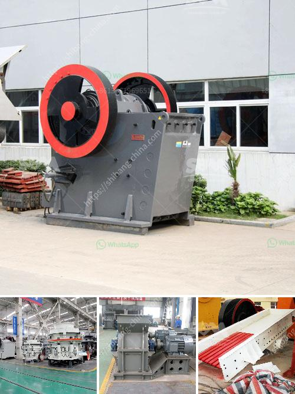

<h3>What crusher produces rock in limestone ?</h3>
Limestone is a sedimentary rock that is formed from the remains of marine organisms such as coral and mollusks. Over millions of years, pressure and heat cause these remains to solidify into limestone. It is one of the most common types of rock found on Earth and has a wide range of uses in various industries. However, to extract limestone from quarries or mines, it needs to be crushed into smaller pieces. This is where crushers come into the picture.

Crushers are machines that are designed to break down rocks and stones into smaller fragments. They are commonly used in the mining and construction industries to reduce the size of limestone, gravel, concrete, and other materials. The type of crusher used for limestone crushing depends on the size and hardness of the rock.

One of the most commonly used crushers for limestone crushing is the jaw crusher. It is a heavy-duty machine that is designed to crush larger rocks into smaller pieces. The jaw crusher has two jaws, a fixed jaw and a moving jaw. When the moving jaw moves away from the fixed jaw, the rock is crushed between the two jaws. Jaw crushers are known for their reliability and high capacity and are commonly used in quarries, mines, and construction sites.

Another type of crusher used for limestone crushing is the impact crusher. This machine uses a high-speed rotor with hammers to break up the rock. The rock is fed into the crusher and is impacted by the hammers, causing it to break and fall onto a series of screens. The screens separate the crushed rock into different sizes. Impact crushers are often used in the production of construction aggregates and can produce a more cubical product compared to jaw crushers.

Cone crushers are also commonly used for limestone crushing. They work by compressing the rock between a rotating mantle and a stationary chamber. As the rock is crushed, it falls out through an opening at the bottom of the chamber. Cone crushers are often used in secondary and tertiary crushing stages and can produce a finer product compared to jaw and impact crushers.

In addition to these primary crushers, there are also specialized crushers used for specific applications. For example, a gyratory crusher is a large machine that is used to crush large rocks into smaller pieces. It is commonly used in mining operations and can handle materials with high compressive strength.

In conclusion, crushers play a crucial role in the production of rock from limestone. Whether it is the jaw crusher, impact crusher, cone crusher, or specialized crushers, each machine serves a specific purpose in breaking down limestone into smaller fragments. The choice of crusher depends on factors such as the size and hardness of the rock, as well as the desired final product. By using crushers, limestone can be efficiently and effectively processed for various applications in industries such as construction, mining, and agriculture.
<h3>Contact us</h3><ul><li><strong>Whatsapp:&nbsp;<a href="https://wa.me/8613661969651">+8613661969651</a></strong></li><li><a href="https://swt.shibang-china.com/?git&amp;zhl&amp;What crusher produces rock in limestone "><strong>Online Service(chat now)</strong></a></li></ul><h3>Related</h3><ul><li><a href='What is the principle of a hammer crusher.md'>What is the principle of a hammer crusher?</a></li><li><a href='What should I know about a crusher plant.md'>What should I know about a crusher plant?</a></li><li><a href='what does a raymond coal mill cost？.md'>what does a raymond coal mill cost？</a></li><li><a href='What machines are required for a limestone powder factory.md'>What machines are required for a limestone powder factory?</a></li><li><a href='What equipment is used for silver mining.md'>What equipment is used for silver mining?</a></li></ul>